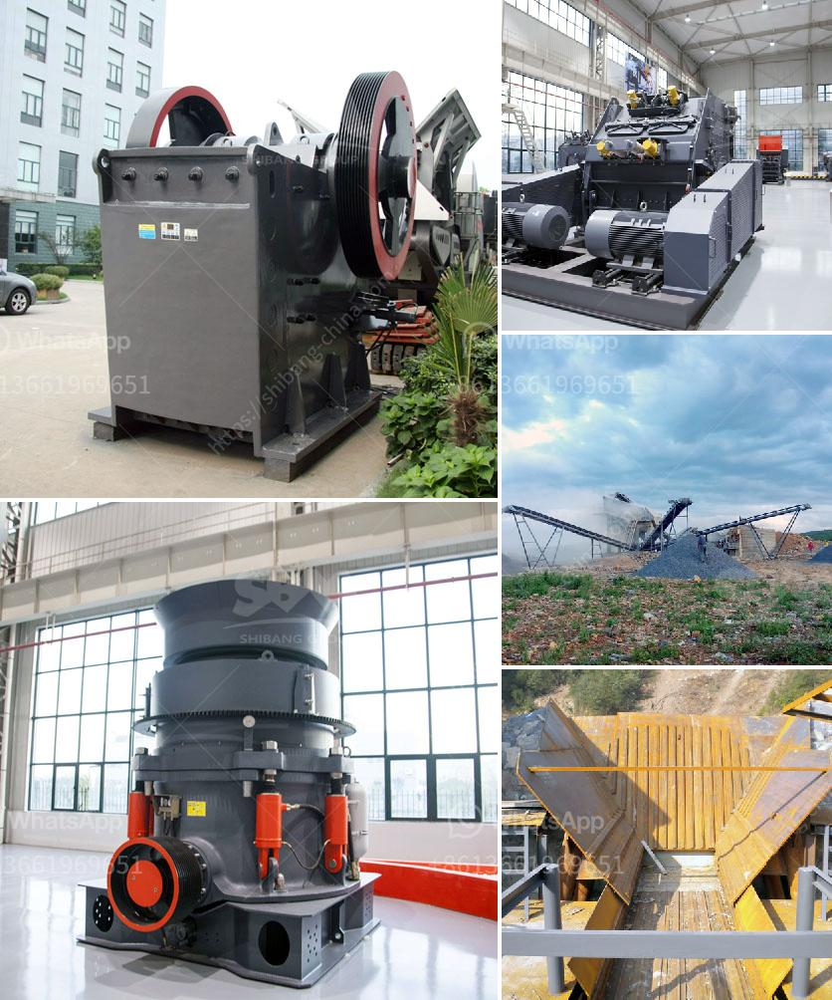

<h3>مصنع التجفيف السائل في تاميل نادو</h3>
تمثّل صناعة التجفيف السائل في تاميل نادو من الصناعات الحديثة والتقنيات المتقدمة التي تساهم في تحويل المنتجات الزراعية إلى منتجات قابلة للتخزين والتصدير. يعد مصنع التجفيف السائل حلاً فعالًا لمشكلة تلف المحاصيل وارتفاع محتوى الرطوبة في مناطق ذات مناخ حار ورطب مثل تاميل نادو.

تمتاز تكنولوجيا التجفيف السائل بأنها تحافظ على جودة المنتجات الزراعية عند تجفيفها، بحيث يتم استخدام الحرارة لخفض نسبة الرطوبة إلى مستوى آمن دون التسبب في تلف العناصر الغذائية الحيوية. يستخدم المصنع الدرجات الحرارية المنخفضة والضغط المنخفض لتقليل وقت التجفيف والحفاظ على المحتوى الغذائي للمنتج.

يتمثل دور مصنع التجفيف السائل في تخزين المنتجات الزراعية بعد جنيها، حيث يتم نقلها إلى المصنع بسرعة وتجفيفها على الفور. يتم استخدام نظام مراقبة متقدم لقياس وتحليل نسبة الرطوبة ودرجة الحرارة للحفاظ على جودة المنتجات. يتم تعبئة المنتجات النهائية في عبوات ذات جودة عالية ومناسبة للتخزين لفترات طويلة دون فقدان القيمة الغذائية أو جودة المنتج.

يساعد مصنع التجفيف السائل في تاميل نادو على تعزيز الاقتصاد المحلي وزيادة الصادرات، حيث يمثل تحويل المنتجات الزراعية إلى منتجات مجفّفة فرصة تجارية رائعة. تستفيد الشركات المصنعة الصغيرة والمتوسطة من هذا القطاع من خلال توفير فرص عمل جديدة وتقديم منتجات ذات جودة عالية لأسواق الخارج.

علاوة على ذلك، يلعب مصنع التجفيف السائل دورًا فعالًا في تقليل هدر المحاصيل وتحسين قيمتها المضافة. في الماضي، كان الشركات الزراعية تواجه صعوبة في تخزين المحاصيل لفترات طويلة مما يؤدي إلى هدرها. ومع ذلك، يمكن الآن التخلص من هذه المشكلة من خلال استخدام مصنع التجفيف السائل، حيث يتيح هذا النظام تخزين المحاصيل لفترات طويلة دون فقدان الجودة أو القيمة الغذائية.

مصنع التجفيف السائل في تاميل نادو يُعَد إضافة مهمة لصناعة الزراعة في المنطقة. يعزز هذا المصنع الابتكار والتطوير في مجالات التجفيف والتعبئة التكنولوجية، مما يعزز الاقتصاد المحلي ويساهم في توفير فرص العمل وزيادة الصادرات. كما يحقق المصنع مشروعية حفظ الغذاء وتخزينه لفترات طويلة، مما يُساهم في حل بعض التحديات الزراعية التي تواجهها تاميل نادو.
<h3>Contact us</h3><ul><li><strong>Whatsapp:&nbsp;<a href="https://wa.me/8613661969651">+8613661969651</a></strong></li><li><a href="https://swt.shibang-china.com/?git&amp;zhl&amp;مصنع التجفيف السائل في تاميل نادو"><strong>Online Service(chat now)</strong></a></li></ul><h3>Related</h3><ul><li><a href='كسارة الفك في نيبال للبيع.md'>كسارة الفك في نيبال للبيع</a></li><li><a href='طواحين الطوابع الذهبية في زيمبابوي.md'>طواحين الطوابع الذهبية في زيمبابوي</a></li><li><a href='تقرير مشروع تعدين الكاولين الصغير.md'>تقرير مشروع تعدين الكاولين الصغير</a></li><li><a href='كسارة متنقلة القطرة.md'>كسارة متنقلة القطرة</a></li><li><a href='تكلفة المعدات المستخدمة في تعدين خام الرصاص.md'>تكلفة المعدات المستخدمة في تعدين خام الرصاص</a></li></ul>