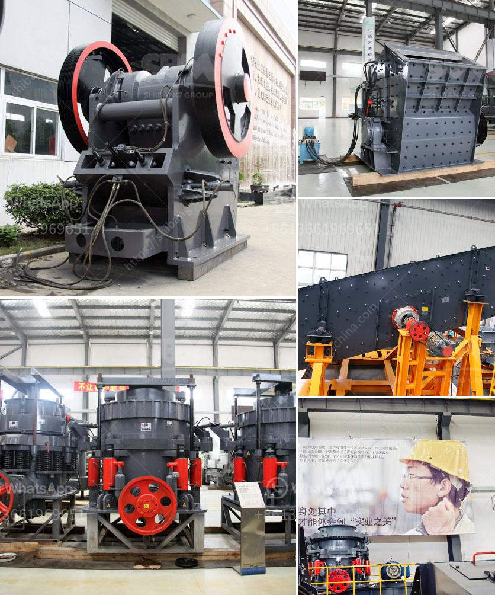

<h3>مصنع الجبس في باكستان</h3>
تُعد صناعة الجبس أحد أهم الصناعات التي تشهدها باكستان، حيث تساهم في توفير فرص عمل للكثير من العمال وتعزز الاقتصاد المحلي. يعد مصنع الجبس في باكستان من بين أبرز المصانع في المنطقة، حيث يمتلك القدرة على إنتاج كميات كبيرة من الجبس ذات جودة عالية.

تعود أهمية صناعة الجبس في باكستان إلى الاستخدامات المتعددة لهذه المادة، حيث يتم استخدام الجبس في صناعات البناء والديكور وصناعة الأثاث والسقف وغيرها. وبالتالي، يمكن القول أن الجبس بات لا غنى عنه في الحياة اليومية والبنية التحتية.

يحتوي مصنع الجبس في باكستان على آلات تقنية حديثة ومتطورة تعمل على تحسين جودة وإنتاجية المنتجات. يتم استخدام أحدث التقنيات في عمليات التصنيع، بدءًا من عملية استخراج الجبس من المناجم وتكسيره وتنقيته وحتى تحويله إلى مسحوق الجبس النهائي. تتم جميع العمليات وفقًا للمعايير الدولية لضمان الجودة والموثوقية في المنتج النهائي.

يمتلك مصنع الجبس في باكستان مجموعة واسعة من المنتجات المبتكرة القائمة على الجبس، بدءًا من الألواح الجصية والألواح المقاومة للرطوبة وحتى الديكورات الجصية المختلفة. هذه المنتجات تلبي احتياجات الأفراد والشركات على حد سواء، حيث تتميز بالمتانة والقوة والجاذبية الجمالية.

بالإضافة إلى ذلك، يلتزم مصنع الجبس في باكستان بالاستدامة البيئية والمعايير البيئية العالمية. يتم اتباع ممارسات صديقة للبيئة في جميع مراحل الإنتاج، بدءًا من استخراج المواد الخام وحتى التخلص الآمن من المخلفات الصناعية. يتم تحقيق هذه الاستدامة من خلال استخدام تقنيات التصنيع الحديثة واستخدام موارد متجددة وتقليل النفايات.

في الختام، يعد مصنع الجبس في باكستان مثالًا ناجحًا على الصناعات التحويلية المزدهرة في البلاد. يلعب هذا المصنع دورًا حيويًا في توفير فرص العمل وتنمية الاقتصاد المحلي. بفضل منتجاته ذات الجودة العالية واحترامه للبيئة، يحظى مصنع الجبس في باكستان بسمعة ممتازة واسعة النطاق، مما يمنحه المزيد من الفرص للنمو والتوسع في المستقبل.
<h3>Contact us</h3><ul><li><strong>Whatsapp:&nbsp;<a href="https://wa.me/8613661969651">+8613661969651</a></strong></li><li><a href="https://swt.shibang-china.com/?git&amp;zhl&amp;مصنع الجبس في باكستان"><strong>Online Service(chat now)</strong></a></li></ul><h3>Related</h3><ul><li><a href='مصنع سحق في ماليزيا.md'>مصنع سحق في ماليزيا</a></li><li><a href='آلة سحق نقاء الشورا.md'>آلة سحق نقاء الشورا</a></li><li><a href='مكونات مصنع الحجر الجيري الأولي.md'>مكونات مصنع الحجر الجيري الأولي</a></li><li><a href='مشكلة الناقل الفحم.md'>مشكلة الناقل الفحم</a></li><li><a href='عملية استخراج الحجر الجيري.md'>عملية استخراج الحجر الجيري</a></li></ul>