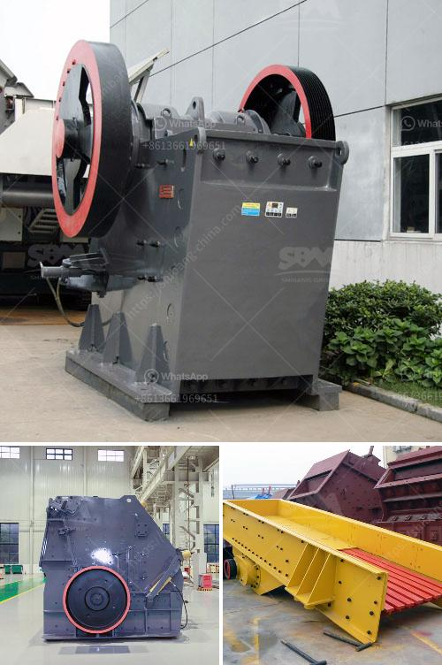

<h3>مصنع الجبس في نيجيريا</h3>
يعدّ مصنع الجبس في نيجيريا واحدًا من أهم المصانع في البلاد، حيث يتم إنتاج الجبس الذي يُستخدم في العديد من الصناعات المختلفة. يعتبر الجبس من المواد الهامة والمتعددة الاستخدامات، حيث يستخدم في صناعة الأسمنت والجص والورق والألواح المعدنية وعوازل الحرارة والحشوات البلاستيكية، وغيرها من التطبيقات.

توفر النيجريا مصدرًا غنيًا من الجبس، الذي يُستخرج من العديد من المناطق في البلاد مثل ولايتَي جيغاوا وجيرا وأنامبرا وباوتش وغيرها. يتم تحويل هذا الجبس الخام إلى منتج نهائي عالي الجودة في مصنع الجبس.

يعتبر مصنع الجبس في نيجيريا مرجعًا في مجال الإنتاج وتحويل الجبس، حيث يمتلك التكنولوجيا الحديثة والمعدات المتطورة لضمان جودة المنتج النهائي. يعمل في المصنع فريقٌ من الخبراء والمتخصصين المهرة الذين يعملون على تحويل الجبس الخام إلى منتج نهائي، يلبي متطلبات السوق المحلية والدولية.

يجري عملية تحويل الجبس في المصنع بعدة خطوات، حيث يتم طحن الجبس الخام إلى مسحوق ناعم، ثم يتم خلطه مع المواد الأخرى مثل الماء والعازل، للحصول على مستحلب متجانس. ينتج عن هذه العملية الجبس النهائي، الذي يتم تعبئته في أكياس أو تصنيعه في الألواح أو الأشكال المطلوبة.

يتم توزيع منتجات المصنع إلى مختلف المستهلكين والصناعات، سواء في السوق المحلية أو الخارجية، حيث يحظى بشعبية كبيرة من قبل العديد من الشركات والصناعات المختلفة. تؤثر منتجات المصنع بشكل إيجابي على الصناعة المحلية والاقتصاد النيجيري، حيث تسهم في تلبية احتياجات البنية التحتية واحتياجات البناء في البلاد.

بالإضافة إلى ذلك، يسهم مصنع الجبس في توفير فرص عمل للعديد من السكان المحليين، حيث يعمل المصنع بطاقة إنتاجية كبيرة تتطلب عمل العديد من العمال والفنيين. يعتبر هذا التوظيف المحلي فرصة لتحسين الحياة المعيشية للعديد من الأفراد وتعزيز التنمية الاقتصادية في المنطقة.

باختصار، يعدّ مصنع الجبس في نيجيريا من أهم المصانع في البلاد، حيث يقوم بتحويل الجبس الخام إلى منتج نهائي عالي الجودة يلبي احتياجات السوق المحلية والدولية. يسهم المصنع في التنمية الاقتصادية للبلاد وتوفير فرص عمل للعديد من السكان المحليين.
<h3>Contact us</h3><ul><li><strong>Whatsapp:&nbsp;<a href="https://wa.me/8613661969651">+8613661969651</a></strong></li><li><a href="https://swt.shibang-china.com/?git&amp;zhl&amp;مصنع الجبس في نيجيريا"><strong>Online Service(chat now)</strong></a></li></ul><h3>Related</h3><ul><li><a href='آلة طحن الجير.md'>آلة طحن الجير</a></li><li><a href='سعر كسارة الهامر العلامة التجارية.md'>سعر كسارة الهامر العلامة التجارية</a></li><li><a href='مطاحن طحن أتا.md'>مطاحن طحن أتا</a></li><li><a href='كسارة الحجر في هيماتشال براديش.md'>كسارة الحجر في هيماتشال براديش</a></li><li><a href='كسارة تأثير صغيرة بشبكة 100.md'>كسارة تأثير صغيرة بشبكة 100</a></li></ul>