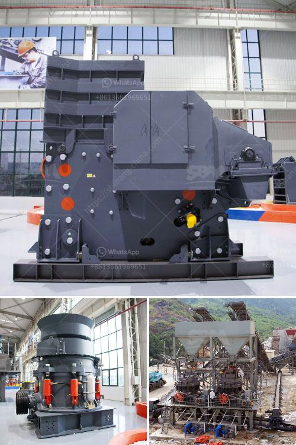

<h3>مصنع الجص في باكستان</h3>
يعد مصنع الجص واحدًا من المصانع الهامة في باكستان، حيث يتم إنتاج الجص بكميات كبيرة وبجودة عالية. يتم استخدام الجص في العديد من الصناعات مثل البناء والديكور وصناعة السيراميك والدهانات.

تأسس مصنع الجص في باكستان في سنة (عام التأسيس)، وهو يقع في (اسم المدينة)، ويعد واحدًا من أكبر المصانع في المنطقة. يتمتع المصنع بتجهيزات حديثة وآلات متطورة تستخدم التكنولوجيا الحديثة في عملية الإنتاج.

يتم الحصول على الجص من مناجم الجبال القريبة، حيث يتم تكسير الصخور الجبلية وطحنها للحصول على الجص الخام. يتم بعد ذلك إجراء عملية تكليس للجص الخام، حيث يتم تسخينه إلى درجة حرارة عالية وإزالة الرطوبة منه. بعد ذلك، يتم طحن الجص المكلس بشكل ناعم للحصول على مسحوق الجص النهائي.

يتم تعبئة مسحوق الجص في أكياس مناسبة للتصدير، حيث يتم شحنها إلى العديد من دول العالم. يتم تصدير الجص المنتج من المصنع إلى الدول القريبة والبعيدة، وشهدت صادرات الجص الباكستاني نموًا كبيرًا خلال السنوات الأخيرة.

تستخدم صناعة البناء الجص بشكل رئيسي في بناء الجدران والأسقف والتشطيبات الداخلية. يتم استخدام الجص أيضًا في صناعة الدهانات حيث يتم خلطه مع الأصباغ لإنتاج ألوان متنوعة ومبتكرة.

بالإضافة إلى ذلك، يُستخدم الجص أيضًا في صناعة السيراميك، حيث يتم استخدامه لتكوين البلاط والأواني والمزيد. يتم اختيار الجص على نطاق واسع في هذه الصناعة بسبب قوامه الناعم ومرونته التي يجعله مناسبًا للتشكيل والنحت.

في الختام، يمثل مصنع الجص في باكستان موردًا هامًا للجص على مستوى العالم. يتفوق المصنع في الجودة والكمية، ويوفر المستحضرات المصنعة لصناعات متنوعة مثل البناء والديكور والسيراميك والدهانات. يساهم مصنع الجص في تعزيز الاقتصاد المحلي وتوفير فرص عمل للسكان المحليين، مما يسهم في تنمية المجتمع والرقي به نحو المستقبل.
<h3>Contact us</h3><ul><li><strong>Whatsapp:&nbsp;<a href="https://wa.me/8613661969651">+8613661969651</a></strong></li><li><a href="https://swt.shibang-china.com/?git&amp;zhl&amp;مصنع الجص في باكستان"><strong>Online Service(chat now)</strong></a></li></ul><h3>Related</h3><ul><li><a href='بيع كسارة الصخور.md'>بيع كسارة الصخور</a></li><li><a href='آلات تعدين الذهب الطمي.md'>آلات تعدين الذهب الطمي</a></li><li><a href='إنتاج الحصى الجيري.md'>إنتاج الحصى الجيري</a></li><li><a href='آلات الطحن لتكلفة مطحنة الدال.md'>آلات الطحن لتكلفة مطحنة الدال</a></li><li><a href='كسارة المحجر في الفلبين للبيع.md'>كسارة المحجر في الفلبين للبيع</a></li></ul>