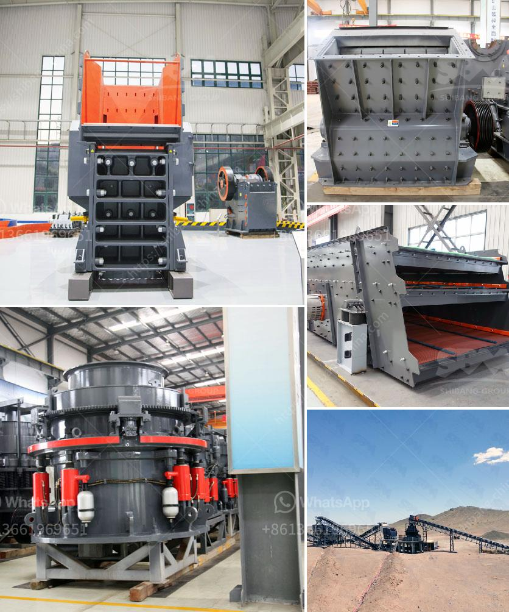

<h3>مصنع الجير والدولوميت في ماليزيا</h3>
تعتبر ماليزيا واحدة من الوجهات الرئيسية لمصانع الجير والدولوميت في جنوب شرق آسيا. يعتبر مصنع الجير والدولوميت في ماليزيا واحدًا من أكبر المصانع في المنطقة التي تعمل في تصنيع وتوريد منتجات الجير والدولوميت عالية الجودة.

تتميز ماليزيا بالعديد من الموارد الطبيعية الهامة، بما في ذلك احتياطيات وفيرة من الحجر الجيري والدولوميت. يتم استخراج الحجر الجيري والدولوميت في ماليزيا من المناجم المحلية، ثم يتم نقلهما إلى مصنع الجير والدولوميت للمعالجة والتحويل.

توفر مصانع الجير والدولوميت في ماليزيا عملية انتاج فعالة ومتطورة. تمتاز هذه المنشآت بتجهيز معدات التكسير والطحن والتجفيف الحديثة، مما يسمح بتحقيق مستوى عالٍ من الأتمتة والكفاءة. توفر هذه العمليات المتطورة المواصفات والملمس المطلوبين للمنتجات.

يستخدم الجير الحجري والدولوميت في العديد من الصناعات المختلفة. تُستخدم مساحيق الجير في التطبيقات المتنوعة مثل صناعة الحديد والصلب، والصناعات الكيميائية، وصناعة البناء، والزراعة. من ناحية أخرى، يستخدم الدولوميت في صناعة الزجاج والسيراميك ومواد البناء، بالإضافة إلى الصناعات اللوازم الرياضية مثل صناعة الزجاج والطلاء.

تحظى منتجات الجير والدولوميت الماليزية بسمعة طيبة على المستوى العالمي، نظرًا للجودة العالية والخدمة الممتازة التي يقدمها مصنع الجير والدولوميت في ماليزيا. يتم تصدير المنتجات إلى العديد من البلدان المختلفة في جميع أنحاء العالم، مما يساهم في تعزيز الاقتصاد الماليزي وزيادة فرص العمل في القطاع الصناعي.

بصفة عامة، يعتبر مصنع الجير والدولوميت في ماليزيا مثالًا حيًا على القدرة التنافسية للصناعة الماليزية في السوق العالمية. تعزز هذه المصانع التنمية الاقتصادية في البلاد وتعزز الاستثمار في الصناعة وتوفر فرص عمل واسعة للعاملين في القطاع.

وفي الاخير، يمكن القول أن مصنع الجير والدولوميت في ماليزيا يلعب دورًا حيويًا في تلبية احتياجات الصناعات المختلفة في جميع أنحاء العالم.

بفضل جودتها العالية وكفاءتها في التشغيل، يعد هذا المصنع إضافة قوية للاقتصاد الماليزي.
<h3>Contact us</h3><ul><li><strong>Whatsapp:&nbsp;<a href="https://wa.me/8613661969651">+8613661969651</a></strong></li><li><a href="https://swt.shibang-china.com/?git&amp;zhl&amp;مصنع الجير والدولوميت في ماليزيا"><strong>Online Service(chat now)</strong></a></li></ul><h3>Related</h3><ul><li><a href='مصنع فصل وتركيز المعادن في نيجيريا.md'>مصنع فصل وتركيز المعادن في نيجيريا</a></li><li><a href='مصنعي مطاحن الرايموند في الهند.md'>مصنعي مطاحن الرايموند في الهند</a></li><li><a href='تكلفة المطحنة من الكسارات.md'>تكلفة المطحنة من الكسارات</a></li><li><a href='آلة مطحنة الأسطوانة في فرنسا.md'>آلة مطحنة الأسطوانة في فرنسا</a></li><li><a href='سعر كسارة الفحم القدرة.md'>سعر كسارة الفحم القدرة</a></li></ul>