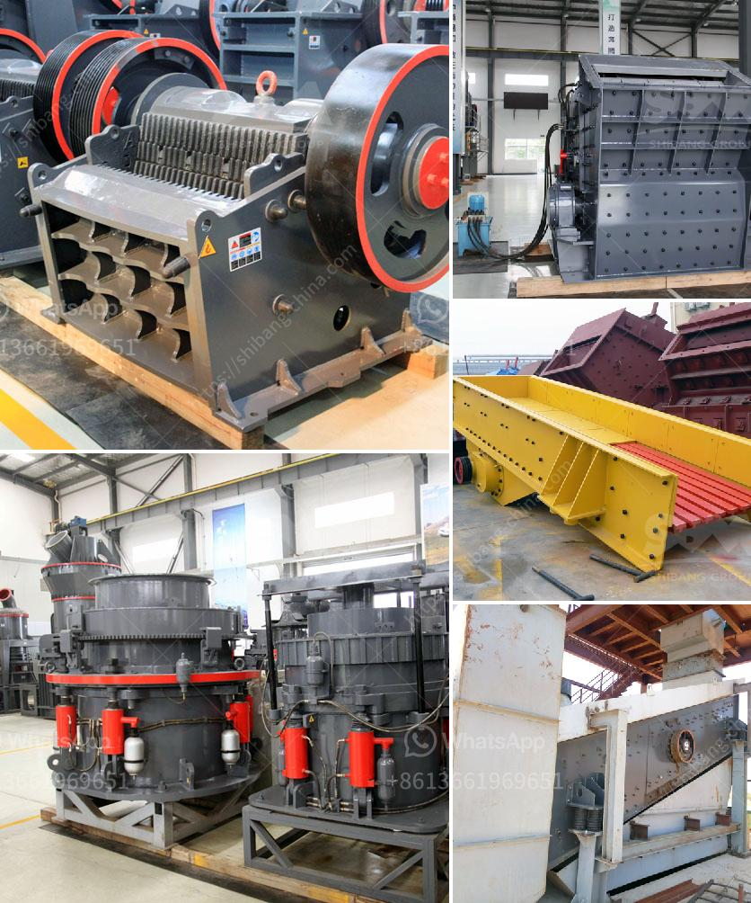

<h3>مصنع الكرة لتكسير السليكات</h3>
تعتبر التكنولوجيا الحديثة والصناعات الناشئة مصدرًا رئيسيًا للتطور والتقدم في العالم اليوم. ومن بين هذه الصناعات الناشئة تأتي صناعة الكرة لتكسير السليكات، والتي تعتبر حلاً مهمًا لمجموعة واسعة من التطبيقات المختلفة.

يشير مصطلح "مصنع الكرة" إلى مجمع تصنيع الكرة، الذي يستخدم تكنولوجيا التكسير بالكرات لتحطيم المواد الصلبة المختلفة مثل السليكات. وتعتبر السليكات صخور أو معادن تحتوي على السيليكون والأكسجين، مثل رمال السيليكا والكربوروندم وغيرها. تمتلك هذه المواد الخواص الميكانيكية العالية والقوة الضاغطة القوية، وهذا هو السبب الرئيسي وراء حاجة تكسيرها للحصول على المنتج النهائي المستخدم في العديد من التطبيقات المختلفة.

تعتمد تكنولوجيا التكسير بالكرات على الاحتكاك القوي بين كرات من الصلب والمادة التي يتم تكسيرها. يتم تحطيم السليكات عندما تتعرض للضغط والتشتيت بين تلك الكرات. يعتبر اقتصاديًا وكفاءة من حيث التكلفة، وقد استخدمت تكنولوجيا التكسير بالكرة في صناعة الزجاج، السيراميك، صناعة البناء وصناعة الخرسانة الجاهزة.

يتألف مصنع الكرة لتكسير السيليكا من آلات ومعدات متخصصة. يتم استخدام الآلات لسحق السليكا إلى حجم معين، ثم يتم نقلها إلى مجموعة من الكرات الثقيلة والصلبة التي تقوم بتحطيمها. عملية التكسير تتطلب دقة عالية واستخدام قوة ضغط قوية لتحقيق نتائج فعالة. بعد هذه العملية، يتم فصل المواد الناتجة وتعبئتها للاستخدام في الصناعات المختلفة.

بالإضافة إلى التكسير الأساسي، يتطلب مصنع الكرة لتكسير السيليكا أيضًا عمليات إضافية لتحسين الجودة وخصائص المنتج النهائي. على سبيل المثال، يتم استخدام العمليات الفيزيائية والكيميائية لإزالة الشوائب الدقيقة وتحسين تركيبة المنتج النهائي. يلعب التحكم في حجم الجسيمات المكسرة وتركيبها دورًا حاسمًا في جودة المنتج واستخدامه في التطبيقات المختلفة.

باختصار، مصنع الكرة لتكسير السليكات يعتبر جزءًا أساسيًا من صناعة السليكات. يلعب دورًا حاسمًا في تحويل السليكات الخام إلى منتج نهائي ذو جودة عالية وخصائص ميكانيكية محسنة. بفضل تكنولوجيا التكسير بالكرات، يمكننا الاستفادة من المواد الصلبة والقوية التي تساهم في تطور العديد من الصناعات المختلفة.
<h3>Contact us</h3><ul><li><strong>Whatsapp:&nbsp;<a href="https://wa.me/8613661969651">+8613661969651</a></strong></li><li><a href="https://swt.shibang-china.com/?git&amp;zhl&amp;مصنع الكرة لتكسير السليكات"><strong>Online Service(chat now)</strong></a></li></ul><h3>Related</h3><ul><li><a href='كسارات الحصى للبيع.md'>كسارات الحصى للبيع</a></li><li><a href='مطحنة الكرات في تنزانيا.md'>مطحنة الكرات في تنزانيا</a></li><li><a href='أكبر معدات تحسين خام الحديد في الصين.md'>أكبر معدات تحسين خام الحديد في الصين</a></li><li><a href='بدء عمل كسارة الجرانيت.md'>بدء عمل كسارة الجرانيت</a></li><li><a href='كسارة حجر ثالثية.md'>كسارة حجر ثالثية</a></li></ul>