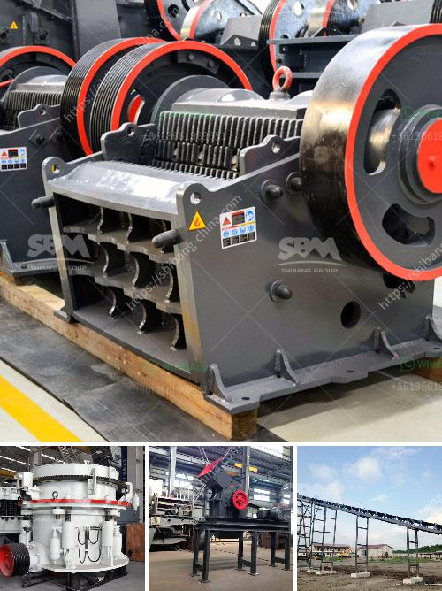

<h3>مصنع الكرة لمصنع الكالسيت</h3>
يعتبر مصنع الكرة من أهم المصانع التي تعمل في صناعة الكرة التي تستخدم في عملية إنتاج الكالسيت. يعمل هذا المصنع على تحويل الكالسيت إلى كرات صغيرة، بحيث يكون ضمان توزيع متجانس لحبيبات الكالسيت. هذا النوع من المصانع يمتاز بتقديم تقنية وآليات حديثة لتصنيع الكرات وضمان جودتها العالية.

يتكون مصنع الكرة لمصنع الكالسيت من العديد من المراحل والعمليات التي تصل إلى النهاية المرغوبة. العملية الأولية هي نقل الكالسيت من المناجم إلى المصنع، حيث يتم تخزينها في مستودعات خاصة. يتم بعدها تنظيف الكالسيت من الشوائب والأتربة باستخدام أجهزة تنقية حديثة. بعد ذلك، يتم طحن الكالسيت إلى حجم صغير باستخدام ماكينات طحن متطورة.

تأتي الخطوة التالية في صناعة الكرة وهي تشكيل الكرات بدقة وتوزيع متجانس. تستخدم آليات خاصة في هذه المرحلة لضمان الحصول على كرات دقيقة بحجم وشكل موحد. كما يتم تدوير الكرات مع إضافة المواد المضافة مثل المواد المربطة للحصول على قوة ومتانة أعلى للكرات النهائية.

ثم يتم سحق الكرات لتحقيق الحجم المطلوب وتمزيقها لتكوين حبيبات صغيرة. يتم تفتيتها بعناية حتى يصل الحجم إلى المواصفات المطلوبة لإنتاج الكالسيت. يتم فصل الحبيبات بواسطة تقنيات الفصل الجاذبية أو التنقية الأخرى للحصول على منتجات ذات جودة عالية.

يعتبر مصنع الكرة لمصنع الكالسيت مرجعًا في صناعة الكالسيت بسبب اعتماده على تكنولوجيا حديثة وعمليات متطورة. إن توجيهها نحو المكونات الضرورية والتقنيات العالية المستخدمة فيها تساعد على الحفاظ على جودة الكالسيت واستدامة العملية الإنتاجية.

علاوة على ذلك، يلعب المصنع دورًا حيويًا في تعزيز صناعة الكالسيت وتلبية الطلب المتزايد على هذه المادة. يتم تصدير الكالسيت إلى العديد من الدول واستخدامها في العديد من الصناعات مثل البناء والطلاء وصناعة الأدوية والزراعة.

لخلاصة القول، يعد مصنع الكرة لمصنع الكالسيت أمرًا ضروريًا لضمان تحويل الكالسيت إلى منتج ذو جودة عالية وخصائص متفوقة. يقدم هذا المصنع تقنيات متطورة وعمليات فعالة تساهم في تلبية الطلب المتزايد على الكالسيت وتعزيز صناعة تحويل المواد الخام.
<h3>Contact us</h3><ul><li><strong>Whatsapp:&nbsp;<a href="https://wa.me/8613661969651">+8613661969651</a></strong></li><li><a href="https://swt.shibang-china.com/?git&amp;zhl&amp;مصنع الكرة لمصنع الكالسيت"><strong>Online Service(chat now)</strong></a></li></ul><h3>Related</h3><ul><li><a href='سعر كسارة حجر الركام في جنوب أفريقيا.md'>سعر كسارة حجر الركام في جنوب أفريقيا</a></li><li><a href='عملية سحق الفحم 200 tph.md'>عملية سحق الفحم 200 tph</a></li><li><a href='كسارة متنقلة بنظام هيدروليكي.md'>كسارة متنقلة بنظام هيدروليكي</a></li><li><a href='كسارة للذهب.md'>كسارة للذهب</a></li><li><a href='تجار كسارات الحجر الكوارتز.md'>تجار كسارات الحجر الكوارتز</a></li></ul>