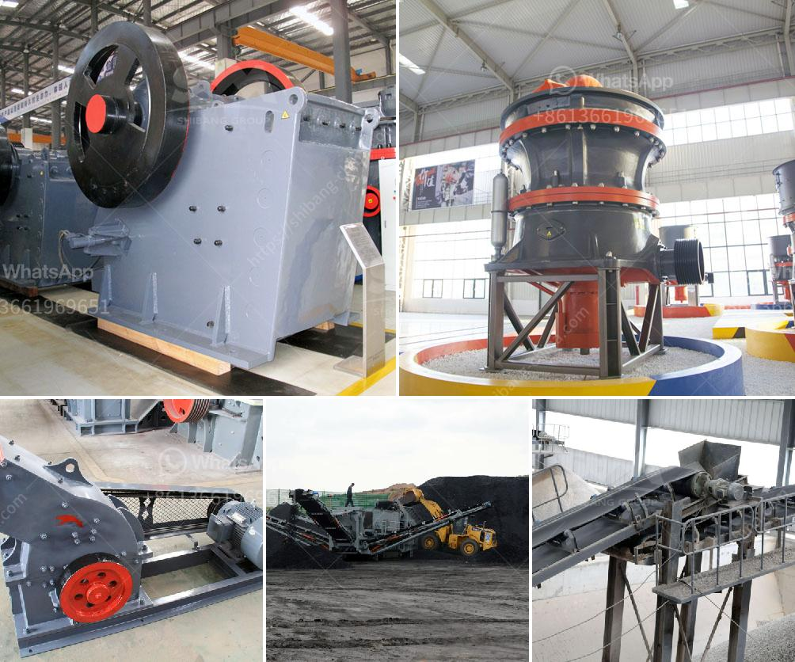

<h3>مصنع الكرة</h3>
يعتبر مصنع الكرة أحد الأماكن الهامة التي تشغل دوراً مهما في صناعة الرياضة الشعبية والمحبوبة حول العالم، فهو المكان الذي يتم فيه إنتاج الكرات المستخدمة في العديد من الألعاب مثل كرة القدم وكرة السلة وكرة التنس وغيرها. تتميز هذه الكرات بجودتها العالية وقدرتها على تحمل الاستخدام المكثف.

تتكون عملية إنتاج الكرة من عدة خطوات، الأولى هي اختيار المواد اللازمة لصناعة الكرة، وعادة ما تكون مصنوعة من اللدائن المرنة أو الجلود الاصطناعية أو حتى الجلود الحقيقية المعالجة والمعروفة بجودتها العالية. تتفاوت المواد المستخدمة حسب نوع الرياضة والاستخدام المطلوب للكرة.

بعد اختيار المواد، تدخل عملية تصميم الكرة الذي يعتبر أحد المراحل الأساسية في صناعتها. يجب أن يتم تصميم الكرة بشكل يعزز من أدائها أثناء اللعب وأن تكون مرنة وسهلة الاستخدام. بعض الكرات تحتوي على فتحات صغيرة تعمل على تحقيق راحة أكبر للمستخدم وتعزيز التهوية.

بعد التصميم، تبدأ مرحلة إنتاج الكرة الفعلية. تتضمن هذه المرحلة العديد من العمليات الهندسية والتقنية، مثل قطع المواد وتجهيزها للتصنيع، ثم تشكيل الكرة ولصق المواد المختلفة، ومن ثم خياطة أجزاء الكرة إن كانت مشتتة. تتم هذه العمليات بدقة عالية للحصول على كرة ذات جودة عالية وقوة تحمل لا تضاهى.

في النهاية، يتم فحص الكرة واختبارها للتأكد من جودتها ومقاومتها قبل أن تكون جاهزة للاستخدام. يُخضع المصنع عادة لاختبارات معترف بها عالمياً للتأكد من أنه يلتزم بأعلى المعايير والمواصفات، وبعد تمرير هذه الاختبارات، يتم تعبئة الكرات وتوزيعها في الأسواق.

باختصار، يعتبر مصنع الكرة مكاناً حيوياً في عالم الرياضة، حيث يتم إنتاج الكرات بجودة عالية تلبي احتياجات اللاعبين في جميع أنحاء العالم. تعتبر صناعة الكرة غاية في الدقة والتكنولوجيا، وتلك الكرات التي تخرج من هذه المصانع تساهم في إحداث تجربة لعب ممتعة وناجحة.
<h3>Contact us</h3><ul><li><strong>Whatsapp:&nbsp;<a href="https://wa.me/8613661969651">+8613661969651</a></strong></li><li><a href="https://swt.shibang-china.com/?git&amp;zhl&amp;مصنع الكرة"><strong>Online Service(chat now)</strong></a></li></ul><h3>Related</h3><ul><li><a href='كسارة محمولة في المملكة العربية السعودية.md'>كسارة محمولة في المملكة العربية السعودية</a></li><li><a href='مطحنة أسطوانية بسعة 15 طن.md'>مطحنة أسطوانية بسعة 15 طن</a></li><li><a href='مطاحن طحن أتا.md'>مطاحن طحن أتا</a></li><li><a href='مصنع غسيل الكروم الطبيعي.md'>مصنع غسيل الكروم الطبيعي</a></li><li><a href='مطحنة الكرة في معالجة المعادن.md'>مطحنة الكرة في معالجة المعادن</a></li></ul>