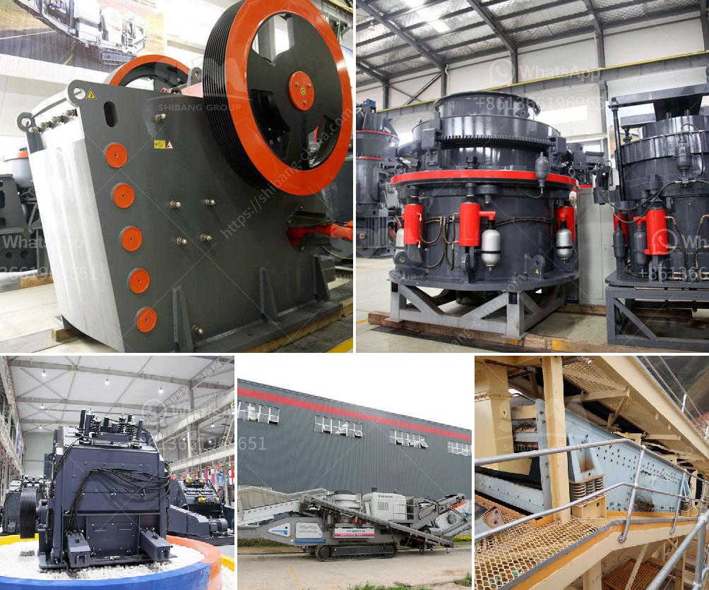

<h3>مصنع المحجر في قوانغدونغ</h3>
يعتبر مصنع المحجر في قوانغدونغ واحدًا من أبرز المصانع في صناعة الحجر الطبيعي في الصين. تقع المصنع في مدينة قوانغتشو وهي إحدى المدن الرائدة في صناعة البناء والديكور في الصين.

يعتبر مصنع المحجر في قوانغدونغ مرجعية في استخدام أحدث التقنيات وأعلى معايير الجودة في إنتاج الحجر الطبيعي. يتميز المصنع بمساحته الواسعة وتجهيزاته المتطورة، مما يسمح بإنتاج وتصنيع مجموعة متنوعة من الأحجار الطبيعية بأحجام وأشكال وألوان مختلفة.

يتم تصنيع الحجر الطبيعي في المصنع باستخدام أحدث الآلات والتقنيات الحديثة، مما يضمن الدقة والجودة في عملية الإنتاج. يشمل العملية الإنتاجية للحجر الطبيعي عدة خطوات، بدءًا من استخراج الصخور من المحاجر الجبلية وحتى القطع والصقل النهائي للأحجار.

تحرص إدارة المصنع على توظيف فريق عمل ذو خبرة وكفاءة عالية في مجال صناعة الحجر الطبيعي. يتم اختيار الأحجار بعناية وفقًا للاحتياجات والمواصفات المطلوبة، مع الالتزام بالمعايير والمواصفات العالمية لضمان تقديم منتج نهائي ممتاز.

توفر المصانع في قوانغدونغ مجموعة متنوعة من الأحجار الطبيعية، بما في ذلك الرخام والجرانيت والحجر الجيري والحجارة الأخرى. يتم استخدام هذه الأحجار في مشاريع البناء والديكور الداخلي والخارجي، حيث يعتبر الحجر الطبيعي خيارًا شائعًا ومفضلًا بسبب جماله ومتانته.

تتميز منتجات مصنع المحجر في قوانغدونغ بجودتها العالية وأدائها الممتاز في البيئات العالية والمناخات المختلفة. تتسم الأحجار الطبيعية بالمتانة والمقاومة للتآكل، مما يجعلها تحتفظ بمظهرها الجميل وتتحمل العوامل البيئية لفترة طويلة.

باختصار، يعد مصنع المحجر في قوانغدونغ من أبرز المصانع في صناعة الحجر الطبيعي في الصين. يتميز بتقنيات الإنتاج المتطورة وجودة المنتجات، ويركز على تلبية احتياجات العملاء في مجال البناء والديكور. إن استخدام الحجر الطبيعي في المشاريع البنائية يضفي لمسة جمالية وفخامة على المباني، بالإضافة إلى متانتها ومقاومتها للتآكل.
<h3>Contact us</h3><ul><li><strong>Whatsapp:&nbsp;<a href="https://wa.me/8613661969651">+8613661969651</a></strong></li><li><a href="https://swt.shibang-china.com/?git&amp;zhl&amp;مصنع المحجر في قوانغدونغ"><strong>Online Service(chat now)</strong></a></li></ul><h3>Related</h3><ul><li><a href='مطحنة مسحوق الحجر الجيري.md'>مطحنة مسحوق الحجر الجيري</a></li><li><a href='مشروع كلنكر الإسمنت في الهند.md'>مشروع كلنكر الإسمنت في الهند</a></li><li><a href='عملية تصنيع بروميد الكالسيوم.md'>عملية تصنيع بروميد الكالسيوم</a></li><li><a href='كسارة الصدم PF لآلة تكسير الحجر للبيع.md'>كسارة الصدم PF لآلة تكسير الحجر للبيع</a></li><li><a href='معدات سحق للإيجار.md'>معدات سحق للإيجار</a></li></ul>