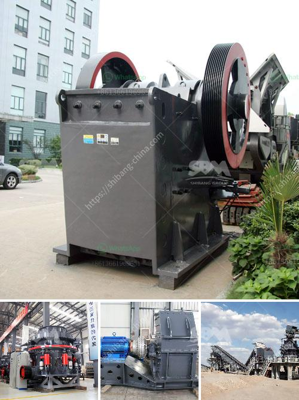

<h3>مصنع المعادن سحق خام البوكسيت</h3>
مصنع المعادن هو المكان الذي يقوم فيه بسحق خام البوكسيت لاستخراج الألومنيوم منه. ويعد البوكسيت من أهم المصادر الرئيسية لاستخراج الألومنيوم، فهو الخام الذي يحتوي على نسبة عالية من أكاسيد الألومنيوم.

عملية سحق خام البوكسيت تبدأ بنقل الخام من منجم البوكسيت إلى المصنع؛ حيث يتم سحقه وتفتيته إلى قطع صغيرة. يتم استخدام الكسارات والطواحين لهذا الغرض، حيث يتم تحويل الخام إلى شكل مسحوق يحتوي على حبيبات صغيرة جداً.

من ثم يتم فرز وغسل الخام المسحوق، حيث يتم فصل الأملاح والشوائب عن البوكسيت النقي. يتم غسل الخام بالماء وفصل الغرامات الصغيرة عن الكتل الكبيرة، ثم يتم فصل الشوائب بواسطة إجراءات ميكانيكية وكيميائية. تتم عملية الفرز بواسطة الأجهزة الميكانيكية مثل شبكات الشاشة وأنظمة الغرابيل.

بعد ذلك، يتم نقل البوكسيت إلى مصنع المعادن لمرحلة الاستخراج الأخيرة. يتم تنقية البوكسيت لفصل الأكاسيد الأخرى المتبقية مثل الشوائب الحديدية، حيث يتم إضافة مواد كيميائية خاصة لتحقيق هذا الغرض. تحدث هذه العملية في أجهزة خاصة مثل مفاعلات الاستحلاب.

بعد إتمام عملية التنقية، يتم تنشيف البوكسيت بواسطة الهواء الساخن لإزالة الرطوبة المتبقية في الخام. في النهاية، يتم تحويل البوكسيت إلى منتج نهائي قابل للاستخدام في الصناعات المختلفة، خاصة في صناعة الألومنيوم.

يجب أن يتم هذه العملية بدقة واتباع إجراءات السلامة المناسبة في مصنع المعادن، حيث قد تكون هناك خطورة من انبعاثات الغازات الضارة والاتصال بالمواد الكيميائية السامة. لذا، يجب أن يكون هناك تأهيل وتدريب للعاملين على تنفيذ العمليات اللازمة والتأكد من تطبيق إجراءات السلامة.

مصنع المعادن سحق خام البوكسيت يلعب دورًا حاسمًا في صناعة الألومنيوم، حيث يتيح لنا استخدام هذه المعدن الثمين في تصنيع المنتجات المختلفة مثل السيارات والطائرات والمباني. يعد الألومنيوم أيضًا خفيفًا الوزن ومقاوم للتآكل، الأمر الذي يجعله مادة مثالية للاستخدام في العديد من التطبيقات الصناعية.
<h3>Contact us</h3><ul><li><strong>Whatsapp:&nbsp;<a href="https://wa.me/8613661969651">+8613661969651</a></strong></li><li><a href="https://swt.shibang-china.com/?git&amp;zhl&amp;مصنع المعادن سحق خام البوكسيت"><strong>Online Service(chat now)</strong></a></li></ul><h3>Related</h3><ul><li><a href='معدات تكسير وطحن التلك.md'>معدات تكسير وطحن التلك</a></li><li><a href='شاشة اهتزازية للبيع في الفلبين.md'>شاشة اهتزازية للبيع في الفلبين</a></li><li><a href='تأجير سحق وفرز الهاتف المحمول.md'>تأجير سحق وفرز الهاتف المحمول</a></li><li><a href='معدات كسارة الذهب.md'>معدات كسارة الذهب</a></li><li><a href='كسارة صنع الحصى.md'>كسارة صنع الحصى</a></li></ul>