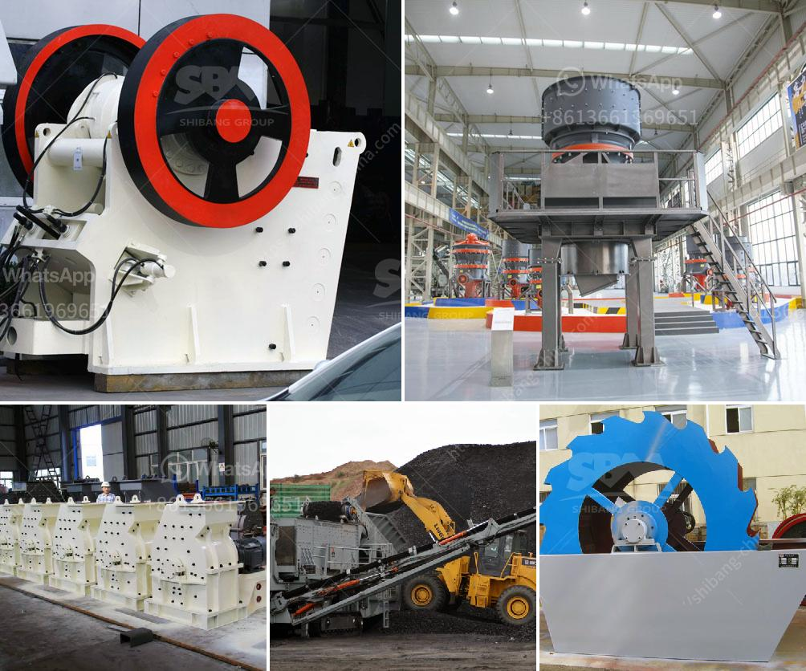

<h3>مصنع النحاس للبيع</h3>
يعد مصنع النحاس أحد المصانع المهمة في قطاع صناعة المعادن. يتخصص هذا المصنع في إنتاج وتصنيع منتجات النحاس التي تستخدم في مجموعة متنوعة من الصناعات مثل الكهرباء والبناء والأجهزة الكهربائية وصناعة الأعمال اليدوية.

يتميز مصنع النحاس بتجهيزاته الحديثة والتكنولوجيا العالية المستخدمة في عمليات الإنتاج. يتم استخدام المعدات والآلات المتطورة لمعالجة وصهر النحاس بطرق فعالة وآمنة تحافظ على الموارد الطبيعية وتقلل من أي تأثير سلبي على البيئة.

يحرص المصنع على استخدام أفضل المواد الخام لتصميم وإنتاج منتجاته. يتم اختيار النحاس عالي الجودة والنقاء لضمان تحقيق التوصيات الفنية ومتطلبات العملاء. بالإضافة إلى ذلك، يتم التأكد من تنفيذ مراقبة الجودة الصارمة خلال جميع مراحل الإنتاج، حيث يتم اختبار كل منتج للتحقق من جودته ومطابقته للمواصفات المطلوبة.

منتجات مصنع النحاس تتضمن أسلاك النحاس، وقضبان النحاس، وأنابيب النحاس، والمنتجات المجلفنة بالنحاس. كل منتج يشتهر بمتانته ومتانته العالية وقابليته للاستخدام في تطبيقات مختلفة. فمثلا، تعتبر أسلاك النحاس مادة أساسية في صناعة الكهرباء وتستخدم في توصيل الطاقة الكهربائية. أنابيب النحاس، من ناحية أخرى، تستخدم في صناعتي السباكة والتدفئة، بالإضافة إلى استخدامات أخرى في مجالات مثل صناعة الأثاث والديكور.

تحظى منتجات مصنع النحاس بشعبية كبيرة في السوق المحلية والعالمية. يستفيد العملاء من جودة المنتجات وخدمة العملاء الممتازة التي يقدمها المصنع. يتم تصدير المنتجات إلى العديد من البلدان حول العالم، وتساهم بشكل كبير في تطور تلك الصناعات في تلك البلدان.

في النهاية، يمثل مصنع النحاس واحدًا من رواد صناعة المعادن ومن المهمية بيع منتجاته. يقدم المصنع منتجات ذات جودة عالية وموثوقة للعملاء، ويعتبر هذا الاستثمار مفيدًا ومربحًا لاقتصاد المنطقة ويسهم في توفير فرص عمل للعديد من الأشخاص.
<h3>Contact us</h3><ul><li><strong>Whatsapp:&nbsp;<a href="https://wa.me/8613661969651">+8613661969651</a></strong></li><li><a href="https://swt.shibang-china.com/?git&amp;zhl&amp;مصنع النحاس للبيع"><strong>Online Service(chat now)</strong></a></li></ul><h3>Related</h3><ul><li><a href='مصنعين لشاشات الاهتزاز في جنوب أفريقيا.md'>مصنعين لشاشات الاهتزاز في جنوب أفريقيا</a></li><li><a href='معالجة الحجر الجيري على نطاق صغير.md'>معالجة الحجر الجيري على نطاق صغير</a></li><li><a href='مصانع الإسمنت للبيع في باكستان.md'>مصانع الإسمنت للبيع في باكستان</a></li><li><a href='آلة معالجة الرماد الطائر.md'>آلة معالجة الرماد الطائر</a></li><li><a href='قائمة أسعار كسارة الحجر بسعة 300 طن في الساعة.md'>قائمة أسعار كسارة الحجر بسعة 300 طن في الساعة</a></li></ul>