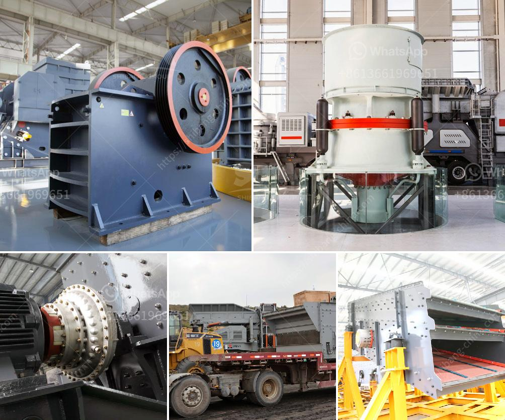

<h3>مصنع تحسين أكسيد النحاس في الصين</h3>
في السنوات الأخيرة، شهدت الصين تطوراً كبيراً في صناعة تحسين أكسيد النحاس. يُعد تحسين أكسيد النحاس مادة مهمة في العديد من الصناعات، مثل صناعة السفن وصناعة المجوهرات، وبالتالي فهو يلعب دورًا أساسيًا في تعزيز الاقتصاد المحلي والعالمي.

أحد أبرز مصانع تحسين أكسيد النحاس في الصين هو مصنع "شيانغتشونغ"، والذي يقع في إقليم "قويتشو" بجنوب البلاد. يغطي المصنع مساحة كبيرة تصل إلى آلاف الأمتار المربعة وتوفر العديد من فرص العمل للسكان المحليين.

يمتلك المصنع آخر التقنيات الحديثة في عملية تصنيع تحسين أكسيد النحاس، ويعتمد على العمالة الماهرة والمهندسين المتخصصين في هذا المجال. يتم استخدام العتاد والأجهزة المتطورة لتجهيز الخامات وفصلها لاستخراج أعلى نسبة نقاء للنحاس الموجود فيها. يتلقى العمال تدريباً مستمراً لضمان تحقيق أعلى جودة في منتجاتهم.

واحدة من أهم مزايا هذا المصنع هي توفره على نظام مراقبة الجودة الصارم، حيث يخضع كل منتج لاختبار متعمق قبل توزيعه في السوق. يتم ضمان جودة النحاس الناتج من خلال إجراءات اختبار متقدمة لفحص النقاء والمتانة.

بالإضافة إلى ذلك، يلتزم المصنع بإجراءات صديقة للبيئة لضمان حماية البيئة. تستخدم العمليات الصناعية بطرق متقدمة للحد من انبعاثات الملوثات والتأثيرات البيئية الضارة، مما يساهم في صناعة نظيفة وصحية.

تعد الصين واحدة من أكبر الأسواق العالمية لتحسين أكسيد النحاس، حيث أن الطلب على هذه المادة يزداد باستمرار. يتصدر مصنع "شيانغتشونغ" السوق الصينية ويُعتبر واحدًا من الموردين الرئيسيين للنحاس في العالم.

باختصار، يعتبر مصنع تحسين أكسيد النحاس في الصين مثالاً للتقنية المتقدمة والجودة العالية. يلتزم المصنع بالتنمية المستدامة وحماية البيئة، مما يجعله اختيارًا مثاليًا لعملاء الداخل والخارج الذين يسعون إلى تأمين المنتجات ذات الجودة العالية.
<h3>Contact us</h3><ul><li><strong>Whatsapp:&nbsp;<a href="https://wa.me/8613661969651">+8613661969651</a></strong></li><li><a href="https://swt.shibang-china.com/?git&amp;zhl&amp;مصنع تحسين أكسيد النحاس في الصين"><strong>Online Service(chat now)</strong></a></li></ul><h3>Related</h3><ul><li><a href='المعدات اللازمة لبدء تعدين الحجر الجيري.md'>المعدات اللازمة لبدء تعدين الحجر الجيري</a></li><li><a href='كرات لمطحنة الكرة.md'>كرات لمطحنة الكرة</a></li><li><a href='مورد سيور ناقلة للفحم من الهند.md'>مورد سيور ناقلة للفحم من الهند</a></li><li><a href='تكلفة ماكينات كسارة المحاجر.md'>تكلفة ماكينات كسارة المحاجر</a></li><li><a href='عملية الكرة الطحن.md'>عملية الكرة الطحن</a></li></ul>