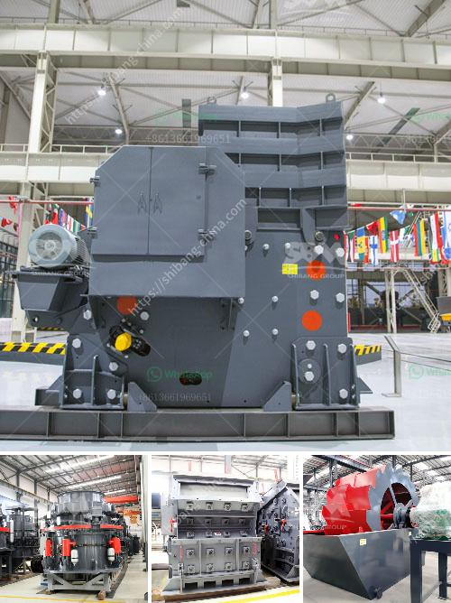

<h3>مصنع تحسين الجرافيت للبيع</h3>
يعتبر الجرافيت من المواد التي تستخدم في العديد من الصناعات بسبب خواصها المميزة. ومن بين الصناعات التي تحتاج إلى الجرافيت بكميات كبيرة هي صناعة البطاريات وصناعة السيراميك وصناعة الأدوات الكهربائية.

ومن أجل تلبية الطلب المتزايد على الجرافيت، يتوجب وجود مصنع متخصص في تحسين جودة هذه المادة. وبالفعل، يتوفر على الساحة العديد من المصانع التي تعمل على تحسين جودة الجرافيت وتوفيرها بكميات كبيرة.

يتميز مصنع تحسين الجرافيت بتوفيره للمواد الخام عالية الجودة والمناسبة لصناعة الجرافيت. كما يتمتع المصنع بتقنيات حديثة في عملية التحسين، مما يساعد في زيادة نقاوة الجرافيت وتحسين خواصها الفيزيائية والكيميائية.

بالإضافة إلى ذلك، يوفر المصنع عمليات أخرى مثل عملية طحن الجرافيت وتنقيتها من الشوائب، وعملية تعدين الجرافيت واستخلاصها من الصخور، وكذلك عملية تصنيع المنتجات الجاهزة من الجرافيت بحسب متطلبات العملاء.

يعتبر سعر الجرافيت مناسبًا ومنافسًا في هذا المصنع. فهو يوفر للعملاء الجرافيت بأسعار تتراوح بين 200 و400 دولار للطن الواحد، مما يعتبر سعرًا جيدًا في سوق الجرافيت.

إن امتلاك مصنع تحسين الجرافيت يعتبر فرصة مميزة للمستثمرين في هذه الصناعة. فصناعة الجرافيت تشهد نموًا كبيرًا في الطلب على الصعيد العالمي، وبالتالي فإن تأسيس مصنع في هذا القطاع قد يعود على المستثمر بأرباح جيدة.

وفي الختام، يمكن الاستنتاج بأن وجود مصنع متخصص في تحسين الجرافيت هو أمر ضروري في سوق الجرافيت الحالي. فالجرافيت يعد مادة ضرورية لصناعة العديد من المنتجات، وتحسين جودة هذه المادة سيساعد في تلبية الطلب المتزايد عليها وتعزيز نمو صناعة الجرافيت.
<h3>Contact us</h3><ul><li><strong>Whatsapp:&nbsp;<a href="https://wa.me/8613661969651">+8613661969651</a></strong></li><li><a href="https://swt.shibang-china.com/?git&amp;zhl&amp;مصنع تحسين الجرافيت للبيع"><strong>Online Service(chat now)</strong></a></li></ul><h3>Related</h3><ul><li><a href='مطاحن الذهب الصينية للبيع في جنوب أفريقيا.md'>مطاحن الذهب الصينية للبيع في جنوب أفريقيا</a></li><li><a href='مصنع غسل الرمل المستعمل للبيع.md'>مصنع غسل الرمل المستعمل للبيع</a></li><li><a href='كسارات الفك في تنزانيا.md'>كسارات الفك في تنزانيا</a></li><li><a href='آلة كسارة الحجر في جنوب أفريقيا.md'>آلة كسارة الحجر في جنوب أفريقيا</a></li><li><a href='كسارة محمولة في السويد.md'>كسارة محمولة في السويد</a></li></ul>