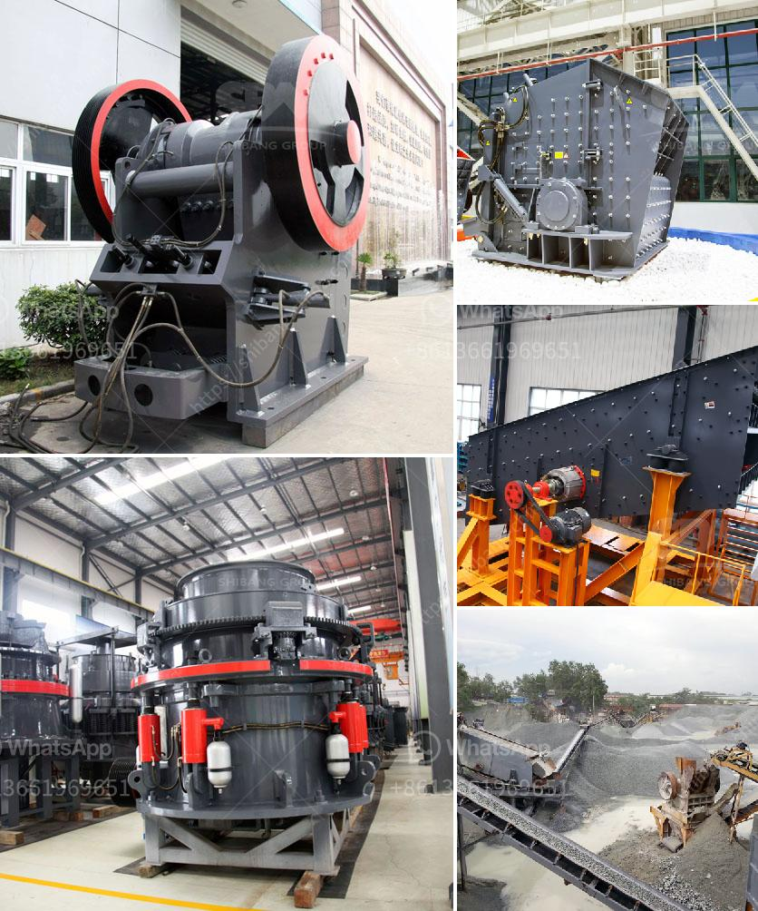

<h3>مصنع تحسين الكروم في الصين</h3>
تعد صناعة تحسين الكروم أحد القطاعات الهامة في الصناعات الثقيلة في الصين. يُستخدم الكروم بصورة رئيسية في الصناعات المعدنية والسيارات والإنشاءات، وله اهمية استراتيجية في تحسين مقاومة المواد للتآكل وقوة المواد المعدنية. وعلى مدار السنوات العديدة الماضية، حقق قطاع تحسين الكروم في الصين تقدمًا كبيرًا فيما يتعلق بالجودة والتكنولوجيا والابتكار.

يتميز مصنع تحسين الكروم في الصين بمجموعة واسعة من المعدات المتطورة والتكنولوجيا الحديثة التي تعزز إنتاجية المصنع وتحسين جودة المنتجات. تعمل هذه المعدات بشكل مستمر وفعال لتصنيع سبائك الكروم المطورة والتي تتميز بمقاومة عالية للتآكل وقوة ميكانيكية في ظروف صعبة. وبالإضافة إلى ذلك، يعتمد المصنع على تقنيات التحسين المستمر وتحليل العمليات لتحديث وتحسين العمليات وزيادة الكفاءة الإنتاجية.

من الجوانب الهامة التي يوليها مصنع تحسين الكروم الصيني اهتمامًا كبيرًا هو البحث والتطوير. يتم تكريس الكثير من الجهود والموارد لتحقيق المزيد من التقدم في مجال تحسين خصائص الكروم وتطوير منتجات الكروم الجديدة. ينتج المصنع بشكل مستمر نتائج مبتكرة ومتفوقة في مجال تحسين الكروم من خلال الابتكار والاستفادة من التكنولوجيات الجديدة.

ومن أجل الحفاظ على سلامة الموظفين والبيئة المحيطة، يتبع مصنع تحسين الكروم في الصين معايير صارمة للعمل الآمن والاستدامة البيئية. يتم تطبيق إجراءات أمان قوية لضمان سلامة الموظفين والحفاظ على البيئة الطبيعية. وتتمتع الشركة بشهادات عالية الجودة في مجال السلامة والبيئة، مما يعكس التزامها بمعايير الجودة العالمية.

يساهم مصنع تحسين الكروم في الصين بشكل كبير في تعزيز مستوى الكفاءة والجودة في قطاع تحسين الكروم، وفي دعم تطور الصناعات المختلفة في البلاد. كما يعمل المصنع على تطوير شراكات استراتيجية مع الشركات العالمية الرائدة في هذا المجال لتبادل المعرفة والتجارب وتحسين التكنولوجيا.

في الختام، يشهد قطاع تحسين الكروم في الصين تقدمًا كبيرًا في الأعوام الأخيرة. يتميز مصنع تحسين الكروم في الصين بمعداته المتطورة والابتكارات التكنولوجية والتركيز على الجودة والأمان. تلعب هذه المصنع دورًا مهمًا في تعزيز تطور الصناعات المختلفة في الصين وتلبية احتياجات السوق المحلية والعالمية في مجال تحسين الكروم.
<h3>Contact us</h3><ul><li><strong>Whatsapp:&nbsp;<a href="https://wa.me/8613661969651">+8613661969651</a></strong></li><li><a href="https://swt.shibang-china.com/?git&amp;zhl&amp;مصنع تحسين الكروم في الصين"><strong>Online Service(chat now)</strong></a></li></ul><h3>Related</h3><ul><li><a href='كسارة الصخور للبيع في الفلبين.md'>كسارة الصخور للبيع في الفلبين</a></li><li><a href='تأجير ناقل محمول في فلوريدا.md'>تأجير ناقل محمول في فلوريدا</a></li><li><a href='كسارة على أساس الإيجار في نيجيريا.md'>كسارة على أساس الإيجار في نيجيريا</a></li><li><a href='آلة كسارة الرمل السيليكا المصنعة.md'>آلة كسارة الرمل السيليكا المصنعة</a></li><li><a href='تكلفة معدات سحق الجرانيت.md'>تكلفة معدات سحق الجرانيت</a></li></ul>