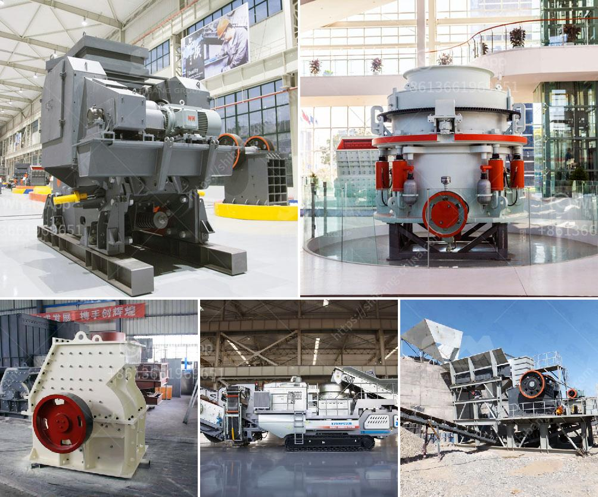

<h3>مصنع تحسين الكروميت في ماليزيا</h3>
في ماليزيا، هناك مصنع كبير لتحسين الكروميت وتصنيع منتجات مشتقة من الكروميت. الكروميت هو خام يحتوي على الكروم ويعتبر مادة مهمة جداً في صناعة الفولاذ والمعادن الأخرى. يعتبر هذا المصنع الماليزي أحد أكبر المصانع في العالم في هذا المجال.

يتم استخراج الكروميت من المناجم ونقله إلى المصنع حيث يتم معالجته وتحسينه. يتطلب هذا العملية استخدام تقنيات معقدة ومتقدمة لفصل الكروم عن المواد الأخرى الموجودة في خام الكروميت. عملية التحسين تشمل عدة مراحل مثل الكسر والطحن والغسيل والتركيز. بعد تلك الخطوات، يتم الحصول على خام الكروميت المحسن وجاهز للاستخدام في الصناعة.

يتم تصنيع منتجات متنوعة من الكروميت في هذا المصنع، بما في ذلك سبائك الكروم والأكسيد الكرومي وغيرها من المنتجات التي تستخدم في مجموعة واسعة من الصناعات. واحدة من أهم المنتجات هي سبائك الكروم التي تستخدم في صناعة الفولاذ. هذه السبائك تساهم في تحسين خصائص الفولاذ مثل مقاومته للتآكل والحرارة. بالإضافة إلى ذلك، فإن الأكسيد الكرومي يستخدم في تصنيع الأصباغ والألوان، حيث يوفر لونًا قويًا ومستقرًا.

يعتبر هذا المصنع من أفضل المصانع في العالم من حيث جودة المنتجات وكفاءة الإنتاج. يتطلب المصنع استخدام تقنيات حديثة وأجهزة متطورة لضمان العمليات الفعالة والفعالة. كما يلتزم المصنع بمعايير صارمة للجودة والسلامة وحماية البيئة. يتم المحافظة على المعايير الصحية والبيئية العالية عبر عمليات التصنيع والتحسين.

يساهم هذا المصنع الكبير في تلبية الطلب المتزايد على المنتجات المشتقة من الكروميت في السوق الماليزية والدولية. يعد هذا القطاع من أهم القطاعات الصناعية في ماليزيا ويساهم في تعزيز الاقتصاد المحلي.

باختصار، يعد مصنع تحسين الكروميت في ماليزيا من أكبر المصانع في العالم في هذا المجال. يتم تحسين خام الكروميت من المناجم وتصنيع منتجات ذات جودة عالية ومتنوعة، مثل سبائك الكروم والأكسيد الكرومي. يلتزم المصنع بمعايير عالية للجودة والسلامة والبيئة. يساهم هذا القطاع في تعزيز الاقتصاد المحلي وتلبية الطلب العالمي على منتجات الكروميت.
<h3>Contact us</h3><ul><li><strong>Whatsapp:&nbsp;<a href="https://wa.me/8613661969651">+8613661969651</a></strong></li><li><a href="https://swt.shibang-china.com/?git&amp;zhl&amp;مصنع تحسين الكروميت في ماليزيا"><strong>Online Service(chat now)</strong></a></li></ul><h3>Related</h3><ul><li><a href='تصنيع مكره مطحنة الكرة.md'>تصنيع مكره مطحنة الكرة</a></li><li><a href='شركة تصنيع آلات الحجر في إيروود.md'>شركة تصنيع آلات الحجر في إيروود</a></li><li><a href='كسارة فكية لتكسير الجرانيت.md'>كسارة فكية لتكسير الجرانيت</a></li><li><a href='سعات مطحنة الأسطوانة العمودية.md'>سعات مطحنة الأسطوانة العمودية</a></li><li><a href='آلة صنع الدولوميت.md'>آلة صنع الدولوميت</a></li></ul>