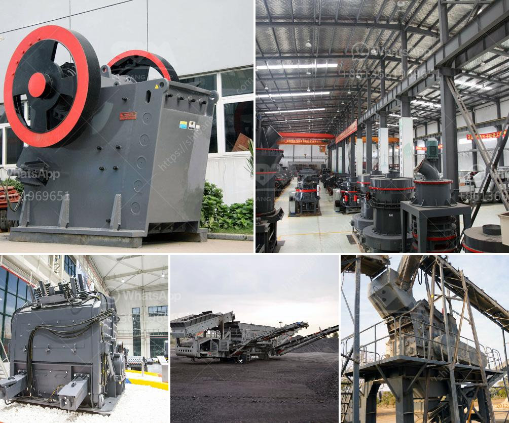

<h3>مصنع تركيز النحاس الصغير</h3>
يوجد العديد من المصانع التي تعمل في مجال تركيز النحاس، ومن بينها المصانع الصغيرة التي تعمل في هذا المجال. يعد تركيز النحاس عملية مهمة جدًا في صناعة التعدين، حيث يتم من خلالها فصل النحاس عن المواد الأخرى بعد استخراجه من الأرض. سأتحدث في هذه المقالة عن مصنع تركيز النحاس الصغير وأهميته في صناعة التعدين.

تعتبر صناعة التعدين من الصناعات الحيوية في العالم، إذ تساهم في تلبية احتياجات العديد من الصناعات الأخرى، بما في ذلك صناعة البناء والسيارات والإلكترونيات. والنحاس هو واحد من المعادن الهامة في صناعة التعدين، فهو يستخدم في صناعة الأسلاك الكهربائية والأنابيب والمكونات الإلكترونية وغيرها.

يقوم المصنع الصغير بتركيز النحاس من خام النحاس الخام المستخرج من المناجم. يتم غسل الخام وسحقه وطحنه إلى حجم صغير جدًا. ثم يتم إضافة الماء والمواد الكيميائية إلى الخام المطحون لفصل النحاس عن المواد الأخرى. تتكون المواد الكيميائية من عوامل فاصلة تساعد في تركيز النحاس، ومثبطات تمنع تركيز المواد الأخرى.

يعتبر المصنع الصغير مناسبًا للشركات ذات القدرة المحدودة والموارد المحدودة. قد يتراوح حجم المصنع بين 200 إلى 400 كيلوجرام من النحاس في اليوم. يعني هذا أن المصنع الصغير يعالج كمية صغيرة من خام النحاس بالمقارنة مع المصانع الكبيرة التي تعالج آلاف الأطنان يوميًا.

يقدم المصنع الصغير بعض الفوائد لصناعة التعدين. قد يكون التشغيل المنخفض للمصنع الصغير مفيدًا في تكاليف التشغيل، حيث لا يحتاج لعمالة كبيرة أو أجهزة معقدة. بالإضافة إلى ذلك، يكون الإنتاج المحدود من المصنع الصغير ذو جودة عالية، حيث يتم مراقبة العملية بعناية وتلافي الأخطاء التي قد تؤثر على جودة المنتج النهائي.

يعد المصنع الصغير أيضًا بداية جيدة للشركات الجديدة التي ترغب في الاستثمار في صناعة التعدين. فمن خلال تشغيل مصنع صغير، يمكن للشركات اكتساب الخبرة وفهم جوانب العملية التي تشمل تركيز النحاس. بعد ذلك، يمكنهم توسيع أعمالهم والانتقال إلى مصانع أكبر حجمًا.

باختصار، فإن المصنع الصغير لتركيز النحاس يلعب دورًا هامًا في صناعة التعدين. يعمل المصنع على تركيز النحاس من خامه، وتوفير كمية صغيرة وجودة عالية من المنتج النهائي. بفضل مرونته وتكلفته المنخفضة، يعتبر المصنع الصغير بداية جيدة للشركات الجديدة في هذه الصناعة المهمة.
<h3>Contact us</h3><ul><li><strong>Whatsapp:&nbsp;<a href="https://wa.me/8613661969651">+8613661969651</a></strong></li><li><a href="https://swt.shibang-china.com/?git&amp;zhl&amp;مصنع تركيز النحاس الصغير"><strong>Online Service(chat now)</strong></a></li></ul><h3>Related</h3><ul><li><a href='آلة كسارة الحجر في جنوب أفريقيا.md'>آلة كسارة الحجر في جنوب أفريقيا</a></li><li><a href='معلمات كسارة 250 طن في الساعة.md'>معلمات كسارة 250 طن في الساعة</a></li><li><a href='كسارة الحجر غانا.md'>كسارة الحجر غانا</a></li><li><a href='مصنع جفاف الفحم في الهند.md'>مصنع جفاف الفحم في الهند</a></li><li><a href='تجار الكسارات المتنقلة المستخدمة في غانا.md'>تجار الكسارات المتنقلة المستخدمة في غانا</a></li></ul>