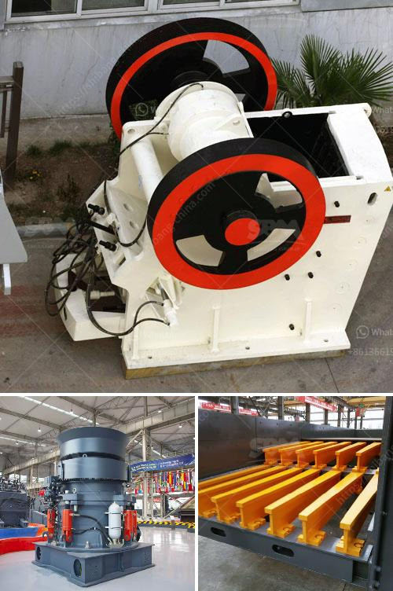

<h3>مصنع تصنيع الدولوميت</h3>
يُعتبر الدولوميت من المعادن الهامة التي تستخدم في عدة صناعات، ولذلك يتم إنتاجها وتصنيعها في مصانع خاصة بهذا الغرض. يعتبر مصنع تصنيع الدولوميت من أحدث المصانع التي تعمل بأحدث التقنيات لإنتاج هذه المادة.

يتم تصنيع الدولوميت عن طريق استخراج الصخور المكونة منها من المناجم، ثم يتم نقلها إلى المصنع للمعالجة. يتم سحق الصخور بواسطة الكسارات الخاصة بالمصنع، ويتم تصفيتها وفصلها عن الشوائب الأخرى بواسطة الغرابيل والمنافر والكسارات المختلفة. بعد ذلك، يتم تحويل الدولوميت المكسرة إلى مسحوق أبيض ناعم من خلال عمليات التحبيب والطحن الأخرى.

تتميز عملية تصنيع الدولوميت بعدة مزايا. فعلى سبيل المثال، فإن المصنع يعمل بأحدث التقنيات الصناعية المتوافقة مع المعايير العالمية. كما أن عملية التصنيع مصممة بطريقة تضمن الحفاظ على نقاء وجودة المنتج، وذلك بضمان خلو المادة المنتجة من أي شوائب أو أجسام غريبة، مما يجعلها قابلة للاستخدام في الصناعات الحساسة مثل الصناعات الكيماوية والدهانات وغيرها.

يتم استخدام الدولوميت بشكل واسع في صناعة البلاستيك والمطاط والدهانات والمواد اللاصقة والمبيدات الحشرية. فهي تعمل كملء وتعزيز للمواد البلاستيكية والمطاطية، كما أنها تزيد من قوة وصلابة المركبات الدهانية. بالإضافة إلى ذلك، تستخدم الدولوميت في صناعة الزجاج وصناعة السيراميك، حيث تعمل على خفض نقطة انصهار المنتجات وتحسين النسبة بين السيليكا والتعدين.

قد يلعب مصنع تصنيع الدولوميت دورًا حيويًا في دعم الصناعات المحلية وتعزيز التنمية الاقتصادية في المنطقة التي يتم بناء المصنع فيها. فالمصنع يوفر فرص عمل للعديد من العاملين، ويحتاج إلى دعم من الجهات الحكومية والمؤسسات المالية لضمان استمرارية عمله بشكل فعال.

في الختام، يتضح أن مصنع تصنيع الدولوميت هو مصنع حديث ومتقدم يلتزم بأعلى معايير الجودة والنقاء في عملياته. يعتبر استخدام الدولوميت في العديد من الصناعات الحيوية للاقتصاد المحلي والعالمي، ويمكن أن يسهم في تطوير الصناعات المحلية وخلق فرص عمل جديدة.
<h3>Contact us</h3><ul><li><strong>Whatsapp:&nbsp;<a href="https://wa.me/8613661969651">+8613661969651</a></strong></li><li><a href="https://swt.shibang-china.com/?git&amp;zhl&amp;مصنع تصنيع الدولوميت"><strong>Online Service(chat now)</strong></a></li></ul><h3>Related</h3><ul><li><a href='كسارة حجر في تروخيلو، بوليفيا.md'>كسارة حجر في تروخيلو، بوليفيا</a></li><li><a href='إقامة مصنع تكسير الفحم.md'>إقامة مصنع تكسير الفحم</a></li><li><a href='كسارات للإيجار في سينسيناتي.md'>كسارات للإيجار في سينسيناتي</a></li><li><a href='مصنع البنتونيت في الهند.md'>مصنع البنتونيت في الهند</a></li><li><a href='سعر آلة طاحونة الهامر.md'>سعر آلة طاحونة الهامر</a></li></ul>