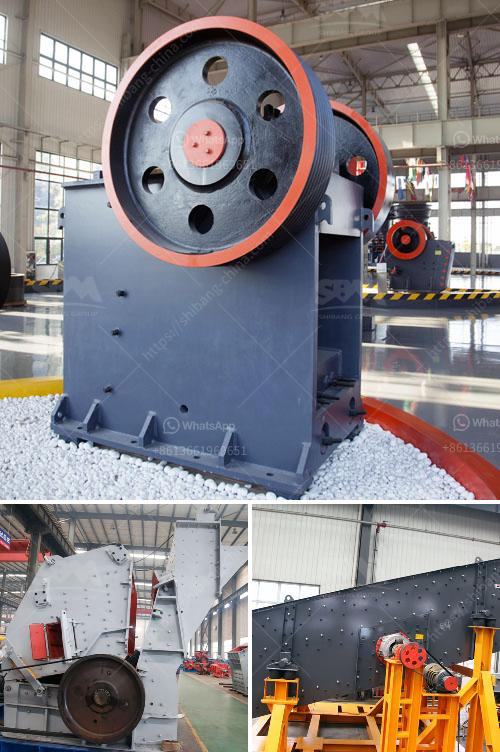

<h3>مصنع تعدين الدولوميت في إثيوبيا</h3>
يعد تعدين الدولوميت أحد القطاعات الحيوية في إثيوبيا التي تعتبر من أكبر الدول المنتجة لهذه المادة في العالم. يوجد العديد من المصانع التعدينية في مختلف مناطق البلاد، تعمل على استخراج وتصنيع الدولوميت للاستفادة من خصائصها الفريدة.

يعتبر مصنع تعدين الدولوميت في إثيوبيا واحدًا من أكبر المصانع في هذا القطاع. يقع المصنع في إقليم أوروميا ويعمل على استخراج الدولوميت من الرواسب الصخرية في المنطقة. يستخدم المصنع تقنيات حديثة ومعدات متطورة لاستخراج الدولوميت بكفاءة عالية.

يتم استخدام الدولوميت في العديد من الصناعات مثل الصناعات الكيميائية والزراعة والبناء. وتتميز هذه المادة بخصائصها الفريدة، فهي تعتبر مصدرًا غنيًا بالكالسيوم والمغنيسيوم، مما يجعلها مادة مهمة لتحسين خصوبة التربة وزيادة إنتاجية المحاصيل الزراعية.

بالإضافة إلى ذلك، يمكن استخدام الدولوميت في إنتاج المواد الكيميائية مثل الأسمدة والدهانات، كما أنها تستخدم في صناعة الزجاج والسيراميك.

من الجدير بالذكر أن صناعة التعدين في إثيوبيا تشهد تطورًا ملحوظًا في السنوات الأخيرة. تستخدم الحكومة سياسات تشجيعية لجذب الاستثمارات وتنمية قطاع التعدين في البلاد. إن وجود مصنع تعدين الدولوميت هو مثال على ذلك، حيث يساهم في توفير فرص العمل للسكان المحليين ويسهم في دعم الاقتصاد المحلي.

وفي الختام، فإن مصنع تعدين الدولوميت في إثيوبيا يعد واحدًا من العوامل الهامة لتنمية البلاد وتحقيق الاستدامة الاقتصادية والاجتماعية. يساهم هذا القطاع في توفير فرص العمل وتحقيق الاكتفاء الذاتي في العديد من الصناعات المختلفة. كما يعزز قدرة البلاد على التصدير وزيادة الإيرادات الوطنية.
<h3>Contact us</h3><ul><li><strong>Whatsapp:&nbsp;<a href="https://wa.me/8613661969651">+8613661969651</a></strong></li><li><a href="https://swt.shibang-china.com/?git&amp;zhl&amp;مصنع تعدين الدولوميت في إثيوبيا"><strong>Online Service(chat now)</strong></a></li></ul><h3>Related</h3><ul><li><a href='سعر فحص الرمل بسعة كبيرة للبيع.md'>سعر فحص الرمل بسعة كبيرة للبيع</a></li><li><a href='مطحنة المطرقة لتركيز السعر.md'>مطحنة المطرقة لتركيز السعر</a></li><li><a href='سعر كسارة الحجر الأمريكي.md'>سعر كسارة الحجر الأمريكي</a></li><li><a href='كسارة لسحق الكوارتز.md'>كسارة لسحق الكوارتز</a></li><li><a href='سعر منتج الكسارة في جنوب أفريقيا.md'>سعر منتج الكسارة في جنوب أفريقيا</a></li></ul>