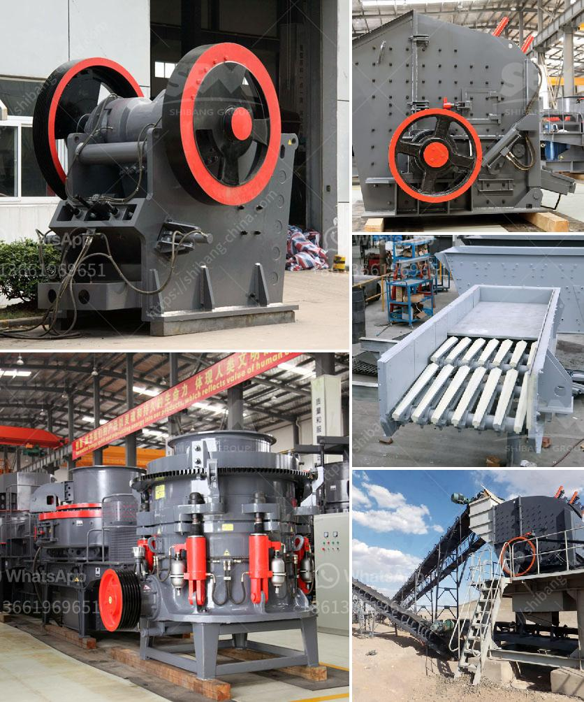

<h3>مصنع تكسير البوكسيت في الجزائر</h3>
تعتبر البوكسيت من الموارد الطبيعية الهامة التي توجد في الجزائر. وتُستخدم البوكسيت كخام أساسي لإنتاج الألومنيوم. ومن أجل تحقيق الاكتفاء الذاتي في صناعة الألومنيوم، تم بناء مصنع لتكسير البوكسيت في الجزائر.

يقع هذا المصنع في منطقة استغلال البوكسيت، وتم تجهيزه بأحدث التقنيات والمعدات لتكسير البوكسيت والتخلص من الشوائب والأتربة. يتم استخدام الفك المطحنة والفك المحطم لتكسير البوكسيت إلى أحجام أصغر قبل أن يتم نقله إلى الخطوط الإنتاجية الأخرى.

يتكون مصنع تكسير البوكسيت من عدة مراحل. في المرحلة الأولى، يتم تكسير البوكسيت في الفك المحطم، ويتم إزالة الشوائب والأتربة من خلال عمليات التنظيف والغسيل. بعد ذلك، يتم نقل البوكسيت إلى الفك المطحنة حيث يتم تكسيره إلى حجم أصغر. ثم يتم تمرير البوكسيت الناتج إلى الخطوط الإنتاجية الأخرى لعمليات مثل التجفيف والطحن والطرد المركزي.

تعتبر صناعة الألومنيوم من الصناعات الحساسة التي تتطلب اهتمامًا فائقًا بالجودة والبيئة. ولذلك، يتم اتخاذ تدابير صارمة في مصنع تكسير البوكسيت لضمان الامتثال للمعايير الصحية والبيئية. يتم تصفية الغازات الناتجة من عمليات التكسير وإزالة الشوائب من المياه المستخدمة في عملية الغسيل. كما يتم إعادة استخدام المياه بشكل فعال للحفاظ على الموارد المائية.

يعتبر مصنع تكسير البوكسيت في الجزائر مشروعًا استراتيجيًا يهدف إلى تحقيق الاكتفاء الذاتي في إنتاج الألومنيوم. فإن توفير الموارد المحلية يقلل من الاعتماد على واردات البوكسيت من الخارج ويعزز الاستدامة الاقتصادية للبلاد. بالإضافة إلى ذلك، فإن وجود مصنع تكسير البوكسيت يؤدي إلى توفير فرص العمل للشباب الجزائري وتحقيق التنمية الاقتصادية.

على الرغم من الفوائد الاقتصادية لمصنع تكسير البوكسيت في الجزائر، يجب أن نلاحظ الأثر البيئي لهذا المشروع. يجب اتخاذ التدابير الواجبة للحد من التأثيرات السلبية على البيئة، مثل التحكم في الانبعاثات والتخلص الملائم من النفايات. يجب أيضًا أن يكون هناك رصد دقيق ومستمر لتأثير المصنع على البيئة المحيطة به.

في الختام، يمثل مصنع تكسير البوكسيت في الجزائر إنجازًا هامًا في صناعة الألومنيوم. إن توفير الموارد المحلية وتعزيز التنمية الاقتصادية يسهم في بناء اقتصاد قوي ومستدام في الجزائر. ومن أجل الاستفادة الكاملة من هذا المصنع، يجب العمل على تحقيق التوازن بين الاقتصاد والبيئة والاجتماع.
<h3>Contact us</h3><ul><li><strong>Whatsapp:&nbsp;<a href="https://wa.me/8613661969651">+8613661969651</a></strong></li><li><a href="https://swt.shibang-china.com/?git&amp;zhl&amp;مصنع تكسير البوكسيت في الجزائر"><strong>Online Service(chat now)</strong></a></li></ul><h3>Related</h3><ul><li><a href='مطحنة الأسطوانة في نيجيريا.md'>مطحنة الأسطوانة في نيجيريا</a></li><li><a href='كسارة الحجر 100 طن للبيع.md'>كسارة الحجر 100 طن للبيع</a></li><li><a href='مطحنة فحم في ماليزيا.md'>مطحنة فحم في ماليزيا</a></li><li><a href='آلة كسارة في أوروبا.md'>آلة كسارة في أوروبا</a></li><li><a href='معدات سحق الصناعات الثقيلة في ماليزيا.md'>معدات سحق الصناعات الثقيلة في ماليزيا</a></li></ul>