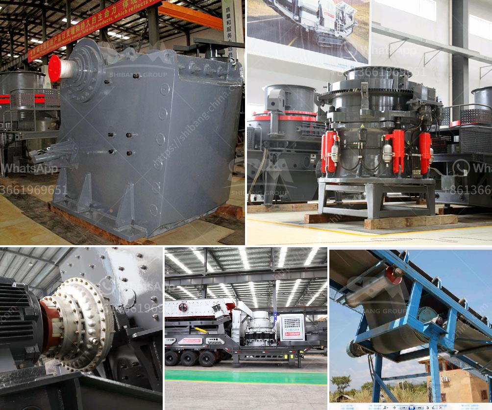

<h3>مصنع تكسير الحجارة المستعمل للبيع في إسبانيا</h3>
يعد تكسير الحجارة عملية أساسية في صناعة البناء والتشييد، حيث يتم استخدامها لتقسيم الصخور والحصى إلى قطع صغيرة من المواد التي يمكن استخدامها في عدة تطبيقات مثل إنتاج الخرسانة والإسفلت ومواد البناء الأخرى. في الوقت الحالي، تتوفر العديد من المصانع المستعملة لتكسير الحجارة للبيع في إسبانيا بأسعار تتراوح بين 200-400 كلمة.

تحظى إسبانيا بقاعدة صناعية ضخمة وتعد واحدة من أكبر المناطق المصنعة لمعدات التكسير في العالم، مما يعني وجود العديد من المصانع المستعملة للبيع. توجد مجموعة متنوعة من المصانع المستعملة المتاحة، بدايةً من المصانع الصغيرة المحمولة التي يمكن نقلها وتثبيتها بسهولة إلى المصانع الكبيرة الثابتة التي تصلح لإنتاج كميات كبيرة من المواد.

يمتاز شراء مصانع التكسير المستعملة بالعديد من المزايا. ففي المقام الأول، يكون سعر المصنع المستعمل أرخص بكثير من المصانع الجديدة، مما يساعد على توفير التكاليف وجعل الاستثمار أكثر جدوى. بالإضافة إلى ذلك، يمكن الحصول بسهولة على المصانع المستعملة، حيث يتوفر العديد منها في السوق، ويمكن شحنها وتركيبها بسرعة. ومن المهم أيضًا أن المصانع المستعملة قد تكون قد تجاوزت مرحلة الشروع في العمل، وبالتالي فإن الأداء والنتائج المتوقعة يمكن تقييمها قبل الشراء.

بالنسبة للمشترين المهتمين بشراء مصنع تكسير الحجارة المستعمل في إسبانيا، توجد العديد من الشركات المتخصصة في تزويد العملاء بالمصانع المستعملة وتوفير الاستشارات والدعم الفني اللازم. يفضل أن يتعامل المشتري مع شركة محترفة وموثوقة في هذا المجال لضمان الحصول على معدات عالية الجودة وبأفضل الأسعار.

وفي الختام، يُعتبر شراء مصنع تكسير الحجارة المستعمل في إسبانيا فرصة ممتازة للشركات وأصحاب المشاريع في صناعة البناء والتشييد للحصول على معدات عالية الجودة وبأسعار مناسبة. إذا كنت تفكر في توسيع أعمالك أو استبدال معداتك القديمة، فعليك أن تنظر في شراء مصنع تكسير الحجارة المستعمل في إسبانيا، حيث يمكنك الحصول على الأداء والجودة المطلوبة بتكلفة أقل.
<h3>Contact us</h3><ul><li><strong>Whatsapp:&nbsp;<a href="https://wa.me/8613661969651">+8613661969651</a></strong></li><li><a href="https://swt.shibang-china.com/?git&amp;zhl&amp;مصنع تكسير الحجارة المستعمل للبيع في إسبانيا"><strong>Online Service(chat now)</strong></a></li></ul><h3>Related</h3><ul><li><a href='سعر آلات كسارة المحجر.md'>سعر آلات كسارة المحجر</a></li><li><a href='مطحنة الكرة لمسحوق الألمنيوم.md'>مطحنة الكرة لمسحوق الألمنيوم</a></li><li><a href='كسارة الحجر في المغرب.md'>كسارة الحجر في المغرب</a></li><li><a href='كسارة صخور مصنوعة يدوياً.md'>كسارة صخور مصنوعة يدوياً</a></li><li><a href='كيفية حساب تكلفة الطحن.md'>كيفية حساب تكلفة الطحن</a></li></ul>