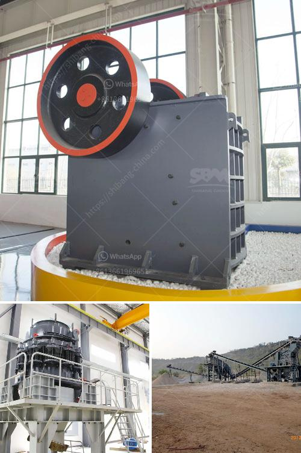

<h3>مصنع تكسير الحجر الألماني</h3>
يعتبر مصنع تكسير الحجر الألماني من بين المصانع الصناعية الهامة في صناعة البناء والإنشاءات. يقوم هذا المصنع بتكسير الحجر الطبيعي لإنتاج الركام الصلب الذي يستخدم في البناء والإنشاءات المختلفة، مثل الخرسانة والأسفلت.

يستخدم مصنع تكسير الحجر الألماني أحدث التقنيات والمعدات لتجهيز وتكسير الحجر. يبدأ العمل بفحص الحجر وفرزه حسب الحجم والجودة. يتم بعد ذلك تكسير الحجر باستخدام معدات خاصة مثل الكسارات والمطارق الهدم الثقيلة.

يتم تحويل الحجر الطبيعي إلى حجم صغير ومنتظم يتراوح بين 0-50 ملم، وفقًا للمواصفات والمتطلبات المحددة. يتم غسل الحجر المكسر لإزالة الشوائب والأتربة وتجفيفه بعناية لضمان جودته ونوعيته الممتازة.

بعد إنتاج الركام الصلب، يتم تحميله في شاحنات النقل المخصصة لنقله إلى العملاء. يتم التعامل مع هذا المصنع بمهنية عالية وفقًا للمعايير والمتطلبات القانونية والبيئية.

من المميزات الرئيسية لمصنع تكسير الحجر الألماني هو جودة المنتج النهائي. حيث يتم تكسير الحجر بدقة واهتمام كبير، مما يؤدي إلى إنتاج ركام صلب عالي الجودة ومتميز في خواصه الميكانيكية.

بفضل تقنيات التكسير المتقدمة وجودة المعدات المستخدمة، يتم الحصول على نسبة تكسير مثالية للحجر الطبيعي، مما يؤدي إلى زيادة الكفاءة والاقتصاد في استخدام المواد الخام. يقدم مصنع تكسير الحجر الألماني منتجات فعالة من حيث التكلفة للعملاء، وبالتالي يحقق ميزة تنافسية في السوق.

في النهاية، يعتبر مصنع تكسير الحجر الألماني مصدرًا موثوقًا للركام الصلب عالي الجودة في صناعة البناء والإنشاءات. يلبي هذا المصنع الاحتياجات المتزايدة للسوق ويواكب التطورات التكنولوجية في هذا المجال، مما يجعله خيارًا مثاليًا للمهندسين المعماريين والمقاولين في تلبية متطلباتهم وتحقيق النجاح في مشاريعهم.
<h3>Contact us</h3><ul><li><strong>Whatsapp:&nbsp;<a href="https://wa.me/8613661969651">+8613661969651</a></strong></li><li><a href="https://swt.shibang-china.com/?git&amp;zhl&amp;مصنع تكسير الحجر الألماني"><strong>Online Service(chat now)</strong></a></li></ul><h3>Related</h3><ul><li><a href='تكلفة منخفضة لسعر كسارة الفك في أوغندا.md'>تكلفة منخفضة لسعر كسارة الفك في أوغندا</a></li><li><a href='كسارات الحطام للبيع.md'>كسارات الحطام للبيع</a></li><li><a href='شركات بيع معدات التعدين في جنوب أفريقيا.md'>شركات بيع معدات التعدين في جنوب أفريقيا</a></li><li><a href='صناعة تكسير ومعالجة الرخام على نطاق صغير.md'>صناعة تكسير ومعالجة الرخام على نطاق صغير</a></li><li><a href='شركات تعدين الذهب في ألمانيا.md'>شركات تعدين الذهب في ألمانيا</a></li></ul>