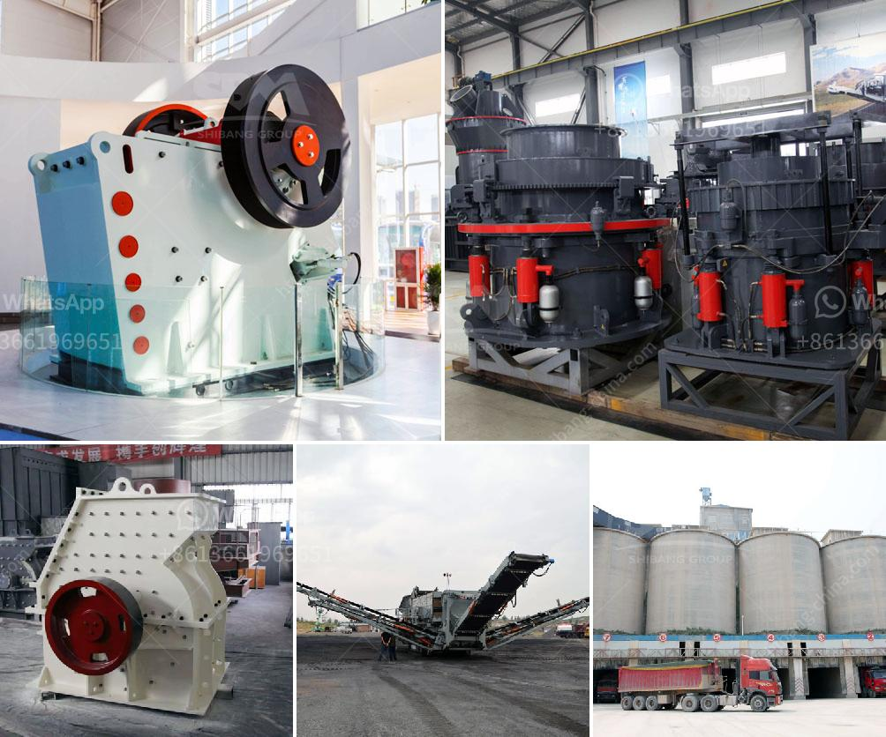

<h3>مصنع تكسير الحجر الجيري في الهند</h3>
يعد مصنع تكسير الحجر الجيري في الهند واحدًا من أهم المصانع في صناعة البناء والتشييد. يتم تحويل الحجر الجيري إلى مواد اصطناعية غير عضوية تستخدم في العديد من التطبيقات المختلفة مثل صناعة الأسمنت وإنتاج الجبس وإنشاء الطرق والجسور.

تعتبر الهند أحد أكبر منتجي الحجر الجيري في العالم، حيث تحتوي على مناطق غنية بهذا المعدن الذي يوجد بكثرة في ولايات راجستان وأندرا براديش وماديا براديش وتيلانجانا. لذا، فإن وجود مصنع تكسير الحجر الجيري في الهند يعطي لقطاع التعدين مرونة كبيرة في استخدام هذا المورد الضخم.

يعمل مصنع تكسير الحجر الجيري على تحويل الصخور الضخمة من الحجم الأولي إلى كتل صغيرة يمكن استخدامها في الصناعات المختلفة. يتم استخدام الكسارات المختلفة لتحطم الصخور الضخمة وتجزئتها إلى قطع صغيرة بأحجام متفاوتة. يتم تخزين هذه القطع في مستودعات خاصة ويتم توزيعها وفقاً لاحتياجات الأسواق المستهدفة.

واحدة من أهم الصناعات التي يستخدم فيها الحجر الجيري هي صناعة الأسمنت. فتتم إضافة قطع الحجر الجيري المكسرة إلى الكلنكر والجبس لإنتاج الأسمنت. يعتبر هذا الاستخدام الأساسي للحجر الجيري باعتباره عاملًا أساسيًا في صناعة البناء والتشييد.

بالإضافة إلى ذلك، يتم استخدام الحجر الجيري المكسر في صناعة الجبس، فعند مزج الحجر الجيري المكسر مع الجبس، يتم تكوين مادة صلبة تستخدم في البناء والتشييد. فالجبس الناتج من الجير والجبس يُستخدم في صناعة الجبس العادي والجبس المعالج والجبس الاصطناعي.

أيضًا، يتم استخدام الحجر الجيري المكسر في إنشاء الطرق والجسور. يتم مزج قطع الحجر الجيري المكسرة مع المواد الركامية الأخرى مثل الحصى والرمل لملأ الفجوات في الطرق والجسور. يساهم استخدام الحجر الجيري في إنشاء الطرق والجسور في تحسين جودة وقوة البنية التحتية وتحقيق الاستقرار الطويل الأمد لها.

باختصار، يعد مصنع تكسير الحجر الجيري في الهند أحد أهم المصانع في صناعة البناء والتشييد. بفضل الحجر الجيري الوفير المتوافر في الهند، يساهم هذا المصنع في توفير مواد اصطناعية غير عضوية تستخدم في العديد من التطبيقات المختلفة مثل صناعة الأسمنت وإنتاج الجبس وإنشاء الطرق والجسور، مما يسهم في دعم التطور العمراني والاقتصادي في الهند.
<h3>Contact us</h3><ul><li><strong>Whatsapp:&nbsp;<a href="https://wa.me/8613661969651">+8613661969651</a></strong></li><li><a href="https://swt.shibang-china.com/?git&amp;zhl&amp;مصنع تكسير الحجر الجيري في الهند"><strong>Online Service(chat now)</strong></a></li></ul><h3>Related</h3><ul><li><a href='أنواع السيور الناقلة.md'>أنواع السيور الناقلة</a></li><li><a href='شركات تصنيع آلات الكسارة في شنغهاي.md'>شركات تصنيع آلات الكسارة في شنغهاي</a></li><li><a href='سعر مطحنة الكرة.md'>سعر مطحنة الكرة</a></li><li><a href='مورد مصنع التكسير والفرز في الصين.md'>مورد مصنع التكسير والفرز في الصين</a></li><li><a href='كسارة حجر في تروخيلو، بوليفيا.md'>كسارة حجر في تروخيلو، بوليفيا</a></li></ul>