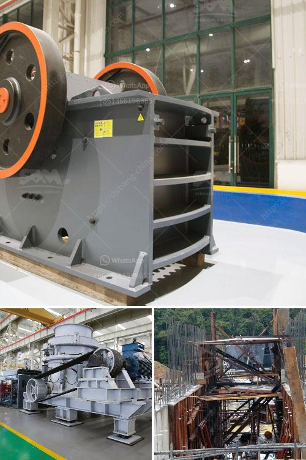

<h3>مصنع تكسير الحجر الكلي في الصين</h3>
يعتبر مصنع تكسير الحجر الكلي في الصين واحدًا من أكبر المصانع في العالم في هذا المجال. يقع المصنع في منطقة ذات طبيعة خلابة في الصين، حيث الهواء النقي والمياه الصافية والمساحات الواسعة المليئة بالحجارة الكبيرة. يعتبر المصنع قطبًا رئيسيًا لصناعة تكسير الحجر الكلي في البلاد.

يضم المصنع أحدث التقنيات والمعدات المتطورة التي تستخدم لتكسير الحجر الكلي بطريقة فعالة وسريعة. يتم استخدام الكسارات والمطاحن والغرابيل والناقلات المختلفة لتكسير الحجر الكلي بشكل أمثل. تعمل هذه المعدات على تحويل الحجارة الكبيرة إلى قطع ذات أحجام مختلفة وفقًا لاحتياجات العملاء.

يتم استخدام المنتجات النهائية الناتجة عن عملية التكسير في العديد من الصناعات المختلفة. فهي تستخدم في بناء الطرق والجسور والأبنية والمباني العامة. كما يتم استخدامها في إنشاء الممرات والممرات السككية والارصفة والأراضي الزراعية. يتعدى استخدام المنتجات النهائية لصناعة التكسير الحجر الكلي هذه حدود الصين، حيث يتم تصديرها أيضًا إلى العديد من البلدان الأخرى.

مصنع تكسير الحجر الكلي في الصين يولي أهمية كبيرة للجودة والسلامة. يتم اتباع إجراءات صارمة للمراقبة والفحص في كل مرحلة من مراحل عملية التكسير. تتم مراقبة جودة المنتجات باستمرار لضمان تلبيتها لمعايير الجودة المطلوبة. يتم أيضًا العناية الشديدة بالسلامة في مصنع التكسير، حيث يتم توفير الحماية وتعليمات السلامة اللازمة للعاملين.

بالإضافة إلى ذلك، يلتزم المصنع بمسؤولية بيئية قوية. يتم اتباع معايير صارمة لحماية البيئة والحد من التأثيرات السلبية لعمليات التكسير. يتم التخلص من النفايات بشكل آمن ويتم مراعاة الصحة والسلامة العامة للبيئة المحيطة.

في النهاية، يعتبر مصنع تكسير الحجر الكلي في الصين مؤسسة رائدة ومهمة في صناعة التكسير. يعتبر المصنع مثالًا يحتذى به في استخدام التقنيات المتطورة والمعدات الحديثة لتحقيق الكفاءة والجودة في عمليات التكسير. كما أنه يلتزم بالمسؤولية الاجتماعية والبيئية، مما يجعله مصنعًا قائدًا في هذا المجال.
<h3>Contact us</h3><ul><li><strong>Whatsapp:&nbsp;<a href="https://wa.me/8613661969651">+8613661969651</a></strong></li><li><a href="https://swt.shibang-china.com/?git&amp;zhl&amp;مصنع تكسير الحجر الكلي في الصين"><strong>Online Service(chat now)</strong></a></li></ul><h3>Related</h3><ul><li><a href='معدات في ماليزيا لسحق المحمولة.md'>معدات في ماليزيا لسحق المحمولة</a></li><li><a href='آلة تكبير الفحم الدقيقة في الهند.md'>آلة تكبير الفحم الدقيقة في الهند</a></li><li><a href='مورد مصنع تكسير الحجر في الفلبين.md'>مورد مصنع تكسير الحجر في الفلبين</a></li><li><a href='آلة قطع الحجر المستخدمة من اليابان.md'>آلة قطع الحجر المستخدمة من اليابان</a></li><li><a href='تكلفة إنشاء مصنع خام الحديد.md'>تكلفة إنشاء مصنع خام الحديد</a></li></ul>