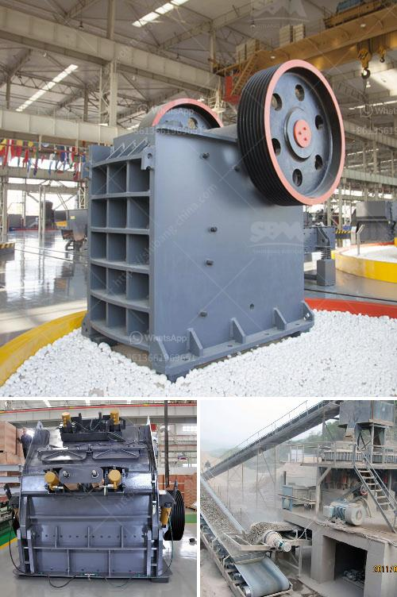

<h3>مصنع تكسير الحجر في الهند بسعر مناسب</h3>
تعتبر صناعة تكسير الحجر من الصناعات الحيوية في الهند، حيث تلعب دوراً هاماً في تلبية الاحتياجات المتزايدة لمواد البناء والبنية التحتية في البلاد. واحدة من أبرز الشركات في هذا المجال هي "مصنع تكسير الحجر بالهند"، وهو مصنع متخصص يعمل على تكسير الحجر لإنتاج مختلف الركام اللازم لمشاريع البناء.

مصنع تكسير الحجر بالهند يمتاز بالعديد من الجوانب التي تجعله اختيارًا ممتازًا للعملاء الذين يبحثون عن جودة عالية وسعر مناسب. فعلى سبيل المثال، يتمتع المصنع بقدرة إنتاجية عالية تتيح إنتاج كميات كبيرة من الركام يوميًا، مما يعني قدرة تلبية الطلبات الضخمة في فترات زمنية قصيرة.

بالإضافة إلى ذلك، يعتمد مصنع تكسير الحجر على تكنولوجيا حديثة ومعدات متطورة لضمان جودة المنتج النهائي. فهو يستخدم أجهزة الكسارة الفكية وكسارة المخروط لتكسير الحجر إلى قطع صغيرة، وبعد ذلك يتم فصل الركام عن الغبار والشوائب باستخدام أنظمة متطورة للفحص والتنقية.

لا يقتصر دور المصنع على إنتاج الركام فحسب، بل يولي أيضًا اهتماماً كبيراً للحفاظ على البيئة. فهو يستخدم نظام تنقية الهواء للتقليل من انبعاثات الغبار والجسيمات الصغيرة، ويتبع معايير صارمة لمعالجة المياه المستخدمة في عمليات التكسير، ويعتمد مواد متوافقة مع البيئة في إنتاجه.

أما بالنسبة للسعر، فيعتبر مصنع تكسير الحجر بالهند من بين الشركات التي تقدم منتجاتها بأسعار معقولة ومنافسة. يتفهم المصنع قيمة المشاريع المختلفة ويعمل على تلبية احتياجات العملاء بأسعار تنافسية تتراوح بين 200-400 روبية هندية.

في النهاية، يعد مصنع تكسير الحجر بالهند اختياراً جيدًا لمختلف العملاء الذين يبحثون عن ركام عالي الجودة بسعر مناسب. يقدم المصنع المنتجات بأعلى معايير الجودة، ويعمل على حماية البيئة في عملية الإنتاج، ويتميز بأسعار تنافسية ملائمة لمتطلبات العملاء.
<h3>Contact us</h3><ul><li><strong>Whatsapp:&nbsp;<a href="https://wa.me/8613661969651">+8613661969651</a></strong></li><li><a href="https://swt.shibang-china.com/?git&amp;zhl&amp;مصنع تكسير الحجر في الهند بسعر مناسب"><strong>Online Service(chat now)</strong></a></li></ul><h3>Related</h3><ul><li><a href='مصانع غسيل الكروم في جنوب أفريقيا.md'>مصانع غسيل الكروم في جنوب أفريقيا</a></li><li><a href='مطحنة السيليكا المطحونة للبيع.md'>مطحنة السيليكا المطحونة للبيع</a></li><li><a href='سعر كسارة الحصى في رانشي.md'>سعر كسارة الحصى في رانشي</a></li><li><a href='تكسير النبات بتنسيق PDF.md'>تكسير النبات بتنسيق PDF</a></li><li><a href='سعر مطحنة الكرة ريموند الفائقة الدقة.md'>سعر مطحنة الكرة ريموند الفائقة الدقة</a></li></ul>