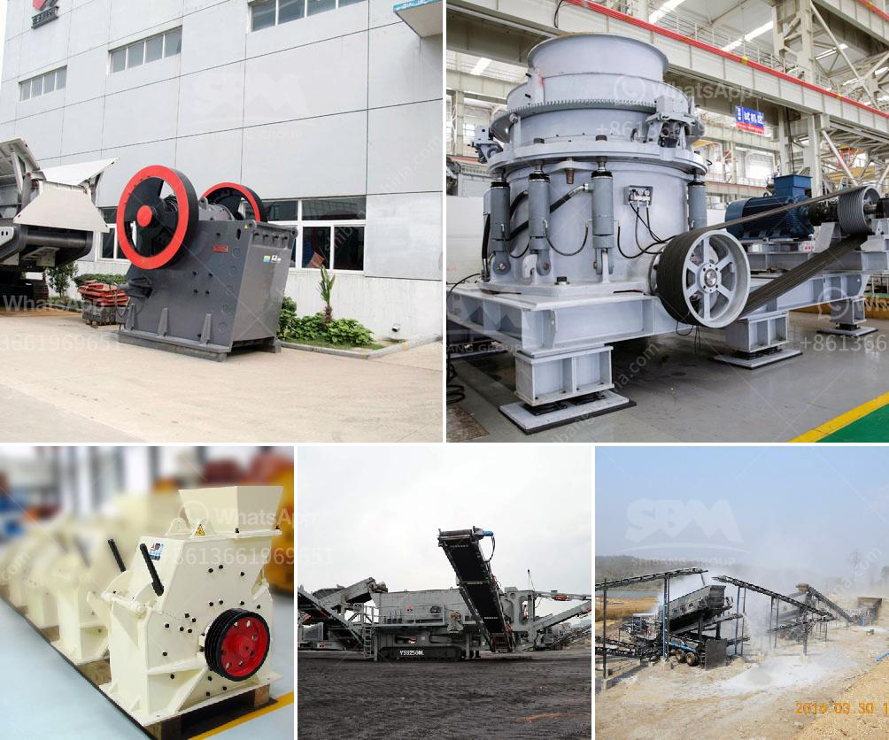

<h3>مصنع تكسير الحجر في كوريا</h3>
يعتبر مصنع تكسير الحجر في كوريا واحدًا من المصانع البارزة والمتقدمة في هذا المجال. يهدف المصنع إلى تحويل الأحجار الكبيرة والخشنة إلى حجارة صغيرة ومستديرة الشكل، مما يجعلها مادة خام قيمة يمكن استخدامها في صناعات مختلفة.

قد تتساءل، ما الذي يجعل هذا المصنع متميزًا عن غيره؟ الإجابة تكمن في التكنولوجيا المتطورة والمعدات الحديثة التي يستخدمها المصنع. يمتلك المصنع محطة تكسير مجهزة بالعديد من الآلات المتخصصة، مثل كسارات الفك والمطارق الهيدروليكية، التي تساعد في تكسير الأحجار بسرعة وكفاءة عالية.

عملية تكسير الحجر تعتمد على جملة من العمليات، بدءًا بتفتيت الحجارة الكبيرة باستخدام الكسارات الفكية. يتم بعدها تحويل الأحجار المكسورة إلى حجم أصغر باستخدام المطارق الهيدروليكية. بفضل هذه الأجهزة الحديثة، يمكن تنفيذ هذه العملية بسرعة ودقة، مما يضمن إنتاج مواد ذات جودة عالية.

تستخدم الحجارة المكسورة في المصنع في العديد من الصناعات. فعلى سبيل المثال، تُستخدم في صناعة الإسمنت وصناعة البناء لتكوين الخرسانة والأسمنت. كما يمكن استخدامها في الطرق والبنية التحتية لتعبيد الطرق والأرصفة. بالإضافة إلى ذلك، تُستخدم الحصى المكسورة في بناء المباني والمنشآت الصناعية.

يعتبر مصنع تكسير الحجر في كوريا مصدرًا للفرص الاقتصادية وخلق فرص عمل. يسهم هذا المصنع بشكل كبير في دعم الاقتصاد المحلي وتوفير فرص العمل للسكان المحليين. يعزز المصنع أيضًا التكنولوجيا والابتكار في هذا القطاع، مما يجذب الاستثمارات الأجنبية ويعزز تطوير صناعة التعدين في البلاد.

من الواضح أن مصنع تكسير الحجر في كوريا يلعب دورًا حاسمًا في صناعة التعدين ويساهم في تعزيز الاقتصاد المحلي. باستمراره في استخدام التكنولوجيا المتطورة وتحسين عملياته، يمكن للمصنع أن يحافظ على مكانته المتقدمة كأحد الرواد في هذا القطاع.
<h3>Contact us</h3><ul><li><strong>Whatsapp:&nbsp;<a href="https://wa.me/8613661969651">+8613661969651</a></strong></li><li><a href="https://swt.shibang-china.com/?git&amp;zhl&amp;مصنع تكسير الحجر في كوريا"><strong>Online Service(chat now)</strong></a></li></ul><h3>Related</h3><ul><li><a href='كل معدة لكل جهاز كسارة فك.md'>كل معدة لكل جهاز كسارة فك</a></li><li><a href='طريقة التعويم لتحليل رمل السيليكا.md'>طريقة التعويم لتحليل رمل السيليكا</a></li><li><a href='مطحنة رايموند في ماليزيا.md'>مطحنة رايموند في ماليزيا</a></li><li><a href='سيور ناقلة للخرسانة.md'>سيور ناقلة للخرسانة</a></li><li><a href='آفاق صناعة كسارة الجرانيت.md'>آفاق صناعة كسارة الجرانيت</a></li></ul>