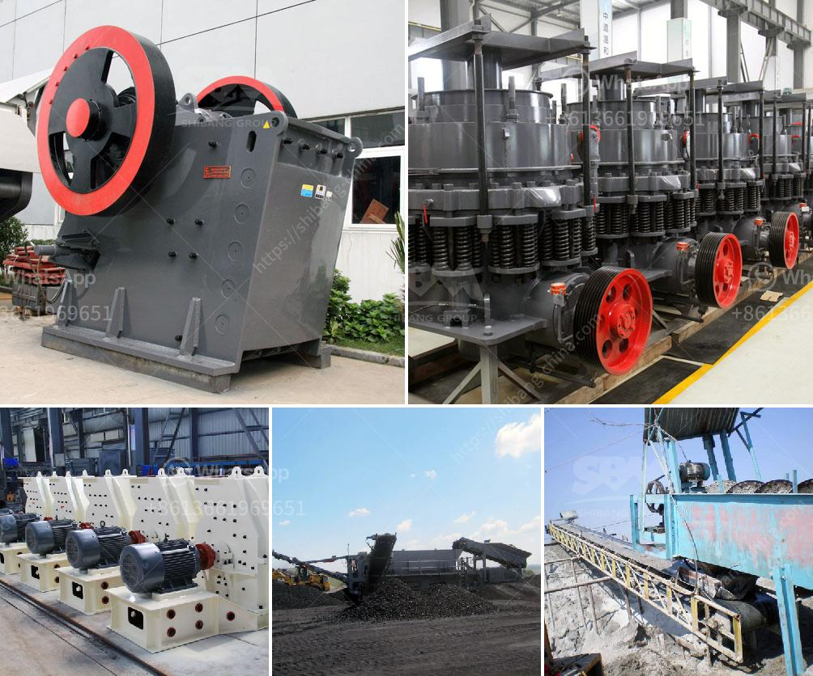

<h3>مصنع تكسير الحجر في نيجيريا</h3>
نيجيريا هي واحدة من الدول النامية في إفريقيا التي تشهد تنمية صناعية متسارعة في العقود الأخيرة. تعتبر صناعة تكسير الحجر من الصناعات الرئيسية التي تساهم في التنمية الاقتصادية للبلاد. يُعد مصنع تكسير الحجر في نيجيريا من أهم المصانع في هذا القطاع.

يقوم مصنع تكسير الحجر بعملية إزالة الصخور الصلبة أو الحصى من المحاجر وتحويلها إلى مواد قابلة للاستخدام في إنتاج الخرسانة والطرق والأعمال الإنشائية الأخرى. يحتوي المصنع على منشآت تتكون من كسارات الفك والكسارات التصادمية والغرابيل والحزام الناقل وغيرها من المعدات اللازمة لتكسير الصخور بطريقة فعالة وآمنة.

تحظى صناعة تكسير الحجر في نيجيريا باهتمام كبير من قبل الحكومة والقطاع الخاص بسبب الطلب المتزايد على المواد الإنشائية في البلاد. يُستخدم الحجر المكسور في بناء المباني والطرق والأنفاق والجسور والسدود وغيرها من المشاريع البنية التحتية التي تعزز التنمية الاقتصادية والاجتماعية في البلاد.

مصنع تكسير الحجر في نيجيريا يعمل على تلبية معايير الجودة العالية والمواصفات الفنية اللازمة. يتم الاهتمام بتدريب وتأهيل العاملين في المصنع لضمان تشغيل المعدات بطريقة صحيحة وآمنة. يتم أيضًا تنفيذ عمليات الصيانة الدورية وإجراءات السلامة لضمان استمرارية وكفاءة المصنع.

يعد مصنع تكسير الحجر في نيجيريا فرصة استثمارية مثالية للمستثمرين المحليين والأجانب على حد سواء. توجد قدرات غير مستغلة لاستغلال الموارد الطبيعية وتلبية الطلب المتزايد على المواد الإنشائية في السوق المحلية والإقليمية. إن وجود مصانع تكسير الحجر المتطورة في نيجيريا يساهم في تعزيز التحول الاقتصادي وخلق فرص عمل جديدة.

باختصار، يمثل مصنع تكسير الحجر في نيجيريا مصدرًا مهمًا للمواد الإنشائية ويساهم في التنمية الاقتصادية للبلاد. يتطلب هذا القطاع اهتمامًا مستمرًا من الحكومة والشركات الخاصة لتنميته بشكل مستدام وتلبية احتياجات سوق البناء المتزايدة. من المتوقع أن يستمر النمو والتطور في هذا القطاع في السنوات القادمة مما يعزز التنمية الشاملة لنيجيريا.
<h3>Contact us</h3><ul><li><strong>Whatsapp:&nbsp;<a href="https://wa.me/8613661969651">+8613661969651</a></strong></li><li><a href="https://swt.shibang-china.com/?git&amp;zhl&amp;مصنع تكسير الحجر في نيجيريا"><strong>Online Service(chat now)</strong></a></li></ul><h3>Related</h3><ul><li><a href='آلة غسيل الرمال للبيع.md'>آلة غسيل الرمال للبيع</a></li><li><a href='كسارة الحجر في المغرب.md'>كسارة الحجر في المغرب</a></li><li><a href='معدات الطحن والفرز للرمل والحصى.md'>معدات الطحن والفرز للرمل والحصى</a></li><li><a href='سعر كسارة الفحم.md'>سعر كسارة الفحم</a></li><li><a href='تصميم كسارة الحجر في الفلبين.md'>تصميم كسارة الحجر في الفلبين</a></li></ul>