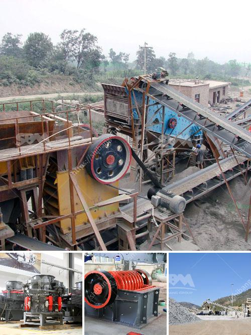

<h3>مصنع تكسير الحصى بمقياس كبير</h3>
تشكل صناعة البناء والتشييد قطاعًا حيويًا للاقتصاد في جميع أنحاء العالم، حيث تسهم في تطوير البنية التحتية وتلبية احتياجات المجتمع من الإسكان والمباني التجارية. أحد المكونات الأساسية في صناعة البناء هو الحصى، الذي يتم الحصول عليه من تكسير الصخور الصلبة وتجهيزه في مصانع تكسير الحصى.

من أجل تلبية الطلب المتزايد على الحصى، تم إنشاء مصانع تكسير الحصى بمقياس كبير. يتم عادة وضع هذه المصانع في مناطق تواجد الصخور بكميات كبيرة، حيث تكون عملية الحصول على الحصى أسهل وأكثر كفاءة. يشمل المصنع عدة مراحل في عملية تكسير الحصى، بدءًا من الحفر والتنقيب عن الصخور وحتى التصنيف والفرز للحصى حسب حجمها المطلوب.

من أهم المزايا لمصانع تكسير الحصى بمقياس كبير هو القدرة على إنتاج كميات كبيرة من الحصى بكفاءة عالية، وبالتالي تلبية احتياجات السوق المتزايدة. بالإضافة إلى ذلك، فإن وجود مصانع تكسير الحصى بمقياس كبير يساهم في تحقيق التوفير في التكاليف والزمن، حيث توفر تكنولوجيا المصنع الحديثة إمكانية تحسين عمليات الانتاج وزيادة الإنتاجية.

على الرغم من أهمية مصانع تكسير الحصى بمقياس كبير، فإنها تواجه بعض التحديات. أحد أهم التحديات هو تأثير هذه المصانع على البيئة والصحة العامة. يمكن أن تؤدي العمليات المستخدمة في تكسير الحصى إلى إنتاج الغبار والضوضاء والتلوث البيئي. لذلك، يجب على المصانع العمل بالالتزام بأعلى المعايير البيئية واتخاذ التدابير اللازمة للحد من أي تأثير سلبي.

بالإضافة إلى ذلك، قد يواجه مصنع تكسير الحصى بمقياس كبير تحديات في إدارة الموارد البشرية والمهارات المطلوبة لتشغيل وصيانة المصنع. يتطلب تشغيل مثل هذه المصانع فريقًا ذا مهارات تقنية وفنية عالية لضمان سلامة عمليات التكسير وجودة منتجات الحصى.

لخلاصة القول، مصانع تكسير الحصى بمقياس كبير تشكل جزءًا هامًا في صناعة البناء والتشييد، وتوفر الحصى المطلوب لإكمال المشاريع. إن التحديات التي تواجهها تلك المصانع تتطلب اهتمامًا كبيرًا بمحيط العمل واحترام المعايير البيئية واكتساب المهارات اللازمة لتشغيل المصانع بكفاءة عالية. بتلك الطرق، يمكن أن تستمر مصانع تكسير الحصى بمقياس كبير في دفع صناعة البناء والتشييد إلى الأمام وتلبية الاحتياجات المستقبلية.
<h3>Contact us</h3><ul><li><strong>Whatsapp:&nbsp;<a href="https://wa.me/8613661969651">+8613661969651</a></strong></li><li><a href="https://swt.shibang-china.com/?git&amp;zhl&amp;مصنع تكسير الحصى بمقياس كبير"><strong>Online Service(chat now)</strong></a></li></ul><h3>Related</h3><ul><li><a href='كسارات حجر مستعملة للبيع.md'>كسارات حجر مستعملة للبيع</a></li><li><a href='مصنعي مطاحن الفحم في الهند.md'>مصنعي مطاحن الفحم في الهند</a></li><li><a href='بيع كسارة الحجر.md'>بيع كسارة الحجر</a></li><li><a href='مطحنة الكرة المستخدمة للبيع في الهند.md'>مطحنة الكرة المستخدمة للبيع في الهند</a></li><li><a href='مصانع تكسير الحجر في الهند.md'>مصانع تكسير الحجر في الهند</a></li></ul>