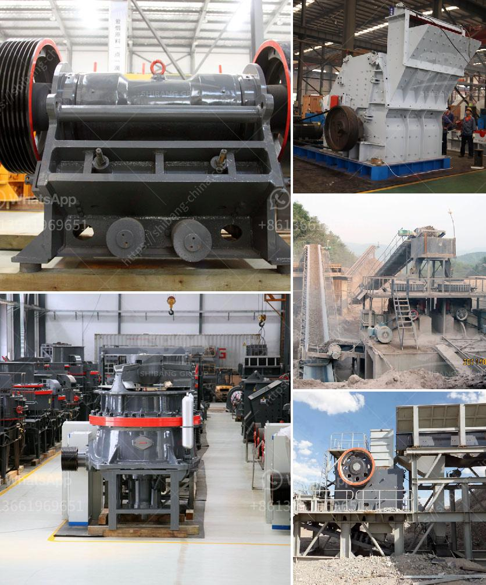

<h3>مصنع تكسير الحصى في جنوب أفريقيا</h3>
يعتبر مصنع تكسير الحصى في جنوب أفريقيا من بين أهم المصانع التي تعمل في مجال صناعة البناء والبنية التحتية. يتم تجميع الحصى من المناجم المحلية وتكسيره وفرزه في المصنع لإنتاج المنتج النهائي الذي يتم استخدامه في البناء وتعبيد الطرق وأعمال الرصف.

يتكون المصنع من مجموعة من المعدات والآلات المتخصصة التي تعمل بشكل متكامل لتكسير الحصى وفرزه وفقًا للمواصفات المطلوبة. تشمل هذه المعدات الكسارات والغرابيل والناقلات اللولبية وأجهزة التحكم في العمليات.

عملية التكسير تتم بواسطة الكسارات التي تقوم بفرم الحصى الخام إلى قطع صغيرة وفتات، حيث يتم تحديد حجم القطع المطلوب تحقيقه بواسطة شبكات معدنية. يتم تحويل الحصى المكسر إلى الغرابيل حيث يتم فصل أجزاء الحصى المختلفة حسب حجمها. تُستخدم الناقلات اللولبية لنقل الحصى المكسر من المرحلة إلى المرحلة الأخرى من عملية التصنيع.

هناك العديد من الفوائد المرتبطة باستخدام حصى مكسر في البناء. فمثلاً، يعتبر الحصى من المواد المستدامة والصديقة للبيئة حيث يمكن استخدام المواد الطبيعية التي لا تتسبب في تلوث البيئة. بالإضافة إلى ذلك، يعتبر الحصى مادة قوية ومتينة، مما يجعله مثاليًا للاستخدام في الهياكل التي تتعامل مع الضغوط والاهتزازات المستمرة.

وفي ختام المقالة، يمكن القول إن مصنع تكسير الحصى في جنوب أفريقيا هو مكان حيوي وضروري لصناعة البناء في البلاد. يمكن أن يلبي المصنع احتياجات السوق المحلية والإقليمية في الحصى المكسر، ويوفر مواد بناء ممتازة وفعالة من حيث التكلفة.
<h3>Contact us</h3><ul><li><strong>Whatsapp:&nbsp;<a href="https://wa.me/8613661969651">+8613661969651</a></strong></li><li><a href="https://swt.shibang-china.com/?git&amp;zhl&amp;مصنع تكسير الحصى في جنوب أفريقيا"><strong>Online Service(chat now)</strong></a></li></ul><h3>Related</h3><ul><li><a href='كسارات الحجر الجيري المستخدمة للبيع في تكساس.md'>كسارات الحجر الجيري المستخدمة للبيع في تكساس</a></li><li><a href='ما هو مطحنة الكرة.md'>ما هو مطحنة الكرة</a></li><li><a href='شركة تصنيع معدات كسارة الحجر في ألمانيا.md'>شركة تصنيع معدات كسارة الحجر في ألمانيا</a></li><li><a href='كسارات مزدوجة التبديل.md'>كسارات مزدوجة التبديل</a></li><li><a href='خط تكسير الحجر الجرانيت.md'>خط تكسير الحجر الجرانيت</a></li></ul>