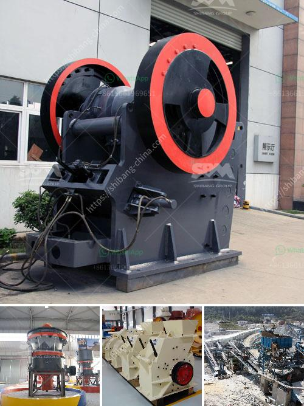

<h3>مصنع تكسير الدولوميت في بهاروتش</h3>
إحدى الصناعات الهامة في مجال التعدين ومعالجة المواد الصخرية هي صناعة تكسير الدولوميت. واحدة من هذه المصانع تقع في منطقة بهاروتش وهي من أكبر المصانع في المنطقة.

مصنع تكسير الدولوميت في بهاروتش يقوم بعملية تحويل الصخور الصلبة من الدولوميت إلى مواد أكثر قابلية للاستخدام في العديد من الصناعات المختلفة. يتم استخراج الدولوميت من المناجم المجاورة ويتم نقلها إلى المصنع حيث تتم عملية التكسير والتحويل.

الدولوميت هي صخرة صلبة تحتوي على نسبة عالية من الكالسيوم والمغنيسيوم، مما يجعلها مادة مرغوبة في العديد من الصناعات. يتم استخدام الدولوميت في صناعة الصلب والأسمدة وصناعة الزجاج والأسمنت وغيرها من الصناعات الكيميائية. لذلك فإن وجود مصنع تكسير الدولوميت في بهاروتش يلعب دورًا حيويًا في تلبية احتياجات هذه الصناعات.

عملية تكسير الدولوميت تشمل عدة خطوات. أولاً، تتم عملية سحق الدولوميت الصلبة إلى قطع صغيرة باستخدام معدات الكسارة. ثم، تمر القطع الصغيرة من الدولوميت بعملية التحويل بواسطة آلات تقوم بفصل الكالسيوم والمغنيسيوم عن بعضهما البعض.

يعتبر مصنع تكسير الدولوميت في بهاروتش مصنعًا حديثًا ومجهزًا بأحدث التقنيات والمعدات. يتمتع المصنع بفريق محترف ومؤهل يدير عمليات التكسير والتحويل بكفاءة عالية. يتم الاهتمام بجودة المنتج النهائي وتلبية متطلبات العملاء بدقة.

يؤثر مصنع تكسير الدولوميت في بهاروتش إيجابًا على الاقتصاد المحلي. يوفر فرص عمل للسكان المحليين ويساهم في تحسين مستوى المعيشة في المنطقة. كما أن الصناعة المتزايدة لتكسير الدولوميت تعزز التنمية الاقتصادية للمنطقة وتعزز تجارة المواد الصخرية.

بشكل عام، يعد مصنع تكسير الدولوميت في بهاروتش مثالًا نموذجيًا لكيفية استخدام المواد الصخرية بطرق فعالة ومستدامة. تلبي هذه الصناعة احتياجات الصناعات المختلفة وتحقق الاستدامة البيئية والاقتصادية للمنطقة.
<h3>Contact us</h3><ul><li><strong>Whatsapp:&nbsp;<a href="https://wa.me/8613661969651">+8613661969651</a></strong></li><li><a href="https://swt.shibang-china.com/?git&amp;zhl&amp;مصنع تكسير الدولوميت في بهاروتش"><strong>Online Service(chat now)</strong></a></li></ul><h3>Related</h3><ul><li><a href='كسارات الأسمنت المستخدمة للبيع.md'>كسارات الأسمنت المستخدمة للبيع</a></li><li><a href='مصنع إنتاج مسحوق الجبس في أوروبا.md'>مصنع إنتاج مسحوق الجبس في أوروبا</a></li><li><a href='خط إنتاج مسحوق الجبس.md'>خط إنتاج مسحوق الجبس</a></li><li><a href='تنقية الجرافيت في معالجة المعادن.md'>تنقية الجرافيت في معالجة المعادن</a></li><li><a href='كسارة الحجر والمضافة.md'>كسارة الحجر والمضافة</a></li></ul>