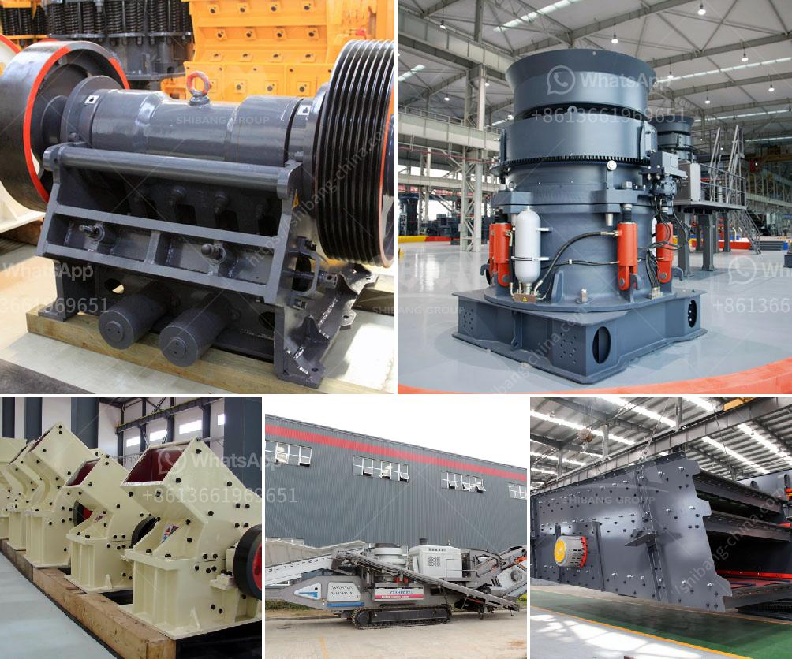

<h3>مصنع تكسير الدولوميت في تركيا</h3>
تعتبر الدولوميت من المواد الطبيعية الهامة في العديد من الصناعات المختلفة، وتستخدم على نطاق واسع في صناعة الصلب وصناعة الزجاج وصناعة الأسمدة وصناعة البناء. وتركيا هي واحدة من الدول التي تمتلك مصادر غنية من الدولوميت.

يعتبر مصنع تكسير الدولوميت في تركيا واحدًا من أهم المصانع في البلاد. يقع المصنع في منطقة ذات طبيعة خلابة وجميلة وتتميز بتركيبة صخورية غنية بالدولوميت. يعتبر هذا المصنع من الروافد الهامة للصناعة في البلاد، حيث يقوم بإنتاج مسحوق الدولوميت عالي الجودة.

تعتمد عملية تصنيع مسحوق الدولوميت في المصنع على عدة خطوات. أولاً، يتم التعدين لاستخراج الدولوميت من الصخور، حيث يتم استخدام الآلات والمعدات الثقيلة لهذا الغرض. بعد ذلك يتم تكسير الدولوميت إلى جزيئات صغيرة باستخدام آلات الكسارة. ثم يتم طحن الدولوميت المكسورة إلى مسحوق ناعم باستخدام مطاحن الأسطوانات.

يتم تنقية مسحوق الدولوميت الناتج من المصنع لضمان جودته ونقاوته. وتتم هذه العملية باستخدام التقنيات المتقدمة لفصل الشوائب والشوائب الأخرى. كما يجرى اختبارات دقيقة للتأكد من توافق المنتج مع المعايير الدولية.

تعمل المصانع المحلية والدولية في تركيا على شراء مسحوق الدولوميت من هذا المصنع لاستخدامه في إنتاج الصلب والزجاج والأسمدة. كما يتم تصدير المنتج إلى العديد من الدول الأخرى حول العالم. يتم تعبئة المسحوق في أكياس صغيرة أو كبيرة حسب طلب العملاء.

يحرص المصنع على تطبيق أعلى معايير الجودة والسلامة في عمليات الإنتاج. يتم الاهتمام بالتدريب والتطوير المستمر للعاملين في المصنع لضمان جودة المنتج النهائي وسلامة العمليات. كما يتم اتخاذ احتياطات لحماية البيئة والحفاظ على الموارد الطبيعية.

باختصار، يعد مصنع تكسير الدولوميت في تركيا من المصانع الهامة في البلاد. يلعب دورًا حيويًا في تلبية احتياجات الصناعة المحلية والعالمية. يقوم المصنع بإنتاج مسحوق الدولوميت عالي الجودة والنقاء، مع الالتزام بأعلى قيم الجودة والسلامة في الإنتاج.
<h3>Contact us</h3><ul><li><strong>Whatsapp:&nbsp;<a href="https://wa.me/8613661969651">+8613661969651</a></strong></li><li><a href="https://swt.shibang-china.com/?git&amp;zhl&amp;مصنع تكسير الدولوميت في تركيا"><strong>Online Service(chat now)</strong></a></li></ul><h3>Related</h3><ul><li><a href='معدات المحجر المملكة المتحدة.md'>معدات المحجر المملكة المتحدة</a></li><li><a href='آلة كسارة الحجر.md'>آلة كسارة الحجر</a></li><li><a href='جهاز كسر الصخور في جنوب أفريقيا.md'>جهاز كسر الصخور في جنوب أفريقيا</a></li><li><a href='مطحنة حجر نيجيريا.md'>مطحنة حجر نيجيريا</a></li><li><a href='تجار كسارة الفك المحمولة في كينيا.md'>تجار كسارة الفك المحمولة في كينيا</a></li></ul>