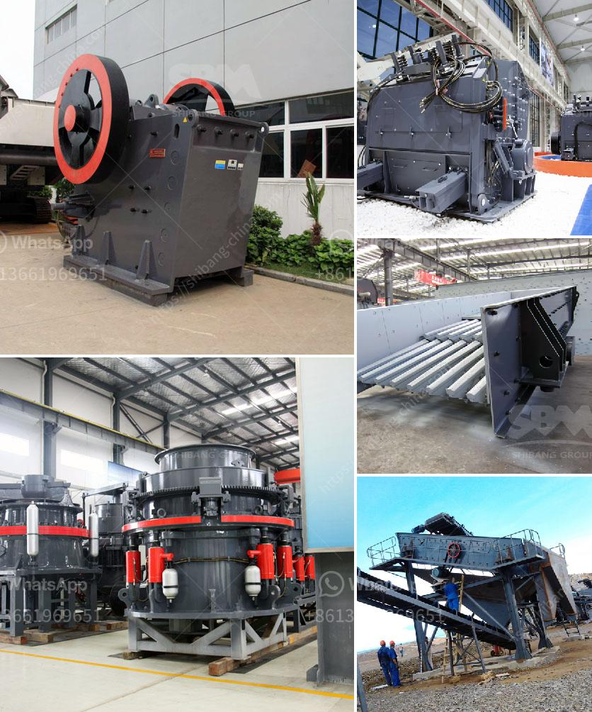

<h3>مصنع تكسير السلاغ في تاميل نادو</h3>
مصنع تكسير السَّلاغ هو مصنع ذو أهمية كبيرة في ولاية تاميل نادو في الهند. يقوم هذا المصنع بتحويل السَّلاغ، الذي هو فضلات صناعة قصب السكر، إلى منتجات قيمة مثل الأسمدة والطاقة الكهربائية.

يتميز مصنع تكسير السَّلاغ في تاميل نادو بتقنية هائلة لتحويل السَّلاغ إلى منتجات قيمة. يعمل المصنع على تكسير السَّلاغ وفصله إلى مكوناته المختلفة باستخدام آلات حديثة وفعَّالة. بعد تكسير السَّلاغ، يتم تحويله إلى أسمدة عضوية تستخدم في الزراعة وتحسين تربة الأراضي. كما يتم استخدام بعض المكونات الأخرى لإنتاج الطَّاقة الكهربائية من خلال توليد البخار وتشغيل المحركات.

تعتبر عملية تحويل السَّلاغ في المصنع مثالية من حيث الأثر البيئي. فبدلاً من أن يُلقى السَّلاغ في الأماكن غير الصحيَّة أو يترك في المزارع كفضلات، يتم تحويله إلى منتجات قيمة تجلب الفوائد للمزارعين وللبيئة. وهذا يساهم في تحسين الصحة العامة والحفاظ على البيئة.

من جانب آخر، يساهم هذا المصنع في تعزيز الاقتصاد المحلي. يؤدي تشغيل المصنع إلى توفير فرص عمل للعديد من العمَّال والفنيين في المنطقة. بالإضافة إلى ذلك، يتم إنتاج منتجات ذات جودة عالية يتم تسويقها محليًا ودوليًا. وهذا يعني تدفق الإيرادات والعائدات إلى المنطقة ودعم الاقتصاد المحلي وتحسين معيشة السكان.

علاوة على ذلك، يوفر مصنع تكسير السَّلاغ طاقة نظيفة ومتجددة من خلال تحويل المكونات العضوية للسَّلاغ إلى الطَّاقة الكهربائية. يتم استخدام هذه الطَّاقة لتشغيل المصنع ذاته وتلبية الاحتياجات الكهربائية للمنطقة المحيطة به. وبفضل طاقتها النظيفة، يقدم المصنع مساهمة رائعة في الحفاظ على البيئة وتقليل الاعتماد على المصادر التقليدية للطاقة.

في النهاية، يعتبر مصنع تكسير السَّلاغ في تاميل نادو مثالًا يُحتذى به في استخدام وتحويل الفضلات الصناعية إلى منتجات قيمة. يساهم المصنع في تحسين الصحة والبيئة وتعزيز الاقتصاد المحلي. وقد يشكل مصدر إلهام للدول الأخرى لاستغلال الفضلات الصناعية بطرق فعَّالة ومستدامة.
<h3>Contact us</h3><ul><li><strong>Whatsapp:&nbsp;<a href="https://wa.me/8613661969651">+8613661969651</a></strong></li><li><a href="https://swt.shibang-china.com/?git&amp;zhl&amp;مصنع تكسير السلاغ في تاميل نادو"><strong>Online Service(chat now)</strong></a></li></ul><h3>Related</h3><ul><li><a href='قائمة أسعار معدات كسارة الحجر الثقيلة.md'>قائمة أسعار معدات كسارة الحجر الثقيلة</a></li><li><a href='كسارة صخرية للبيع.md'>كسارة صخرية للبيع</a></li><li><a href='معدات لإنتاج الحجر الطبيعي.md'>معدات لإنتاج الحجر الطبيعي</a></li><li><a href='مصنع آلات كسارة الحجر في كمبوديا.md'>مصنع آلات كسارة الحجر في كمبوديا</a></li><li><a href='معدات تعدين الذهب الطبيعي في الصين.md'>معدات تعدين الذهب الطبيعي في الصين</a></li></ul>