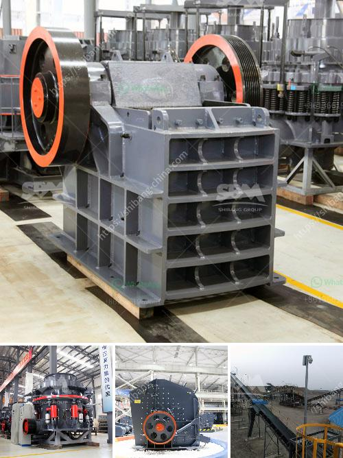

<h3>مصنع تكسير الصدم</h3>
تكسير الصدم هو أحد المصانع الهامة في صناعة قطع غيار السيارات. يتم في هذا المصنع تكسير وتفتيت الصدمات الناجمة عن حوادث المركبات، والتي تتضمن أجزاء السيارة مثل الهيكل الخارجي والصدامات والأبواب والشبك.

يتكون المصنع من مجموعة من الآلات والمعدات الحديثة المصممة لتكسير الصدم بطريقة فعالة وآمنة. فعندما تصل السيارات المحطمة إلى المصنع، تتم فصل القطع غير القابلة للتجديد أو إعادة التدوير مثل الزجاج والمرايا والألواح المعدنية المتضررة.

تبدأ عملية التكسير بعد ذلك، حيث يتم استخدام الآلات المتخصصة لتكسير الأجزاء المعدنية إلى قطع أصغر. يتم فصل الشوائب وإزالتها من القطع المكسورة باستخدام طرق مختلفة مثل الفرز اليدوي أو باستخدام المغناطيسية لفصل العناصر المعدنية.

بعد ذلك، تخضع الأجزاء المكسورة لعملية التنظيف والفرز. تقوم الفرق المتخصصة بفحص الأجزاء وتحديد ما إذا كانت صالحة لإعادة استخدامها أو يجب إعادة تصنيعها أو إعادة تدويرها. يتم تصنيفها وتخزينها وفقًا لذلك.

يتم استخدام القطع المكسورة التي يمكن إعادة استخدامها في إصلاح السيارات، وهذا يساهم في توفير المواد الأولية والحد من النفايات. أما القطع التي يتعذر إصلاحها، فإنها تعاد تصنيعها ويتم استخدامها في صناعة قطع غيار جديدة. وأخيرًا، يتم توجيه القطع التي لا يمكن إعادة استخدامها أو تصنيعها إلى عملية التدوير، حيث تتمتع بخصائص التوجيه البيئي، حيث يتم استخدامها في تصنيع منتجات أخرى.

باستخدام مصنع تكسير الصدم، يتم تحقيق العديد من الفوائد البيئية والاقتصادية. ففيما يتعلق بالبيئة، يساعد هذا المصنع على تقليل النفايات المولدة من حوادث المركبات وتوجيه القطع القابلة لإعادة الاستخدام والتدوير وتقليل استخدام المواد الأولية الجديدة. من حيث الاقتصاد، فإنه يوفر تكلفة إنتاج أقل لصناعة السيارات، كما يساهم في توفير الموارد الثانوية وتحسين استدامة الصناعة.

إن مصنع تكسير الصدم يعتبر إحدى الصناعات الحديثة والمبتكرة التي تسهم في الحفاظ على البيئة وتحقيق الاستدامة. مع استمرار تطور التقنيات وازدياد الوعي بأهمية إعادة التدوير وإعادة الاستخدام، يتوقع أن يتزايد الطلب على مثل هذه الصناعات في المستقبل.
<h3>Contact us</h3><ul><li><strong>Whatsapp:&nbsp;<a href="https://wa.me/8613661969651">+8613661969651</a></strong></li><li><a href="https://swt.shibang-china.com/?git&amp;zhl&amp;مصنع تكسير الصدم"><strong>Online Service(chat now)</strong></a></li></ul><h3>Related</h3><ul><li><a href='كسارة الفك المحمولة في غرب أفريقيا تجار.md'>كسارة الفك المحمولة في غرب أفريقيا تجار</a></li><li><a href='مطحنة الكرة لمسحوق الكوارتز في تاميل نادو.md'>مطحنة الكرة لمسحوق الكوارتز في تاميل نادو</a></li><li><a href='سعر كسارة الفك 400x600.md'>سعر كسارة الفك 400x600</a></li><li><a href='سعر معدات معالجة الكاولين.md'>سعر معدات معالجة الكاولين</a></li><li><a href='مصنع إنتاج مسحوق الجبس بسعة 500 طن.md'>مصنع إنتاج مسحوق الجبس بسعة 500 طن</a></li></ul>