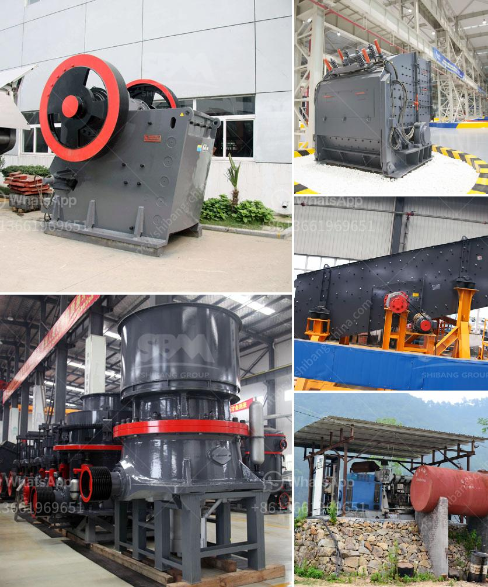

<h3>مصنع تكسير الكروم</h3>
تعتبر صناعة تكسير الكروم من الصناعات الهامة في قطاع التعدين والصناعات المعدنية. يعمل مصنع تكسير الكروم على تحويل خام الكروم الخام إلى منتجات نهائية قابلة للاستخدام في العديد من التطبيقات المختلفة.

يتكون مصنع تكسير الكروم عادةً من عدة مراحل رئيسية. في المرحلة الأولى، يتم تكسير خام الكروم الخام بواسطة كسارات متخصصة إلى قطع صغيرة. تقوم هذه الكسارات بشكل فعال بتقسيم خام الكروم إلى أجزاء صغيرة تتراوح بين أحجام محددة.

بعد ذلك، يتم نقل قطع الخام إلى المرحلة التالية وهي معالجة الفصل المغناطيسي. يتم استخدام المغناطيسية في هذه المرحلة لفصل الكروم عن المواد الأخرى غير المرغوب فيها. يتم وضع قطع الخام المسحوقة في طاولة فصل مغناطيسية تنتج تياراً مغناطيسياً يجذب الجسيمات المغناطيسية ويفصلها عن المواد الأخرى.

ثم يتم تجميع الكروم المغناطيسي في مراحل لاحقة حيث يتم إجراء عمليات التحجيم والتجفيف لإزالة الرطوبة الزائدة. يتم تكوين الكروم المنتج النهائي في هذه المرحلة على شكل أقراص أو حبيبات قابلة للتخزين والنقل.

تعتبر منتجات مصنع تكسير الكروم ضرورية في العديد من الصناعات، بما في ذلك صناعة الفولاذ، حيث يتم استخدام الكروم لإضافة المتانة والمقاومة للصدأ لسبائك الفولاذ. كما يتم استخدام الكروم في صناعة الزجاج المقوى والسيراميك وصناعة الدهانات والأصباغ والبلاستيك.

علاوة على ذلك، يسهم مصنع تكسير الكروم في تعزيز الاقتصاد المحلي بتوفير فرص عمل للعديد من العاملين في الصناعة. يوفر هذا المصنع فرص عمل في مجالات مختلفة مثل المهندسين والفنيين والعمال المهرة والغير المهرة.

مصنع تكسير الكروم يلعب دورًا حاسمًا في دعم صناعة التعدين وتعزيز النمو الاقتصادي. توفر منتجاته الضرورية للعديد من الصناعات الرئيسية وتشجع الاستثمار وتعزز الاستدامة البيئية من خلال التعامل الملائم مع المواد النفايات واستخدام التقنيات الحديثة للحفاظ على البيئة.

باختصار، يسهم مصنع تكسير الكروم في تحويل خام الكروم الخام إلى منتجات قيمة وذات جودة عالية تستخدم في العديد من الصناعات. إنه مصدر للفرص العمل ومساهمة هامة في اقتصاد المجتمع.
<h3>Contact us</h3><ul><li><strong>Whatsapp:&nbsp;<a href="https://wa.me/8613661969651">+8613661969651</a></strong></li><li><a href="https://swt.shibang-china.com/?git&amp;zhl&amp;مصنع تكسير الكروم"><strong>Online Service(chat now)</strong></a></li></ul><h3>Related</h3><ul><li><a href='تصنيع آلات السحق في بوليفيا.md'>تصنيع آلات السحق في بوليفيا</a></li><li><a href='تنقية الجرافيت في معالجة المعادن.md'>تنقية الجرافيت في معالجة المعادن</a></li><li><a href='استشاريو تحسين خام الحديد في الهند.md'>استشاريو تحسين خام الحديد في الهند</a></li><li><a href='اتصالات أحزمة الناقلات.md'>اتصالات أحزمة الناقلات</a></li><li><a href='جهاز استشعار المعادن لسير الناقل.md'>جهاز استشعار المعادن لسير الناقل</a></li></ul>