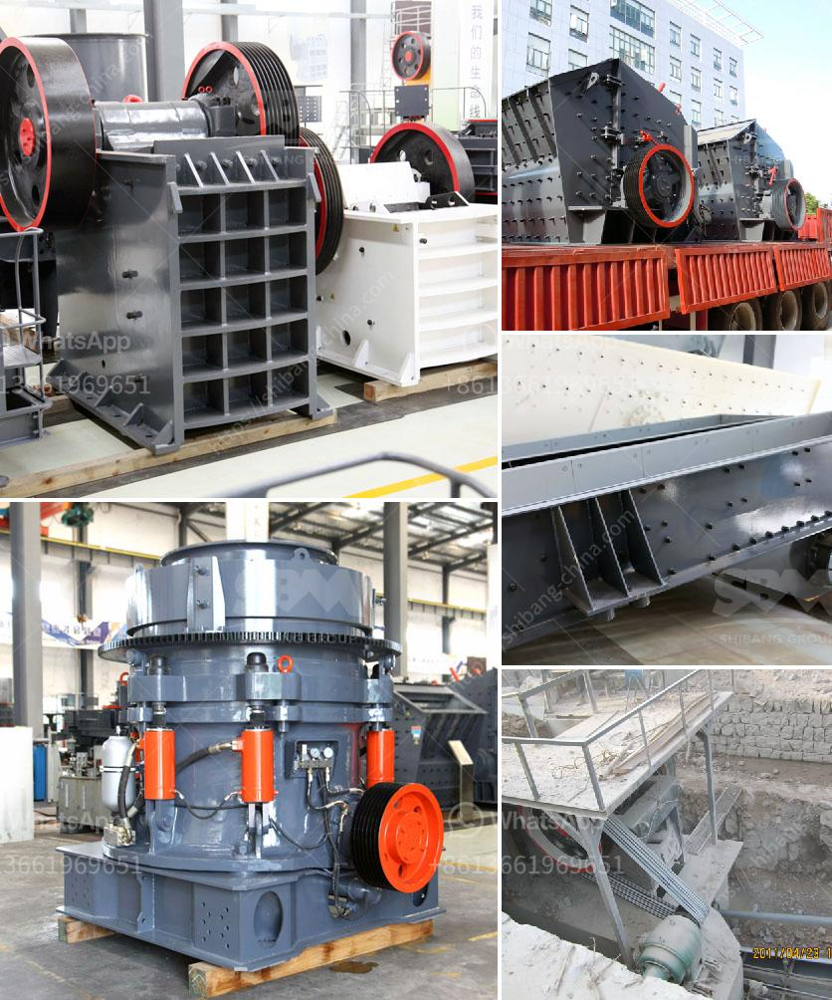

<h3>مصنع تكسير الكلنكر الاسمنتي</h3>
تعتبر صناعة الإسمنت أحد الصناعات الهامة في العديد من الدول حول العالم، حيث يتم استخدامه في البناء والإنشاءات والصيانة. ومن أهم مكونات الإسمنت هو الكلنكر الأسمنتي، والذي يتم تكسيره في مصنع خاص لإنتاج الكلنكر الجاهز للاستخدام.

يعمل مصنع تكسير الكلنكر الأسمنتي على تحطيم الكلنكر الأسمنتي الخام إلى أجزاء صغيرة، بهدف تحسين نوعية الكلنكر وتسهيل العملية اللاحقة لخلط الإسمنت النهائي. ويتم ذلك عن طريق استخدام معدات وآلات خاصة ومتطورة تعمل على تكسير الكلنكر بطريقة فعالة وآمنة.

يتكون مصنع تكسير الكلنكر الأسمنتي عادة من مكبس تكسير الكلنكر ونقالة ومحبس ومنظومة غبار المواد الجافة ونظام تحكم تلقائي. ويتم تشغيل المصنع بواسطة فريق ذو خبرة عالية في مجال صناعة الإسمنت، يتولى مراقبة أداء المعدات وضمان تحقيق أعلى مستويات الجودة والكفاءة.

يتم إدخال الكلنكر الأسمنتي الخام إلى مكبس التكسير، حيث يتم تحطيمه وتكسيره إلى قطع صغيرة بأحجام مختلفة. يتم تدوير هذه الأجزاء المكسورة في النقالة، والتي تنقلها إلى المراحل التالية من عملية الإنتاج.

يتم تجميع الأجزاء المكسورة في محبس خاص لإزالة الغبار والشوائب من الكلنكر الأسمنتي. وبعد ذلك، يتم توجيه الأجزاء إلى نظام تحكم تلقائي يقوم بالتحكم في توزيع الأجزاء وضبط عملية التكسير بشكل مناسب.

باستخدام مصنع تكسير الكلنكر الأسمنتي، يتم تحقيق فوائد عديدة. فعملية تكسير الكلنكر تساهم في زيادة سطح التفاعل والتباين الحراري في عملية الحرق بعد ذلك، مما يؤدي إلى تحسين نوعية الإسمنت النهائي. وبفضل النظام التحكمي التلقائي، يمكن ضبط عملية التكسير بدقة وفقًا للمواصفات المطلوبة.

في الختام، يعتبر مصنع تكسير الكلنكر الأسمنتي جزءًا أساسيًا من صناعة الإسمنت، حيث يقوم بتجهيز الكلنكر الخام للاستخدام النهائي في الإسمنت. وبفضل التكنولوجيا المتقدمة، يمكن تحقيق تحسينات في عملية التكسير، مما يتيح إنتاج إسمنت عالي الجودة وفعال من حيث التكلفة.
<h3>Contact us</h3><ul><li><strong>Whatsapp:&nbsp;<a href="https://wa.me/8613661969651">+8613661969651</a></strong></li><li><a href="https://swt.shibang-china.com/?git&amp;zhl&amp;مصنع تكسير الكلنكر الاسمنتي"><strong>Online Service(chat now)</strong></a></li></ul><h3>Related</h3><ul><li><a href='مصنع كسارة خام الحديد.md'>مصنع كسارة خام الحديد</a></li><li><a href='كسارة حجر محمولة.md'>كسارة حجر محمولة</a></li><li><a href='تطبيق آلة صنع الرمل.md'>تطبيق آلة صنع الرمل</a></li><li><a href='كسارات VSI بسعة 25 طن في الساعة.md'>كسارات VSI بسعة 25 طن في الساعة</a></li><li><a href='صناعة الحجر الجيري في الفلبين.md'>صناعة الحجر الجيري في الفلبين</a></li></ul>