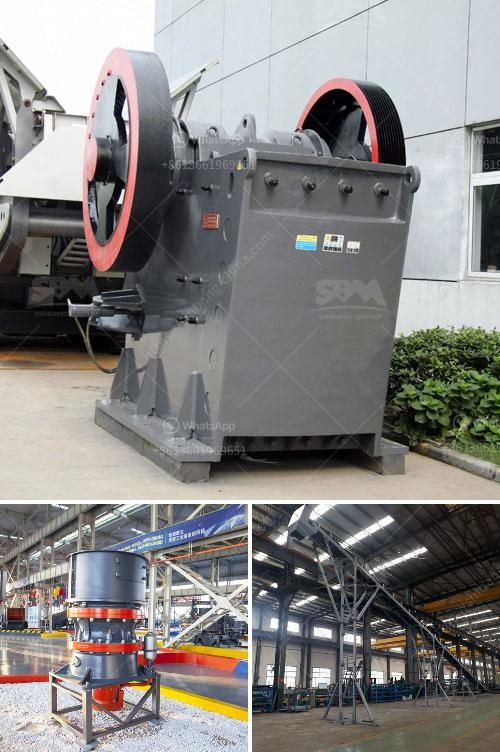

<h3>مصنع تكسير المحاجر الكامل في جنوب أفريقيا</h3>
يعتبر مصنع تكسير المحاجر الكامل في جنوب أفريقيا من المشاريع الصناعية الهامة التي تساهم في تعزيز قطاع التعدين في البلاد. يقع هذا المصنع في جنوب أفريقيا الجنوبية، ويهدف إلى استخراج وتكسير المواد الصخرية وتحويلها إلى منتجات نهائية ذات جودة عالية.

تتميز المحاجر في جنوب أفريقيا بالكثير من المعادن القيمة والصخور المستخدمة في صناعة البناء والبنية التحتية. ومن المواد الشائعة المستخدمة في مصنع التكسير الكامل في جنوب أفريقيا: الحجر الجيري، الجرانيت، البازلت، الرخام، والحجر الرملي. يتم تكسير هذه المواد الصخرية باستخدام معدات خاصة مثل الكسارات والمطاحن.

يتضمن المصنع تجهيزات متقدمة تساعد في تحسين كفاءة عمليات التكسير وتعزيز استخلاص المعادن من المواد الصخرية. وتتضمن هذه التجهيزات سيور نقل الحجر وآلات سحق الحجر وغرابيل التصنيف. كما يحتوي المصنع على معدات لتصفية الغبار وتنقية الماء المستخدم في عمليات التكسير، مما يساهم في الحفاظ على البيئة المحيطة.

يعمل المصنع الكامل على تحويل المواد الصخرية التي تم جمعها من المحاجر إلى منتجات جاهزة للبيع. وتشمل هذه المنتجات الحصى ورمل البناء والحصمة. تنتج هذه المنتجات بناءً على احتياجات السوق المحلية والعالمية. فعلى سبيل المثال، تستخدم الحصمة في صناعة الخرسانة، بينما يتم استخدام الحصى ورمل البناء في البناء والتشييد.

يشكل مصنع تكسير المحاجر الكامل في جنوب أفريقيا عاملاً مهماً في تطور البنية التحتية للبلاد واقتصادها. فهو يتيح للعديد من الشركات والمشاريع الاعتماد المحلي على المواد الصخرية بدلاً من استيرادها من الخارج. يعمل المصنع أيضًا على توفير فرص عمل جديدة للعديد من العاملين ويسهم في تعزيز النمو الاقتصادي.

باختصار، يعتبر مصنع تكسير المحاجر الكامل في جنوب أفريقيا مشروعًا صناعيًا هامًا يعزز قطاع التعدين في البلاد. يساهم المصنع في استخراج وتكسير المواد الصخرية وتحويلها إلى منتجات نهائية ذات جودة عالية. يوفر المصنع منتجات محلية للاعتماد عليها في البناء والبنية التحتية، ويساهم في توفير فرص عمل جديدة وتعزيز الاقتصاد. يجب أن يستمر هذا المصنع في تطوير تكنولوجيا جديدة لتحسين كفاءة عمليات التكسير والحفاظ على البيئة.
<h3>Contact us</h3><ul><li><strong>Whatsapp:&nbsp;<a href="https://wa.me/8613661969651">+8613661969651</a></strong></li><li><a href="https://swt.shibang-china.com/?git&amp;zhl&amp;مصنع تكسير المحاجر الكامل في جنوب أفريقيا"><strong>Online Service(chat now)</strong></a></li></ul><h3>Related</h3><ul><li><a href='مصنع غسيل الفحم في جنوب أفريقيا الفلبين.md'>مصنع غسيل الفحم في جنوب أفريقيا الفلبين</a></li><li><a href='استخدام مطحنة ريموند.md'>استخدام مطحنة ريموند</a></li><li><a href='مصنع الكرة.md'>مصنع الكرة</a></li><li><a href='كسارة الفك تركيا.md'>كسارة الفك تركيا</a></li><li><a href='معدات فحص الرمال للبيع في جنوب أفريقيا.md'>معدات فحص الرمال للبيع في جنوب أفريقيا</a></li></ul>