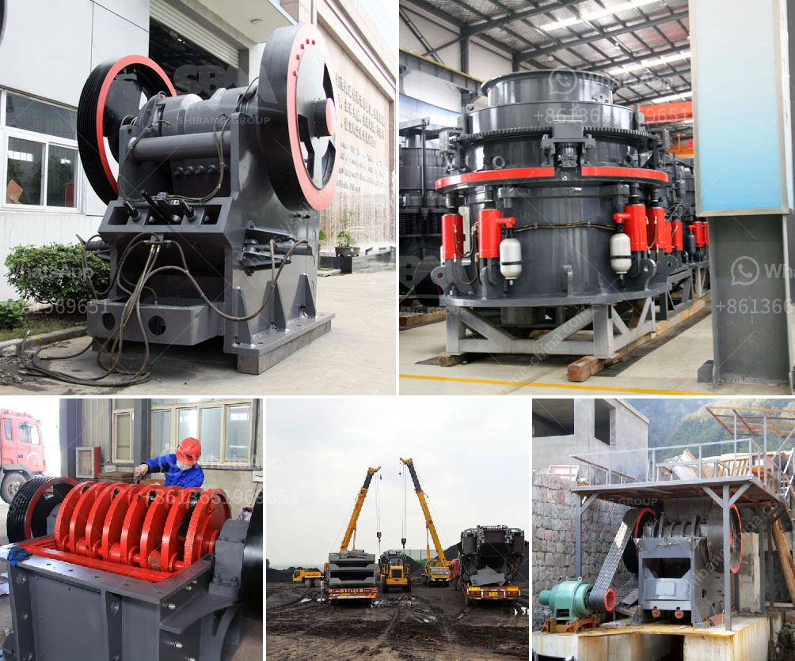

<h3>مصنع تكسير المعادن</h3>
يعد مصنع تكسير المعادن أحد المصانع الهامة في صناعة التعدين. يتم استخدام هذا المصنع لتكسير المعادن وتحويلها إلى حجم صغير يمكن استخدامه في المراحل التالية من عملية التصنيع. ويعتبر التكسير من الخطوات الأساسية في تجهيز المعادن قبل استخدامها في تصنيع المنتجات النهائية.

تعتمد عملية تكسير المعادن على استخدام معدات خاصة تسمى الكسارات. الكسارات تزود بمحركات قوية لتحويل المعادن الكبيرة إلى قطع صغيرة. وتفترق الكسارات إلى أنواع مختلفة حسب نوع المعدن المراد تكسيره والمنتج النهائي المرغوب. كما أن هناك أحجام مختلفة من الكسارات تستخدم حسب حجم المعادن المختلفة.

يتم تحميل المعادن في الكسارة بواسطة شاحنات أو حفارات. وبعد ذلك، يتم تشغيل الكسارة لفترة محددة حسب حجم المعادن وكميتها. تحتوي الكسارات على جداول بالحجم النهائي المرغوب وتعمل على ضمان تحقيق هذا الحجم عن طريق التحكم في فتحة الخروج التي يخرج منها المادة المكسورة. يتم جمع المنتج النهائي في مجموعات ويتم نقلها إلى مراحل تصنيع أخرى.

تعتبر عناية بالمعدات المستخدمة في مصنع تكسير المعادن أمرًا هامًا جدًا. يجب الحفاظ على تلك المعدات وصيانتها بانتظام لضمان أداءها الأمثل وتجنب حدوث أعطال غير متوقعة. بالإضافة إلى ذلك، يتم اتخاذ تدابير أمنية لحماية العمال والعاملين في المصنع من أي حوادث ممكنة.

يعتبر مصنع تكسير المعادن جزءًا أساسيًا من سلسلة التصنيع في صناعة التعدين. فهو يتحمل المسؤولية عن تجهيز المعادن لمراحل تصنيع أخرى والحصول على المنتج النهائي الذي يمكن تسويقه وبيعه. يعمل المصنع مع معادن مختلفة ويساهم في إنتاج العديد من المنتجات التي تستخدم في حياتنا اليومية.

باختصار، يلعب مصنع تكسير المعادن دورًا حيويًا في صناعة التعدين وتحويل المعادن إلى منتجات صالحة للاستخدام. يتم تحقيق ذلك من خلال استخدام كسارات مختلفة وضمان الحجم المرغوب لنهاية المعادن. يجب العناية بالمعدات المستخدمة وضمان السلامة والأمان للعمال والعاملين في المصنع.
<h3>Contact us</h3><ul><li><strong>Whatsapp:&nbsp;<a href="https://wa.me/8613661969651">+8613661969651</a></strong></li><li><a href="https://swt.shibang-china.com/?git&amp;zhl&amp;مصنع تكسير المعادن"><strong>Online Service(chat now)</strong></a></li></ul><h3>Related</h3><ul><li><a href='كسارات مزدوجة التبديل.md'>كسارات مزدوجة التبديل</a></li><li><a href='آفاق صناعة كسارة الجرانيت.md'>آفاق صناعة كسارة الجرانيت</a></li><li><a href='خطة عمل لكربونات الكالسيوم.md'>خطة عمل لكربونات الكالسيوم</a></li><li><a href='كسارة الحجر المصنوعة في إيطاليا.md'>كسارة الحجر المصنوعة في إيطاليا</a></li><li><a href='شاشة اهتزاز للشبكة 14 شاشة اهتزاز.md'>شاشة اهتزاز للشبكة 14 شاشة اهتزاز</a></li></ul>