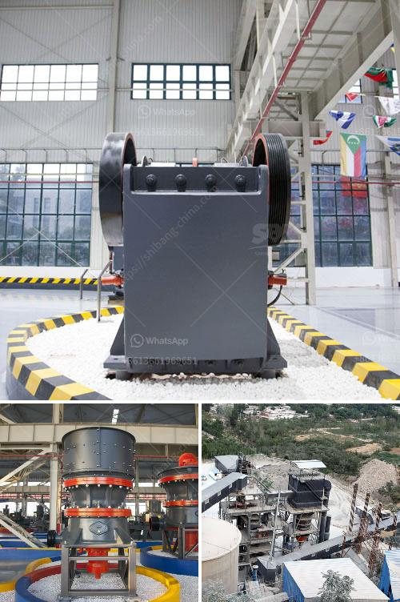

<h3>مصنع تكسير حجر الجرانيت في كينيا</h3>
حجر الجرانيت هو أحد أنواع الصخور الطبيعية الأكثر استخدامًا في صناعة البناء والديكور. يتم استخراج الجرانيت من المحاجر الجبلية وتحويله إلى قطع أكبر للاستفادة منه في تشييد المباني والمشاريع الأخرى. واحدة من الطرق الرئيسية لتحويل الجرانيت إلى حجارة إعادة عملية التكسير.

هناك العديد من المصانع المتخصصة في وحدات تكسير حجر الجرانيت في كينيا. هذه المصانع تعمل بتقنيات وآليات متطورة لكسر الجرانيت إلى مقاسات محددة يمكن استخدامها في البناء والديكور. يتم تشغيل هذه المصانع بجهود فريق متخصص ومهرة من العمال المدربين جيدًا على استخدام المعدات وتشغيل الآلات الضرورية.

مصنع تكسير حجر الجرانيت في كينيا يعتبر مكانًا حيث يتم توليد قيمة اقتصادية وتوفير فرص عمل للعديد من السكان المحليين. يعمل هؤلاء العمال في نقل الجرانيت من المحاجر إلى المصنع وفي عملية التكسير نفسها. كما يشتمل العمل على تصفية الحجارة المكسرة وتصنيفها حسب الحجم والجودة. تتم هذه العمليات باستخدام الآلات الحديثة والتكنولوجيا المتقدمة لضمان جودة المنتج النهائي.

يعتبر مصنع تكسير حجر الجرانيت في كينيا جزءًا من سلسلة توريد هامة للمنتجات الحجرية في السوق المحلية والعالمية. تستخدم المنتجات المكسرة في بناء الجدران والأرضيات والممرات والمطابخ والحمامات والتماثيل والتماثيل والنوافير والعديد من المشاريع الأخرى. تعتبر البنية التحتية التي توفرها هذه المصانع من العوامل المهمة التي تساهم في تنمية البنية التحتية للبلاد، وبالتالي تحفز النمو الاقتصادي.

إلى جانب تقديم الفوائد الاقتصادية، يلتزم مصنع تكسير حجارة الجرانيت في كينيا بالمعايير البيئية والاستدامة. فعملية التكسير تعتمد على استخدام الطاقة النظيفة وتعامل مع مياه الصرف الصحي والفضلات بشكل آمن، مما يحافظ على حماية البيئة المحيطة والحفاظ على الموارد الطبيعية.

في الختام، يعتبر مصنع تكسير حجر الجرانيت في كينيا مكانًا هامًا يوفر فرص عمل ويرفع القيمة الاقتصادية للدولة. بفضل استخدام التكنولوجيا المتقدمة والالتزام بالمعايير البيئية، يمثل هذا المصنع نموذجاً مثالياً للاستدامة والتنمية الاقتصادية والاجتماعية في صناعة الجرانيت.
<h3>Contact us</h3><ul><li><strong>Whatsapp:&nbsp;<a href="https://wa.me/8613661969651">+8613661969651</a></strong></li><li><a href="https://swt.shibang-china.com/?git&amp;zhl&amp;مصنع تكسير حجر الجرانيت في كينيا"><strong>Online Service(chat now)</strong></a></li></ul><h3>Related</h3><ul><li><a href='تكلفة مجفف الرمال في ولاية كيرالا.md'>تكلفة مجفف الرمال في ولاية كيرالا</a></li><li><a href='صور شاشات الاهتزاز.md'>صور شاشات الاهتزاز</a></li><li><a href='كم تكلف مصنع التكسير.md'>كم تكلف مصنع التكسير</a></li><li><a href='آلات كسارة المحجر.md'>آلات كسارة المحجر</a></li><li><a href='سعر كسارة الفك في نيجيريا.md'>سعر كسارة الفك في نيجيريا</a></li></ul>