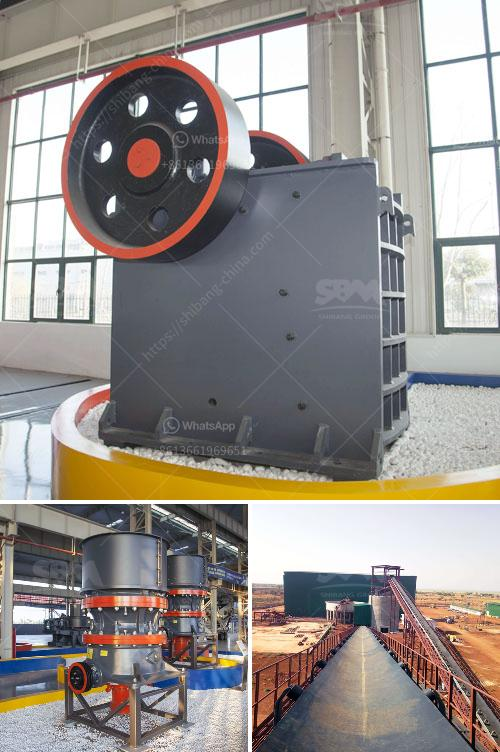

<h3>مصنع تكسير حجر صغير</h3>
تكسير الحجر هو عملية هامة في صناعة البناء والبناء، حيث يتم تفتيت الحجر الكبير إلى جزيئات أصغر تستخدم في إنتاج مواد البناء مثل الرمل والزلط والحصى. يتم ذلك من خلال استخدام مصانع تكسير الحجر التي تعد مهمة في عملية تحقيق أعلى كفاءة وجودة في الإنتاج.

أحد أنواع مصانع تكسير الحجر هو المصنع الصغير، والذي يستخدم لتكسير الحجر بحجم يتراوح بين 200-400 ملم. يتكون هذا المصنع من العديد من الأجزاء المختلفة التي تعمل معًا لتحقيق هدف التكسير بكفاءة عالية.

المصنع الصغير يتكون عادة من مغذي اهتزازي يتم استخدامه لنقل الحجر الكبير من المستودع إلى الكسارة. بعد ذلك، يتم تفريغ الحجر في الكسارة الفكية التي تستخدم لتكسير الحجر إلى قطع صغيرة. تتميز الكسارة الفكية بمطرقة تعمل بحركة تكرارية، مما يسمح للحجر بالانحطاط تدريجيًا إلى أجزاء صغيرة.

بعدما يتم تكسير الحجر في الكسارة الفكية، ينتقل الحجر إلى الكسارة المخروطية. تستخدم الكسارة المخروطية لتكسير الحجر الناتج من الكسارة الفكية إلى قطع أصغر وأكثر تجانسًا. وبالتالي، يتم استخدام الكسارة المخروطية لتحقيق حبيبات الحجم المطلوب.

في النهاية، تتم إزالة أي مواد غير مرغوب فيها من خلال استخدام الغرابيل والمغاسل. تتم استخدام غرابيل لفصل الحجر عن الرمل والحصى بحجم محدد، بينما تُستخدم المغاسل لغسل الحجر وإزالة الأتربة والشوائب.

يعتبر المصنع الصغير لتكسير الحجر مناسبًا بشكل خاص للمشاريع الصغيرة والمتوسطة الحجم. إنه يوفر إنتاجية عالية وكفاءة تكسير فعالة. كما يتميز بتوفير الوقت والجهد في إنتاج مواد البناء بجودة عالية.

لذا، فإن مصنع تكسير الحجر الصغير يلعب دورًا حاسمًا في صناعة البناء والبناء، حيث يساهم في تلبية الاحتياجات المتزايدة للمواد الأساسية في البناء بطرق تكلفة فعالة وجودة مستدامة.
<h3>Contact us</h3><ul><li><strong>Whatsapp:&nbsp;<a href="https://wa.me/8613661969651">+8613661969651</a></strong></li><li><a href="https://swt.shibang-china.com/?git&amp;zhl&amp;مصنع تكسير حجر صغير"><strong>Online Service(chat now)</strong></a></li></ul><h3>Related</h3><ul><li><a href='مصنع معدات التعدين للذهب.md'>مصنع معدات التعدين للذهب</a></li><li><a href='كسارة تأثير في المملكة العربية السعودية.md'>كسارة تأثير في المملكة العربية السعودية</a></li><li><a href='آلة كسارة محمولة.md'>آلة كسارة محمولة</a></li><li><a href='مصنع كسارة الفك.md'>مصنع كسارة الفك</a></li><li><a href='أسعار كسارات الخرسانة.md'>أسعار كسارات الخرسانة</a></li></ul>