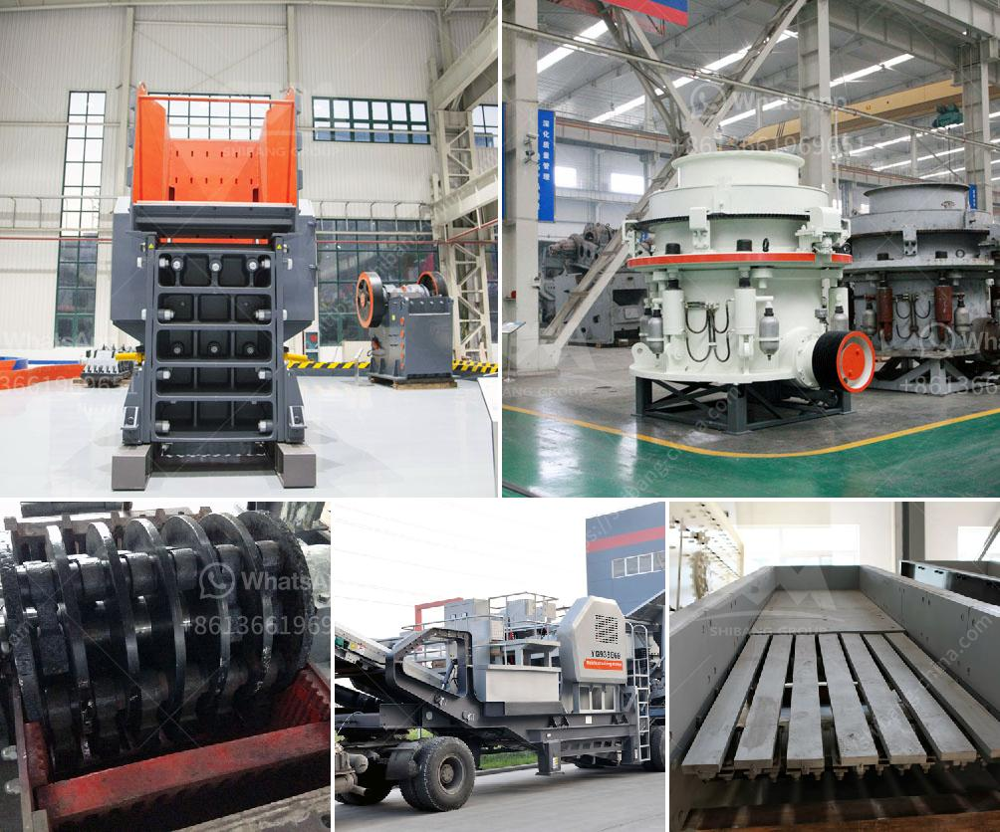

<h3>مصنع تكسير خام البوكسيت</h3>
تكسير خام البوكسيت هو عملية مهمة في صناعة الألمنيوم. يستخدم البوكسيت كمصدر رئيسي للألمنيوم، والذي يتم استخدامه في العديد من التطبيقات مثل العبوات، والسيارات، والصناعات العسكرية وغيرها. في هذه المقالة، سنناقش عملية تكسير خام البوكسيت في مصنع خاص.

يحتوي مصنع تكسير خام البوكسيت على العديد من المعدات والماكينات التي تستخدم لتكسير الخام إلى قطع صغيرة. يتم تكسير البوكسيت بواسطة كسارات ضجيجية بكلفة منخفضة وعالية الجودة. تعمل هذه الماكينات على طحن البوكسيت إلى حبيبات صغيرة بحجم 200-400 ميكرون. هذا الحجم المثالي للحبيبات يجعل من السهل على المصانع اللاحقة استخدام البوكسيت في إنتاج الألومنيوم.

لدى مصنع تكسير خام البوكسيت أيضًا معدات أخرى مثل الفرز والتحبيب والفصل المغناطيسي، وهذه الماكينات تقوم بتنقية البوكسيت من الشوائب والأتربة والشوائب الأخرى التي يمكن أن تؤثر على الجودة النهائية للألمنيوم الناتج.

يعمل المصنع على طراز إدارة صارمة للبيئة والسلامة لضمان أن عمليات التكسير تتم بأمان وبدون تأثير سلبي على البيئة المحيطة. يتم تجهيز المصنع بأنظمة لمراقبة الغبار وتجهيز معدات السلامة للحد من الحوادث والمخاطر الناجمة عن التكسير.

يعتبر إنتاج الألومنيوم من خام البوكسيت عملية مستدامة، حيث يمكن إعادة تدوير الألمنيوم المستخدم مرارًا وتكرارًا دون فقدان الكفاءة أو الجودة. بالإضافة إلى ذلك، فإن صناعة الألمنيوم طاقة مكثفة وتستهلك الكثير من الطاقة. وبفضل تحسينات التكنولوجيا ومصانع تكسير البوكسيت الحديثة، يتم تقليل استهلاك الطاقة والانبعاثات الناتجة عن عملية إنتاج الألومنيوم.

في الختام، يمثل مصنع تكسير خام البوكسيت جزءًا رئيسيًا في سلسلة إنتاج الألومنيوم. يساهم في إنتاج البوكسيت عالي الجودة والنقي، والذي يمكن استخدامه في صناعة الألمنيوم. بفضل التطور التكنولوجي، يتم الآن تقليل تكلفة الإنتاج وكفاءة استخدام الطاقة في صناعة الألومنيوم، مما يجعلها صناعة مستدامة وبيئية.
<h3>Contact us</h3><ul><li><strong>Whatsapp:&nbsp;<a href="https://wa.me/8613661969651">+8613661969651</a></strong></li><li><a href="https://swt.shibang-china.com/?git&amp;zhl&amp;مصنع تكسير خام البوكسيت"><strong>Online Service(chat now)</strong></a></li></ul><h3>Related</h3><ul><li><a href='موردين محمولين لكسارة الحجر.md'>موردين محمولين لكسارة الحجر</a></li><li><a href='مطحنة هامر للأسمنت.md'>مطحنة هامر للأسمنت</a></li><li><a href='مطحنة الكرة لمسحوق الكوارتز في تاميل نادو.md'>مطحنة الكرة لمسحوق الكوارتز في تاميل نادو</a></li><li><a href='شركة تصنيع كسارات الحجر.md'>شركة تصنيع كسارات الحجر</a></li><li><a href='آلة طحن الطين المستخدمة للبيع.md'>آلة طحن الطين المستخدمة للبيع</a></li></ul>