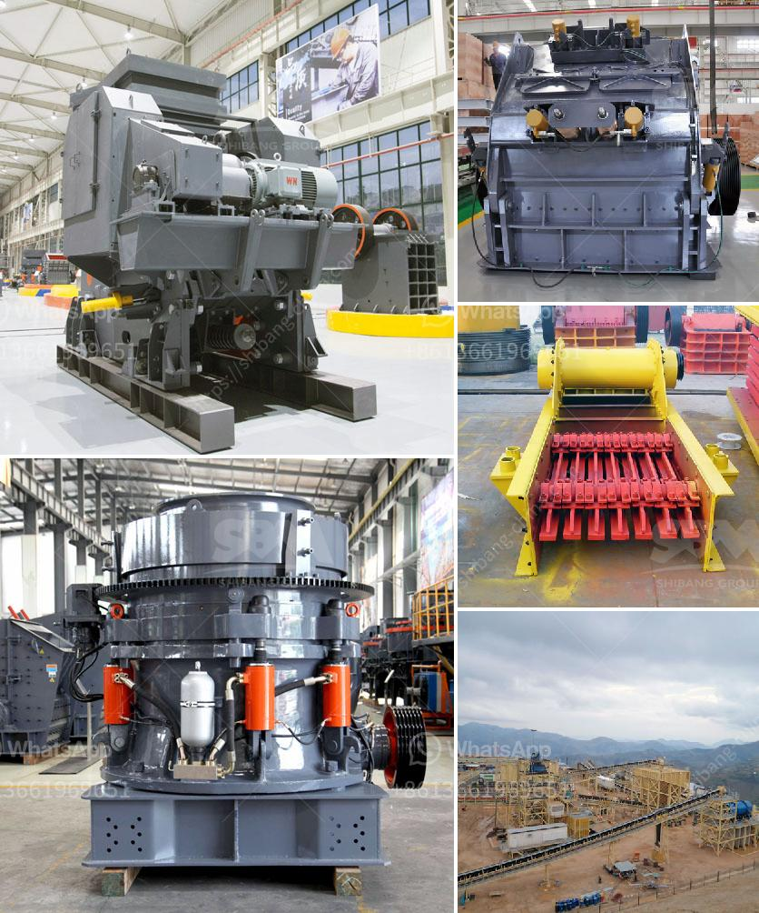

<h3>مصنع تكسير خام الحديد في ألمانيا</h3>
يعد قطاع صناعة تكسير خام الحديد أحد القطاعات الحيوية في ألمانيا. يوجد العديد من المصانع المتخصصة في تكسير خام الحديد في أنحاء البلاد. في هذه المقالة، سنتناول مصنعًا مشهورًا في ألمانيا لتكسير خام الحديد ونستعرض بعض المعلومات عنه.

يقع مصنع تكسير خام الحديد هذا في منطقة بافاريا الجنوبية بألمانيا. يمتد على مساحة واسعة ويضم العديد من الآلات والمعدات المتقدمة التي تستخدم في تكسير ومعالجة الخام. يتعاون المصنع مع العديد من الشركات الكبرى في صناعة الحديد والصلب، حيث يتم توريد الخام إليه من مناجم مختلفة في ألمانيا ودول أخرى.

يكمن الهدف الرئيسي لهذا المصنع في تكسير وغربلة الخام للحصول على حجم ملائم يمكن استخدامه في صناعة الحديد والصلب. يتم تحويل الخام إلى كسر صغير بفضل الآلات المتطورة المستخدمة في المصنع. تتم عمليات التكسير والغربلة بعناية لضمان حصول الخام على الخواص المثلى التي تسهم في جودة الصلب النهائي.

بالإضافة إلى عمليات تكسير الخام، يتم في المصنع أيضًا اجراء عمليات أخرى مثل الغسيل والتجفيف لإزالة الشوائب الموجودة في الخام. يعتمد المصنع على تقنيات حديثة ومتطورة لضمان حصول النتائج المطلوبة في أسرع وقت ممكن وبأعلى كفاءة.

يضم المصنع فريقًا محترفًا من العاملين يعملون بجد لضمان سير عمليات تكسير الخام بسلاسة وفقًا للمعايير العالمية. يتم تنفيذ إجراءات صارمة للسلامة والبيئة في المصنع لضمان سلامة وصحة العاملين والمحافظة على البيئة المحيطة.

في الختام، يعد مصنع تكسير خام الحديد هذا في ألمانيا مثالًا جيدًا على الرواد في تكسير الخام ومعالجته. يسهم المصنع في تزويد صناعة الحديد والصلب بالمواد الخام عالية الجودة التي يمكن استخدامها في تصنيع منتجات متنوعة. كما يلتزم المصنع بمعايير السلامة والبيئة للعمل بكفاءة وحماية العاملين والبيئة.
<h3>Contact us</h3><ul><li><strong>Whatsapp:&nbsp;<a href="https://wa.me/8613661969651">+8613661969651</a></strong></li><li><a href="https://swt.shibang-china.com/?git&amp;zhl&amp;مصنع تكسير خام الحديد في ألمانيا"><strong>Online Service(chat now)</strong></a></li></ul><h3>Related</h3><ul><li><a href='مطحنة ريموند لمعالجة البازلت الجاف.md'>مطحنة ريموند لمعالجة البازلت الجاف</a></li><li><a href='معدات كسارة المحجر المحمولة المستخدمة.md'>معدات كسارة المحجر المحمولة المستخدمة</a></li><li><a href='مصنع غسيل رمل السيليكا في الهند.md'>مصنع غسيل رمل السيليكا في الهند</a></li><li><a href='تكلفة مشروع مصنع طحن الكلنكر الصغير.md'>تكلفة مشروع مصنع طحن الكلنكر الصغير</a></li><li><a href='آلة سحق البلاد.md'>آلة سحق البلاد</a></li></ul>