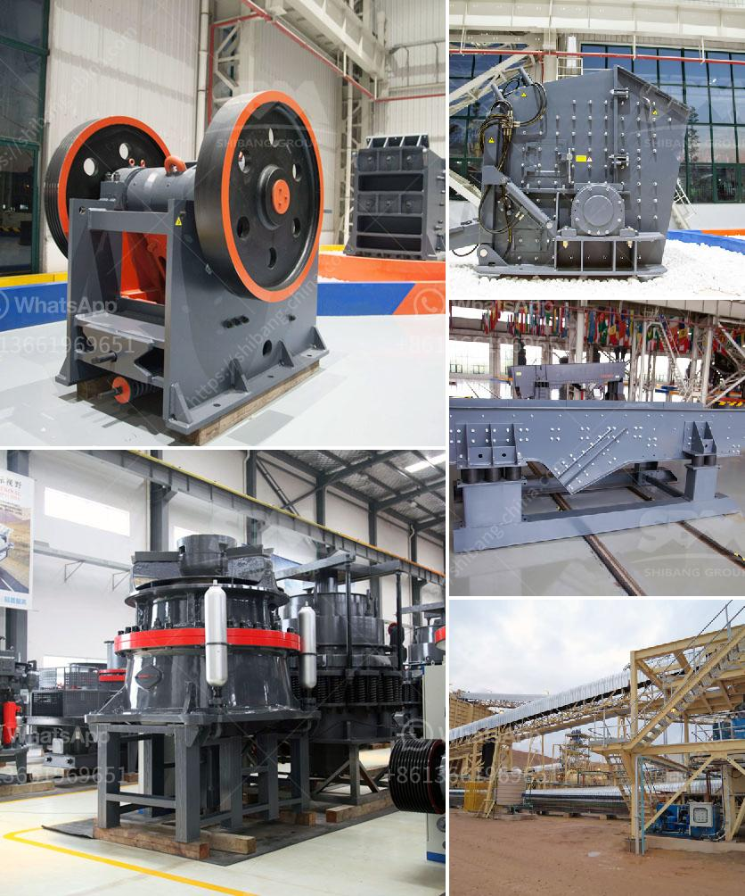

<h3>مصنع تكسير خام الحديد</h3>
يعد خام الحديد من أهم الموارد الطبيعية التي تعتبر أساساً في صناعة الحديد والصلب. ومن أجل استخدامه بفاعلية، يتم غالبًا تحويله إلى شكل مناسب من خلال عملية التكسير. يوجد العديد من المصانع المختصة في عملية تكسير خام الحديد، وسأتحدث في هذه المقالة عن مصنع تكسير خام الحديد وأهميته في صناعة الحديد والصلب.

تعد عملية تكسير خام الحديد الخطوة الأولى في إنتاج الحديد والصلب. تتطلب هذه العملية القدرة على كسر الصخور المليئة بالحديد إلى قطع أصغر. يتم ذلك عن طريق استخدام الكسارات والطواحين المتخصصة التي تضغط أو تفرِم الخام الخشن إلى قطع أصغر بحجم معين.

يُستخدم عادة الكسّارات الفكية والكسّارات المخروطية في مصانع تكسير خام الحديد. تحتوي الكسّارات الفكية على فكين تتحركان للأعلى وللأسفل بحيث تضغط الحجارة بينهما وتكسرها. بينما تستخدم الكسّارات المخروطية قوة الضغط والتأثير لكسر الحجارة.

بعد عملية التكسير الأولية، يتم نقل الخام المكسر إلى مطحنة الكرات أو المطحنة الأسطوانية. يتم فيها طحن الخام للحصول على جسيمات أصغر. وتستخدم الكرات المعدنية أو الأسطوانات في المطحنة لتفتيت الخام. وتعتبر هذه الخطوة مهمة حيث أن جسيمات الحديد الناعمة قابلة لأفضل استرداد الحديد والصلب منها.

بعد عملية التكسير والطحن، يتم نقل الخام إلى مراحل أخرى من عملية إنتاج الحديد والصلب، مثل عمليات التركيز والتخمير. يتم تخليص الخام من أي شوائب أو مواد أخرى غير مرغوب فيها والاحتفاظ بالحجارة التي تحتوي على الحديد.

تتطلب عملية تكسير خام الحديد استخدام تقنيات متقدمة ومعدات ذات كفاءة عالية. وتعد المحافظة على سلامة العاملين في المصنع والحد من التلوث من أهم التحديات التي تواجهها هذه الصناعة. لذلك، يجب أن يتم اختيار موقع المصنع بعناية لضمان الامتثال للمعايير البيئية والاجتماعية.

بالاستفادة من خام الحديد وتكسيره على نحو فعال، تتمكن الصناعة من إنتاج الحديد والصلب المستدام بكميات كبيرة. وتعد صناعة الحديد والصلب أساسية في البنية التحتية وتقدم دعمًا للعديد من الصناعات الأخرى مثل صناعة السيارات والبناء.

باختصار، فإن مصنع تكسير خام الحديد يلعب دوراً حيوياً في إنتاج الحديد والصلب. من خلال استخدام تقنيات متقدمة ومعدات متطورة، يتم تحويل الخام الخشن إلى جسيمات أصغر قابلة للتصنيع والاستخدام في الصناعات المختلفة. يعد تكسير الخام مرحلة أساسية في سلسلة إنتاج الحديد والصلب ولا بد من تنفيذها بدقة بغرض تحقيق أعلى كفاءة إنتاجية واستدامة للصناعة.
<h3>Contact us</h3><ul><li><strong>Whatsapp:&nbsp;<a href="https://wa.me/8613661969651">+8613661969651</a></strong></li><li><a href="https://swt.shibang-china.com/?git&amp;zhl&amp;مصنع تكسير خام الحديد"><strong>Online Service(chat now)</strong></a></li></ul><h3>Related</h3><ul><li><a href='شركة تصنيع الكسارات في الصين.md'>شركة تصنيع الكسارات في الصين</a></li><li><a href='أهداف مطحنة الكرة.md'>أهداف مطحنة الكرة</a></li><li><a href='خط إنتاج الحجر الجيري.md'>خط إنتاج الحجر الجيري</a></li><li><a href='تصميم مصنع الإسمنت بتنسيق PDF.md'>تصميم مصنع الإسمنت بتنسيق PDF</a></li><li><a href='سعات مطحنة الأسطوانة العمودية.md'>سعات مطحنة الأسطوانة العمودية</a></li></ul>