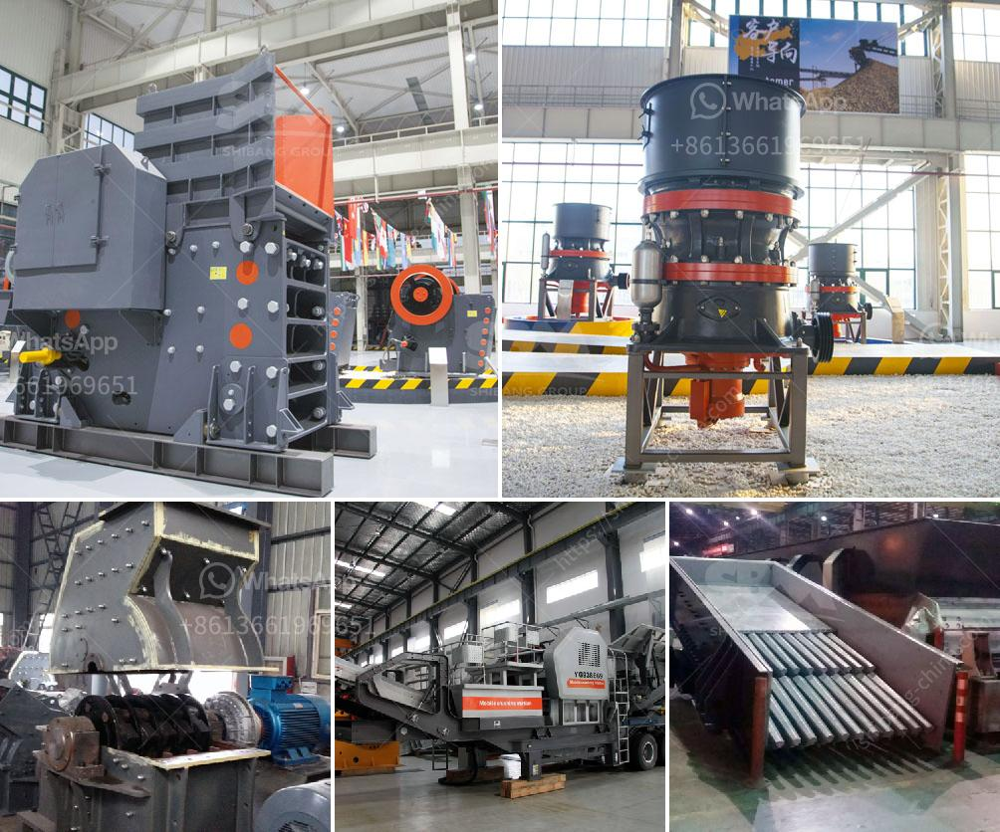

<h3>مصنع تكسير صخور متنقل وثابت جديد</h3>
مصانع تكسير الصخور هي مكون رئيسي في صناعة البناء والبنية التحتية. تستخدم هذه المصانع لتحويل الصخور الكبيرة إلى حجارة صغيرة يمكن استخدامها في مشاريع البناء المختلفة. ومن المعروف أن معظم هذه المصانع يكون لها تصميم ثابت حيث يتم تركيبها في موقع محدد وتعمل في المكان نفسه دون نقلها. ومع ذلك، يوجد نوع جديد من مصانع تكسير الصخور وهو المصنع المتنقل.

يمتاز المصنع المتنقل بمرونته وقدرته على تنقله من موقع لآخر. يتم نقل هذه المصانع عبر وسائل النقل المختلفة مثل الشاحنات أو الشاسيهات القابلة للنقل. يتم تصميم المصنع المتنقل بحيث يمكن ضبطه وتكييفه ليتناسب مع المواصفات والمتطلبات المحددة لموقع العمل. هذا يجعله مثاليًا للمشاريع المؤقتة أو المشاريع التي تتطلب نقل المصنع إلى مواقع مختلفة.

يتكون المصنع المتنقل الجديد من مكونات رئيسية مثل المغذية الاهتزازية، وكسارة الفك، ومجمع الغبار. تعمل المغذية الاهتزازية على تغذية الحجارة إلى كسارة الفك، حيث يتم تكسير الصخور الكبيرة إلى قطع صغيرة. بعد ذلك، تمر الحجارات المكسرة عبر مجمع الغبار الذي يتم فيه جمع الغبار وفصله عن المواد الأخرى.

إلى جانب المصنع المتنقل، يوجد أيضًا المصنع الثابت الجديد. يتم تركيب هذا المصنع في موقع محدد وعادةً ما يكون أكثر قدرة وإنتاجية من المصنع المتنقل. يمتاز المصنع الثابت بتكامله مع المعدات والأجهزة الأخرى في الموقع مثل المغذيات الناقلة والغرابيل والسيور الناقلة. يعمل المصنع الثابت على تكسير الصخور وتحويلها إلى حجارة صغيرة بشكل مستمر.

يعتبر التطور الجديد في مصانع تكسير الصخور مناسبًا بشكل خاص للمشاريع الصغيرة والمتوسطة حيث يتم تقديم المرونة والقدرة على نقل المصنع وفقًا للاحتياجات. كما أنه مفيد للمشاريع التي تتطلب نسبة إنتاجية محددة لفترة زمنية محدودة، حيث يمكن نقل المصنع بعد انتهاء المشروع.

بالنظر إلى أهمية صناعة البناء والبنية التحتية في تحقيق التنمية والتقدم، يمثل المصنع المتنقل والثابت الجديد تنوعًا هامًا في هذه الصناعة. يساهم في توفير المرونة والكفاءة في إنتاج الحجارة ويساعد على تلبية احتياجات المشاريع المختلفة بشكل أكثر فعالية.

باختصار، تكسير الصخور هو عملية حاسمة في صناعة البناء والبنية التحتية. وتقدم مصانع تكسير الصخور المتنقلة والثابتة الجديدة حلاً مبتكرًا وفعالًا لمتطلبات المشاريع المختلفة. تمتاز بمرونتها وأدائها المستمر وقابليتها للنقل بين المواقع بكل سهولة.
<h3>Contact us</h3><ul><li><strong>Whatsapp:&nbsp;<a href="https://wa.me/8613661969651">+8613661969651</a></strong></li><li><a href="https://swt.shibang-china.com/?git&amp;zhl&amp;مصنع تكسير صخور متنقل وثابت جديد"><strong>Online Service(chat now)</strong></a></li></ul><h3>Related</h3><ul><li><a href='كسارة الأسطوانة PG 610 x 400.md'>كسارة الأسطوانة PG 610 x 400</a></li><li><a href='آلة نقل حجر الكوارتز.md'>آلة نقل حجر الكوارتز</a></li><li><a href='معدات تكسير خام الكروم المستخدمة.md'>معدات تكسير خام الكروم المستخدمة</a></li><li><a href='تكلفة آلة طحن الرمال السيليكا.md'>تكلفة آلة طحن الرمال السيليكا</a></li><li><a href='مصنع إعادة تدوير الخرسانة للبيع.md'>مصنع إعادة تدوير الخرسانة للبيع</a></li></ul>