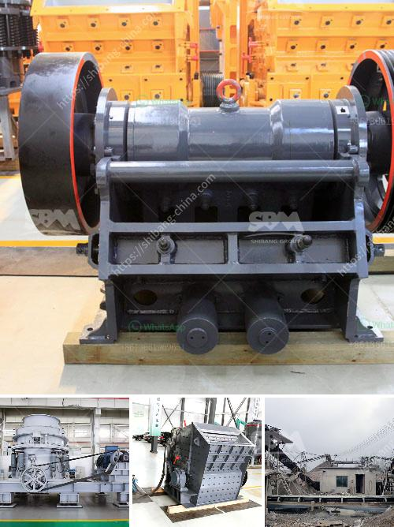

<h3>مصنع تكسير صغير من الصين</h3>
يعد التكسير من أهم وأساسيات صناعة التعدين، حيث يقوم بتحويل المواد الخام إلى قطع مختلفة الأحجام والأشكال التي يمكن استخدامها في عمليات الإنتاج المختلفة. وفي الصين، تتميز هذه الصناعة بشكل كبير بوجود العديد من مصانع التكسير الصغيرة التي تعمل على تلبية احتياجات السوق المحلي والعالمي. ونستعرض في هذه المقالة مصنع تكسير صغير من الصين وأهميته في الصناعة.

يتميز المصنع بتصميمه العملي والمتين، حيث يتم توفيره بأحجام صغيرة ليناسب متطلبات المشاريع الصغيرة والمتوسطة. يتميز أيضًا بوزنه الخفيف وقدرته على النقل بسهولة ويسر، مما يجعله مناسب للعمل في مواقع البناء المختلفة. وبفضل تكنولوجيا التكسير الحديثة التي يتم استخدامها في المصنع، يتمكن من تكسير الصخور والمعادن بكفاءة عالية وبأداء مستقر.

يعتبر المصنع صديق للبيئة، حيث يتم استخدام تقنيات حديثة لتقليل الانبعاثات الضارة وصوت التشغيل. كما يتم تجهيز المصنع بأنظمة تنقية الهواء ومصفاة للغبار لمنع الانبعاثات الملوثة من الانتشار في البيئة المحيطة. وبفضل المحركات الكهربائية الفعالة التي يتم استخدامها في المصنع، يتم تقليل استهلاك الطاقة وبالتالي تخفيض الكلفة البيئية.

يمتاز المصنع بالدقة والكفاءة في عمليات التكسير، حيث يعمل على تحويل المواد الخام إلى قطع متناسقة الأحجام والأشكال. يتم تحقيق ذلك بفضل وجود أنظمة التحكم الآلي المتطورة والمعدات العالية الجودة التي يتم استخدامها في المصنع. وبالتالي، يتم تحقيق أعلى مستويات الإنتاجية وجودة المنتج النهائي.

علاوة على ذلك، يتميز المصنع بتوفيره لخدمات ما بعد البيع الممتازة، حيث يتم تقديم الدعم الفني المستمر والصيانة الدورية للمصنع. يتم توفير قطع الغيار الأصلية وتبادل الخبرات مع العملاء لضمان تشغيل المصنع بكفاءة وديمومة. وبفضل جودة المصنع وخدماته، يتمتع بسمعة جيدة وشهرة واسعة في صناعة التكسير.

باختصار، يعد هذا المصنع التكسير الصغير من الصين مثالًا جيدًا على التصميم الحديث والجودة العالية في صناعة التعدين. يلبي التحديات المتزايدة للسوق ويحقق أعلى مستويات الإنتاجية والكفاءة. وبفضل التكنولوجيا المتقدمة والتوجيه الاستراتيجي، يحقق المصنع أداءً استثنائيًا في مجال التكسير ويساهم بشكل فعال في نمو صناعة التعدين.
<h3>Contact us</h3><ul><li><strong>Whatsapp:&nbsp;<a href="https://wa.me/8613661969651">+8613661969651</a></strong></li><li><a href="https://swt.shibang-china.com/?git&amp;zhl&amp;مصنع تكسير صغير من الصين"><strong>Online Service(chat now)</strong></a></li></ul><h3>Related</h3><ul><li><a href='المعدات اللازمة لبدء تعدين الحجر الجيري.md'>المعدات اللازمة لبدء تعدين الحجر الجيري</a></li><li><a href='تبطين أنابيب مطحنة فحم الحجر.md'>تبطين أنابيب مطحنة فحم الحجر</a></li><li><a href='مطحنة السيليكا المطحونة للبيع.md'>مطحنة السيليكا المطحونة للبيع</a></li><li><a href='كسارة الإسمنت في تركيا.md'>كسارة الإسمنت في تركيا</a></li><li><a href='محجر مستعمل بشكل معقول في نيجيريا.md'>محجر مستعمل بشكل معقول في نيجيريا</a></li></ul>