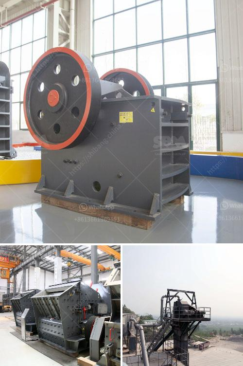

<h3>مصنع تكسير في مالي</h3>
تنتشر صناعة التكسير في جميع أنحاء العالم وتعد من أهم الصناعات التي تسهم في التنمية الاقتصادية وتوفير فرص العمل. وتعد مالي، البلد الساحر الواقع في غرب إفريقيا، محط أنظار المستثمرين الذين يرغبون في الاستفادة من مواردها الطبيعية وتعزيز العملية الصناعية في القارة.

أحد أبرز المشاريع الصناعية التي تم تنفيذها في مالي هو مصنع التكسير. وتم تأسيس هذا المصنع على هامش سياسة الحكومة المالية الهادفة إلى تعزيز قطاع الصناعة وتنويع الاقتصاد. تعاونت الحكومة المالية مع شركة دولية ذات خبرة عالمية في مجال صناعة التكسير، حيث تم توقيع عقد لبناء وتشغيل المصنع.

يعتبر هذا المشروع فرصة استثمارية هائلة لمالي، حيث سيتمكن البلد من تحقيق التنمية الصناعية وزيادة إنتاجيته الاقتصادية. تم توظيف العديد من السكان المحليين للعمل في المصنع، ما ساهم في توفير عدد كبير من فرص العمل للشباب والباحثين عن فرص عمل جديدة. كما أنه يشجع على تعزيز الكفاءة العملية وتوفير الخبرة والمعرفة الصناعية للعاملين في المصنع.

توفر هذه الصناعة الجديدة فرصاً للتصدير، حيث سيتم تصدير المنتجات المصنعة إلى العديد من الدول الأخرى في القارة وحتى خارجها. ستشجع هذه العملية التجارية على زيادة الإيرادات المالية للحكومة المالية وتساهم في تعزيز مواردها الاقتصادية.

تعتبر تكنولوجيا التكسير المستخدمة في هذا المصنع من التقنيات الحديثة والمتطورة. فعملية التصنيع تستخدم الآلات المتقدمة والذكية التي تعمل بالكمبيوتر، مما يسهل عملية الإنتاج ويزيد من كفاءة العملية بشكل عام. يتم التحكم في العمليات الصناعية بدقة، مما يضمن الإنتاجية العالية وجودة المنتجات.

بالإضافة إلى ذلك، يتم العمل وفقًا للمعايير البيئية العالمية. تعتبر المحافظة على البيئة والاستدامة أمرًا هامًا في هذا المصنع، حيث يتم معالجة النفايات بشكل صحيح والتخلص منها بطرق صديقة للبيئة.

تعزز صناعة التكسير في مالي التنمية الاقتصادية والاجتماعية في البلاد. فهي تساهم في خلق فرص العمل وتوفير الدخل للعديد من الأسر، بالإضافة إلى تحقيق التنمية الصناعية والاستفادة من الموارد الوفيرة في البلاد. يتوقع أن يستمر هذا المشروع في تحقيق النجاح واعتباره نموذجًا يحتذى به لتنمية الصناعة في القارة الإفريقية.
<h3>Contact us</h3><ul><li><strong>Whatsapp:&nbsp;<a href="https://wa.me/8613661969651">+8613661969651</a></strong></li><li><a href="https://swt.shibang-china.com/?git&amp;zhl&amp;مصنع تكسير في مالي"><strong>Online Service(chat now)</strong></a></li></ul><h3>Related</h3><ul><li><a href='شركة الإسمنت في بروتيا جلين.md'>شركة الإسمنت في بروتيا جلين</a></li><li><a href='مورد معدات فصل الوسط الكثيف.md'>مورد معدات فصل الوسط الكثيف</a></li><li><a href='آلة تكسير وطحن مناجم الذهب.md'>آلة تكسير وطحن مناجم الذهب</a></li><li><a href='كسارة الحجر المحمولة اللوحة المزدوجة.md'>كسارة الحجر المحمولة اللوحة المزدوجة</a></li><li><a href='آلة كسارة الطين في راجكوت.md'>آلة كسارة الطين في راجكوت</a></li></ul>