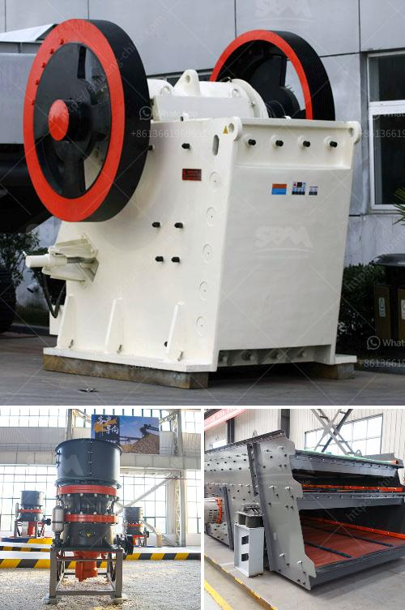

<h3>مصنع تكسير في ماليزيا</h3>
تتباين الصناعات والمصانع في جميع أنحاء العالم حسب الحاجة المحلية والإمكانيات المتاحة. في ماليزيا، يعد مصنع تكسير واحدًا من الصناعات الهامة والرئيسية التي تسعى الحكومة لزيادة وجودها وتعزيزها.

تعد صناعة التكسير من أهم الصناعات في ماليزيا، حيث يتم تحويل المواد الخام إلى منتجات نهائية. تستخدم هذه المنتجات في العديد من الصناعات، بما في ذلك صناعة البناء والتشييد. تكسر المواد الخام بواسطة آلات محطمة متخصصة لتحويلها إلى مواد ناعمة وموحدة التركيب.

تعتبر ماليزيا مكانًا مثاليًا لإقامة مثل هذه المصانع، حيث تتمتع ببيئة أعمال مشجعة وقوة عاملة ماهرة. كما أن لديها مقومات طبيعية متميزة مثل الأنهار والجبال والأراضي الزراعية الوفيرة التي توفر المواد الخام بسهولة. يتم انتاج المواد الخام في المصانع وتوجيهها إلى مصانع التكسير.

تحقق الحكومة الماليزية رؤية تطوير الصناعة وتحسينها من خلال توفير الدعم والتسهيلات للمصانع الجديدة. يتمتع المستثمرون الأجانب والمحليون بمزايا مثل الإعفاءات الضريبية والقروض الميسرة لتشجيعهم على الاستثمار في هذا القطاع. يهدف ذلك إلى توفير وظائف جديدة وتعزيز النمو الاقتصادي في البلاد.

بالإضافة إلى ذلك، تنص الحكومة الماليزية على أن تكون المصانع الجديدة صديقة للبيئة وتعتمد التقنيات الحديثة للحد من التلوث وتحسين الكفاءة. تم تبني معايير صارمة للتحقق من الامتثال للمعايير البيئية والصحية الدولية.

من المهم أن نشير إلى أن هذه الصناعة تواجه تحديات مستمرة، ومن بينها التنافس من المصانع الأخرى في المناطق المجاورة وتحديات البيئة والتشريعات الحكومية. ومع ذلك، فإن المصانع في ماليزيا تعمل جاهدة لتطوير تقنيات جديدة وتحسين العمليات لتعزيز منافستها والحفاظ على استدامة هذه الصناعة.

باختصار، مصنع تكسير في ماليزيا يلعب دورًا حيويًا في تطوير الاقتصاد الماليزي وتعزيز النمو الصناعي. يعمل القطاع على تحويل الموارد الطبيعية إلى منتجات نهائية ذات قيمة مضافة، وتوفير وظائف جديدة ودخل اقتصادي. من المهم دعم هذا القطاع وتشجيع الاستثمار المستدام والابتكار فيه لتعزيز تنافسية ماليزيا في السوق العالمية.
<h3>Contact us</h3><ul><li><strong>Whatsapp:&nbsp;<a href="https://wa.me/8613661969651">+8613661969651</a></strong></li><li><a href="https://swt.shibang-china.com/?git&amp;zhl&amp;مصنع تكسير في ماليزيا"><strong>Online Service(chat now)</strong></a></li></ul><h3>Related</h3><ul><li><a href='آلة طحن مطحنة الرمل السيليكا.md'>آلة طحن مطحنة الرمل السيليكا</a></li><li><a href='كسارة الفك الصينية PE 150 250 في الفلبين.md'>كسارة الفك الصينية PE 150 250 في الفلبين</a></li><li><a href='معالجة الحجر الجيري في نيجيريا.md'>معالجة الحجر الجيري في نيجيريا</a></li><li><a href='مصنع كسارة خام الحديد.md'>مصنع كسارة خام الحديد</a></li><li><a href='كسارة الحجر في بيرو.md'>كسارة الحجر في بيرو</a></li></ul>