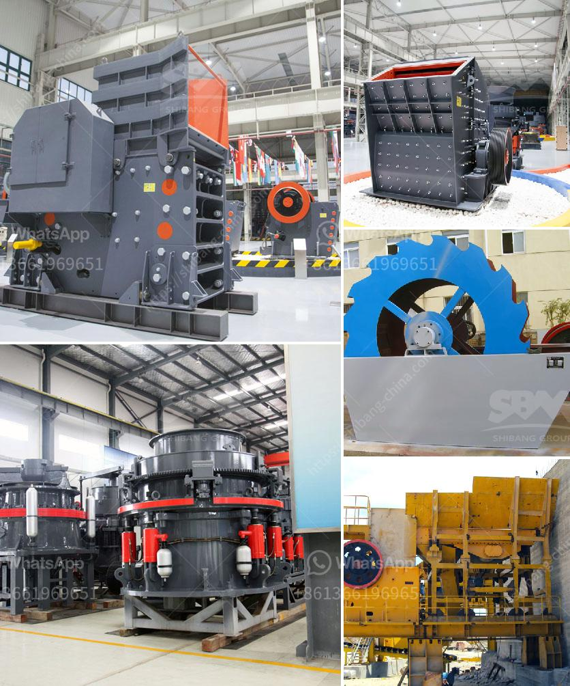

<h3>مصنع تكسير متنقل في الصين</h3>
يعتبر مصنع التكسير المتنقل في الصين مثالاً رائعاً للتطور التكنولوجي الحديث في صناعة التعدين وتكسير المواد. يعد هذا المصنع وحدة متنقلة وقابلة للتنقل تستخدم في تكسير المواد الخام في موقع الإنتاج. يعتبر هذا المصنع المتنقل حلاً مثالياً للعديد من الشركات التي تعمل في صناعة التعدين، حيث يتيح لهم توفير التكاليف والجهود المطلوبة لنقل المواد الخام إلى موقع تكسير ثابت.

تتميز وحدة التكسير المتنقلة بعدة مزايا. أحد هذه المزايا هو سهولة النقل والتركيب، يمكن نقل المصنع بسهولة من موقع لآخر وتركيبه في وقت قصير. هذا يعني أن الشركات يمكن أن تنقل وتعيد استخدام هذا المصنع حسب الحاجة وتستفيد منه في أكثر من موقع.

يتميز المصنع المتنقل أيضاً بالقدرة على التعامل مع مواد مختلفة. يمكن لهذا المصنع تكسير العديد من المواد مثل الصخور والخرسانة والحصى والأسفلت. هذه القدرة المتنوعة تسمح للشركات بالعمل في تطبيقات متعددة وتحقيق أقصى استفادة من المصنع.

من الجوانب الفنية للمصنع المتنقل هي قدرته على تكسير المواد بكفاءة عالية. يحتوي المصنع على أنظمة تكسير متطورة تضمن تكسير المواد بشكل فعال وسريع. بالإضافة إلى ذلك، يمكن تعديل إعدادات المصنع لتلبية متطلبات التكسير المحددة وفقًا لمواصفات العميل.

إضافة إلى ذلك، يمتاز المصنع المتنقل بالاستدامة البيئية. يستخدم المصنع أنظمة متقدمة للتحكم بالغبار والضوضاء، مما يقلل من التأثير البيئي لعمليات التكسير. تعكس هذه الاهتمام بالبيئة التزام الشركات الصينية بالحفاظ على البيئة وتوفير تكنولوجيا صديقة للبيئة.

من الواضح أن مصنع التكسير المتنقل في الصين يتميز بالتكنولوجيا المتقدمة والكفاءة والقدرة المتعددة. تعتبر هذه الوحدة القابلة للتنقل حلاً مثالياً للشركات التي تحتاج إلى تكسير المواد في مواقع إنتاج متعددة دون تكاليف النقل والتركيب. بفضل هذا المصنع المتنقل، يمكن للصناعات التعدينية في الصين تحقيق أقصى استفادة من الموارد وتحسين كفاءة عملياتها.
<h3>Contact us</h3><ul><li><strong>Whatsapp:&nbsp;<a href="https://wa.me/8613661969651">+8613661969651</a></strong></li><li><a href="https://swt.shibang-china.com/?git&amp;zhl&amp;مصنع تكسير متنقل في الصين"><strong>Online Service(chat now)</strong></a></li></ul><h3>Related</h3><ul><li><a href='كسارة الحجر في الكاميرون.md'>كسارة الحجر في الكاميرون</a></li><li><a href='مطحنة الهامر للحبوب.md'>مطحنة الهامر للحبوب</a></li><li><a href='شراء كسارة الحجر sbm في الفلبين.md'>شراء كسارة الحجر sbm في الفلبين</a></li><li><a href='طاحونة الحجر إلى النانوجسيمات.md'>طاحونة الحجر إلى النانوجسيمات</a></li><li><a href='مورد مصنع الكسارة.md'>مورد مصنع الكسارة</a></li></ul>