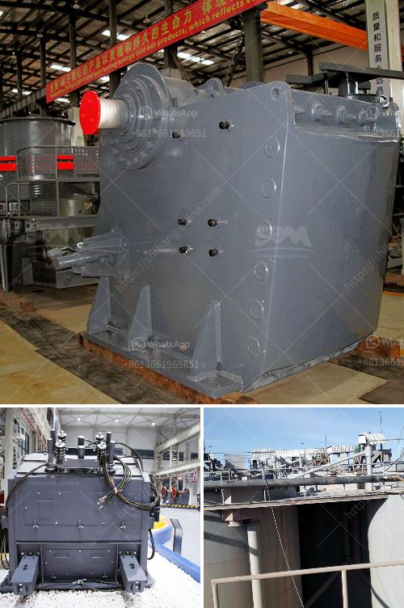

<h3>مصنع تكسير محمول للبيع في جنوب أفريقيا</h3>
يعتبر قطاع صناعة التعدين وتكسير الحجارة من أهم القطاعات الاقتصادية في جنوب أفريقيا. ومن أجل تلبية احتياجات السوق المحلية والدولية، تم تطوير مصنع تكسير محمول في هذا البلد.

تتميز مصانع التكسير المحمول بمرونتها وقدرتها على العمل في ظروف مختلفة وفي مناطق العمل النائية. يعتبر التكسير المحمول من أفضل الطرق لتحويل الصخور الكبيرة إلى مواد أصغر الحجم، وهو مطلب أساسي في عمليات التعدين والبناء.

تعتبر جنوب أفريقيا واحدة من أكبر منتجي المعادن في العالم، حيث يتم استخراج العديد من المعادن الثمينة مثل الذهب والألماس والفحم. تزدهر صناعة التعدين في البلاد، وهو ما يؤدي إلى زيادة الطلب على مصانع التكسير المحمول.

تواجه شركات التعدين الكثير من التحديات في تكسير الصخور وتحويلها إلى مواد صغيرة الحجم. يتطلب هذا العمل تجهيزات مرنة وفعالة تلبي احتياجات العملاء. يقدم المصنع المحمول للبيع في جنوب أفريقيا حلا مثاليًا لهذه التحديات.

تتميز مصانع التكسير المحمول بسهولة النقل والتثبيت. يمكن نقلها بسهولة إلى موقع العمل المطلوب باستخدام وسائل النقل المختلفة. هذا يوفر الوقت والتكاليف للشركات التعدينية التي تحتاج إلى نقل المصانع بين مواقع العمل المختلفة.

بفضل هذا المصنع المحمول، يمكن للشركات تكييف عملياتها بشكل أفضل وزيادة الإنتاجية. تسمح القدرة على نقل المصنع وتثبيته في فترة قصيرة بالعمل في مواقع العمل المحددة حسب الحاجة، وتجنب تكاليف إعادة البناء المكلفة.

بالإضافة إلى ذلك، توفر هذه المصانع القدرة على التحكم في حجم المواد المكسورة بدقة. يزود المصنع بأجهزة التحكم المتقدمة التي تسمح بإعدادات متنوعة ودقيقة. هذا يعني أن الشركات يمكنها تلبية متطلبات العملاء بدقة وتوفير المنتجات بأحجام وجودة محددة.

ولا يقدم المصنع المحمول فقط حلا مثاليًا لشركات التعدين، ولكنه يلبي أيضًا احتياجات صناعة البناء في جنوب أفريقيا. من خلال توفير المحمولية والمرونة والدقة، يمكن للمصانع المحمولة أن تكون أداة قيمة في عمليات البناء.

باختصار، فإن مصنع التكسير المحمول للبيع في جنوب أفريقيا يقدم حلا فعالا واقتصاديا لشركات التعدين وصناعة البناء في البلاد. بفضل مرونته وقدرته على النقل والتثبيت السريع، فإنه يلبي متطلبات العملاء ويساهم في زيادة الإنتاجية وتحسين جودة المنتجات.
<h3>Contact us</h3><ul><li><strong>Whatsapp:&nbsp;<a href="https://wa.me/8613661969651">+8613661969651</a></strong></li><li><a href="https://swt.shibang-china.com/?git&amp;zhl&amp;مصنع تكسير محمول للبيع في جنوب أفريقيا"><strong>Online Service(chat now)</strong></a></li></ul><h3>Related</h3><ul><li><a href='قائمة شركات كسارة المحاجر في نيجيريا.md'>قائمة شركات كسارة المحاجر في نيجيريا</a></li><li><a href='أرض الجرانيت الأسود للبيع في تاميل نادو.md'>أرض الجرانيت الأسود للبيع في تاميل نادو</a></li><li><a href='أصغر كسارة فك محمولة للبيع في جنوب أفريقيا.md'>أصغر كسارة فك محمولة للبيع في جنوب أفريقيا</a></li><li><a href='مصنع غسيل الذهب الصغير.md'>مصنع غسيل الذهب الصغير</a></li><li><a href='تحسين مصنع التكسير.md'>تحسين مصنع التكسير</a></li></ul>