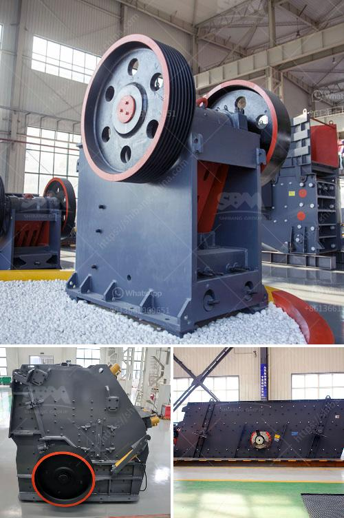

<h3>مصنع تكسير نصف متنقل</h3>
يعتبر مصنع التكسير النصف متنقل أحد أنواع المصانع الحديثة التي تستخدم في صناعات البناء والهندسة المدنية. يعتبر هذا المصنع حلاً مثالياً للمشاريع الكبيرة التي تتطلب تكسير كمية كبيرة من المواد الخام.

يتميز مصنع التكسير النصف متنقل بأنه يحتوي على معدات كاملة لعملية التكسير بما في ذلك الكسارات والأجهزة الأخرى المتعلقة بالعملية. بالإضافة إلى ذلك، يمكن تحريكه ووضعه في الموقع المطلوب بسهولة، مما يجعله مرنًا جداً وسهل الاستخدام.

يعمل مصنع التكسير النصف متنقل على تكسير المواد الخام مثل الصخور والأحجار الكبيرة لتحويلها إلى قطع أصغر يمكن استخدامها في صناعات البناء والتشييد. يعمل عادةً بواسطة أحدث التقنيات والمعدات لضمان تحقيق أقصى كفاءة وجودة في عملية التكسير.

يمتاز مصنع التكسير النصف متنقل بالعديد من المزايا. فمن السهل نقله وتركيبه في أي موقع وفي وقت قصير، مما يوفر الكثير من الجهد والوقت. بالإضافة إلى ذلك، فإن هذا المصنع قادر على تجهيز مجموعة متنوعة من المواد الخام في نفس الوقت، مما يجعله فعالاً للغاية ويوفر الوقت والمال.

عملية التكسير في المصنع تحدث عن طريق تطبيق القوة الميكانيكية على المواد الخام، مما يجعلها أصغر حجمًا وأكثر قابلية للتشغيل في صناعة البناء. هذا يعني أن المواد الخام يمكن استخدامها مباشرة في المشاريع الهندسية دون الحاجة إلى عمليات التحضير الإضافية، مما يوفر المزيد من الوقت والجهد.

في الختام، يعد مصنع التكسير النصف متنقل حلاً مثالياً لتلبية احتياجات صناعة البناء والهندسة المدنية. بفضل مرونته وسهولة نقله وتركيبه، يعد هذا المصنع خيارًا اقتصاديًا وفعالًا. عند اختيار هذا المصنع، يمكن للمشاريع الكبيرة الاستفادة من تكسير المواد الخام بكفاءة وجودة عالية، لتلبية احتياجاتها بسهولة وفعالية.
<h3>Contact us</h3><ul><li><strong>Whatsapp:&nbsp;<a href="https://wa.me/8613661969651">+8613661969651</a></strong></li><li><a href="https://swt.shibang-china.com/?git&amp;zhl&amp;مصنع تكسير نصف متنقل"><strong>Online Service(chat now)</strong></a></li></ul><h3>Related</h3><ul><li><a href='إنتاج ٣٠٠ طن سنوياً من خط إنتاج مسحوق الجبس.md'>إنتاج ٣٠٠ طن سنوياً من خط إنتاج مسحوق الجبس</a></li><li><a href='مطحنة كرات مخروطية للبيع.md'>مطحنة كرات مخروطية للبيع</a></li><li><a href='سعر مطحنة رايموند للكاولين.md'>سعر مطحنة رايموند للكاولين</a></li><li><a href='البحث عن آلات معالجة الكاولين.md'>البحث عن آلات معالجة الكاولين</a></li><li><a href='شركة الإسمنت في بروتيا جلين.md'>شركة الإسمنت في بروتيا جلين</a></li></ul>