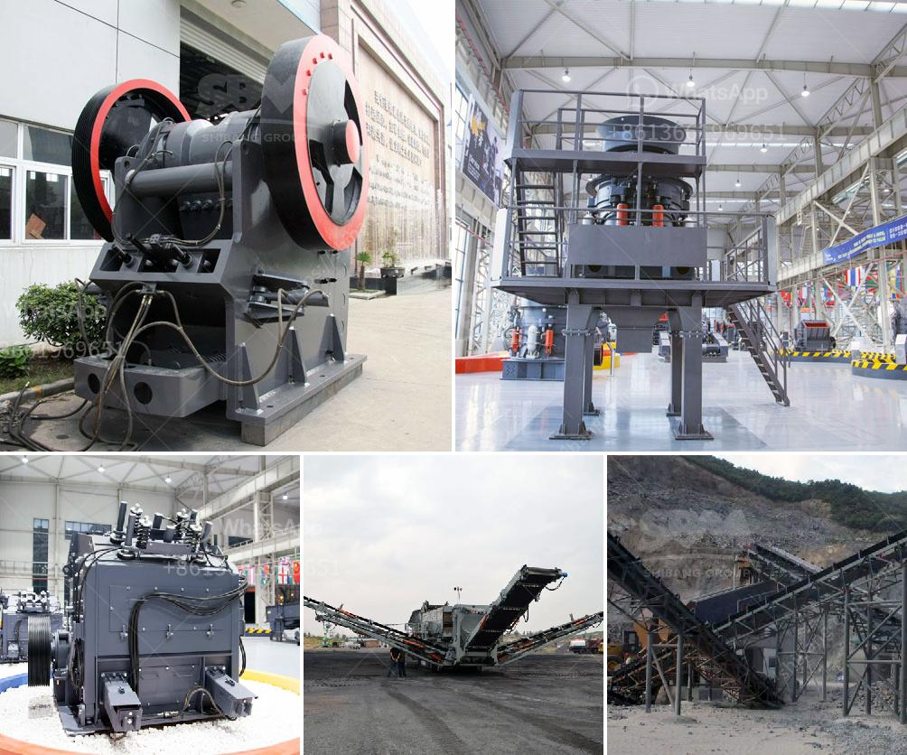

<h3>مصنع تكسير وطحن الكالسايت في أودايبور</h3>
تعد مدينة أودايبور في ولاية راجستان بالهند واحدة من أبرز المراكز الصناعية في البلاد، حيث تضم العديد من المصانع والمنشآت الصناعية المتنوعة. أحد هذه المصانع المهمة هو مصنع تكسير وطحن الكالسايت.

يُعد التكسير والطحن عمليات أساسية في صناعة الكالسايت، والتي تعتبر العنصر الرئيسي في الحجر الجيري والجبس. يتم استخدام الكالسايت في مختلف الصناعات مثل صناعة الزجاج والسيراميك والصناعات الكيماوية. لذا، فإن وجود مصنع تكسير وطحن الكالسايت في أودايبور يعتبر أمرًا هامًا للمنطقة ولاسيما للاقتصاد المحلي.

يعمل هذا المصنع على تكسير أحجار الكالسايت الطبيعية وطحنها إلى مسحوق ناعم يستخدم في عمليات التصنيع. يتم ذلك بواسطة معدات متطورة وآليات حديثة تضمن جودة عالية وكفاءة في العملية. يتم تصنيف الكالسايت حسب درجة النعومة المطلوبة، حيث يوفر المصنع مجموعة متنوعة من الخامات المختلفة التي تلبي طلبات العملاء.

يتطلب مصنع تكسير وطحن الكالسايت اهتمامًا خاصًا بالبيئة والسلامة، حيث قد يكون للعملية أثر سلبي على البيئة المحيطة. ولذا، يتم اتخاذ إجراءات للتأكد من تقليل التأثيرات البيئية السلبية، مثل استخدام تقنيات تنقية الهواء والمياه والتخلص الآمن من المخلفات الصناعية.

علاوة على ذلك، يعد مصنع تكسير وطحن الكالسايت مصدرًا للعمالة المحلية، حيث يوفر فرص عمل للعديد من الأشخاص في المنطقة. يعمل المهندسون والفنيون والعمال في المصنع على تشغيل المعدات وصيانتها، وكذلك التأكد من جودة المنتج النهائي.

باختصار، يعتبر مصنع تكسير وطحن الكالسايت في أودايبور مصدرًا مهمًا للتصنيع المحلي وتوفير فرص العمل، ويساهم في تطوير الاقتصاد المحلي والمساهمة في الصناعة الوطنية. كما يعزز هذا المصنع أهمية أودايبور ويعكس التقدم الصناعي الذي تشهده المدينة.
<h3>Contact us</h3><ul><li><strong>Whatsapp:&nbsp;<a href="https://wa.me/8613661969651">+8613661969651</a></strong></li><li><a href="https://swt.shibang-china.com/?git&amp;zhl&amp;مصنع تكسير وطحن الكالسايت في أودايبور"><strong>Online Service(chat now)</strong></a></li></ul><h3>Related</h3><ul><li><a href='كسارة الفك والشاشة بتنسيق PDF.md'>كسارة الفك والشاشة بتنسيق PDF</a></li><li><a href='موردين لفات الناقل في جنوب أفريقيا.md'>موردين لفات الناقل في جنوب أفريقيا</a></li><li><a href='طاحونة عمودية للأسمنت في كينيا بسعة 100 طن.md'>طاحونة عمودية للأسمنت في كينيا بسعة 100 طن</a></li><li><a href='الميزة الرئيسية لكسارة الصدم أو الفك.md'>الميزة الرئيسية لكسارة الصدم أو الفك</a></li><li><a href='مصنع الجبس في نيجيريا.md'>مصنع الجبس في نيجيريا</a></li></ul>