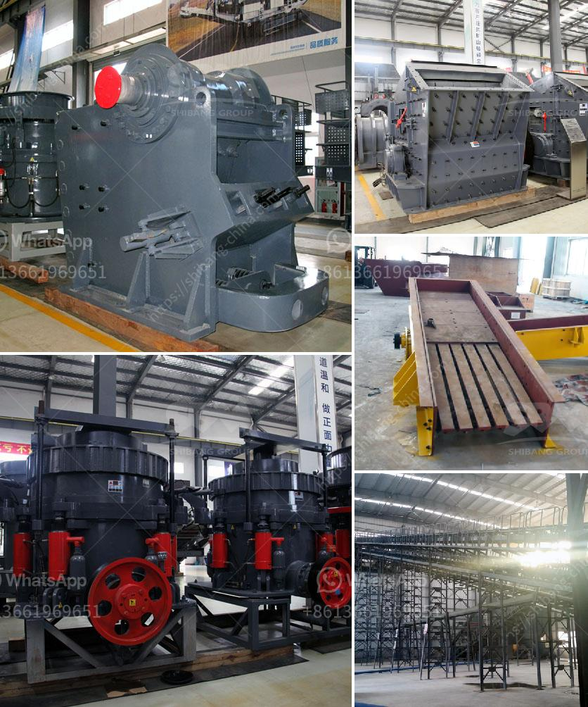

<h3>مصنع تكسير وفحص الكسارة</h3>
مصنع تكسير وفحص الكسارة هو مصنع يقوم بعملية تحطيم وفحص الصخور والتربة الخام لاستخدامها في مجموعة متنوعة من التطبيقات. يعتبر هذا المصنع أحد المراحل الرئيسية في عملية البناء والتشييد وتعتبر الكسارة جزءًا هامًا في هذا المصنع.

يتم تصميم الكسارات لتكسير الصخور والتربة إلى أحجام أصغر، وبالتالي تسهيل استخدامها في أماكن مختلفة مثل البناء والهندسة المدنية والأعمال الطرقية والإنشاءات الصناعية والزراعة وصناعة الأسمنت والزجاج وغيرها من الصناعات. يتألف مصنع تكسير وفحص الكسارة عادةً من معدات متخصصة مثل الكسّارات، والغرابيل والمناخل والأحزمة الناقلة وما إلى ذلك.

يتم استخدام الكسّارة الأولية المثبتة في المصنع لتقطيع الصخور الضخمة إلى قطع أصغر من حيث الحجم والشكل. يتم تحميل الصخور في فوهة الكسّارة وتتم عملية التكسير بإستخدام القوة الميكانيكية والضغط العالي. بعد ذلك، تنتقل القطع إلى الغرابيل والمناخل الذي يقوم بفحص الحصى وفصلها حسب الحجم. تستخدم الأحزمة الناقلة لنقل الحصى إلى المكان المناسب لمزيد من العملية.

يعد مصنع تكسير وفحص الكسارات من أهم المصانع في صناعة البناء والتشييد. حيث يعتبر الحصى والرمل المنتج من هذه الكسّارات والتي تم فحصها بشكل صحيح مواد أساسية لمشاريع البناء المختلفة. من الجدير بالذكر أن مصانع تكسير وفحص الكسارة تحتاج إلى تخطيط هندسي دقيق وتكنولوجيا متطورة لظمان جودة المنتج النهائي وأداء المصنع. تتراوح مدة عمر المصنع من عدة سنوات إلى عقود، ويتأثر ذلك بعوامل مثل نوع الصخارة والتطبيق النهائي للمنتج.

في الختام، يمكن القول أن مصنع تكسير وفحص الكسارة يلعب دورًا هامًا في صناعة البناء والتشييد. يتم استخدامها لتحطيم الصخور الضخمة إلى أحجام صغيرة وتصفيتها وفقًا للحجم المطلوب. يساهم المصنع في توفير مواد البناء اللازمة لمختلف المشاريع الهندسية ويساعد في تقليل التكاليف والوقت المستغرق للحصول على هذه المواد من مصادر أخرى. بالإضافة إلى ذلك، يتطلب المصنع تخطيطًا هندسيًا دقيقًا واستخدام تكنولوجيا حديثة لتحقيق الجودة المطلوبة.
<h3>Contact us</h3><ul><li><strong>Whatsapp:&nbsp;<a href="https://wa.me/8613661969651">+8613661969651</a></strong></li><li><a href="https://swt.shibang-china.com/?git&amp;zhl&amp;مصنع تكسير وفحص الكسارة"><strong>Online Service(chat now)</strong></a></li></ul><h3>Related</h3><ul><li><a href='مصنع زينيث للسحق.md'>مصنع زينيث للسحق</a></li><li><a href='موردين خام الزنك في جنوب أفريقيا.md'>موردين خام الزنك في جنوب أفريقيا</a></li><li><a href='مصنع تكسير في مالي.md'>مصنع تكسير في مالي</a></li><li><a href='كسارة آلية.md'>كسارة آلية</a></li><li><a href='شاشة اهتزاز في إندونيسيا.md'>شاشة اهتزاز في إندونيسيا</a></li></ul>